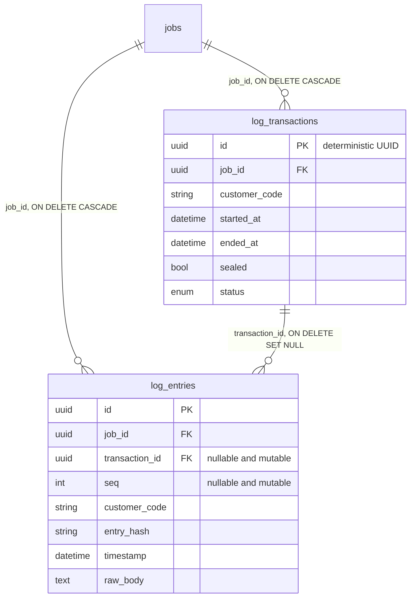
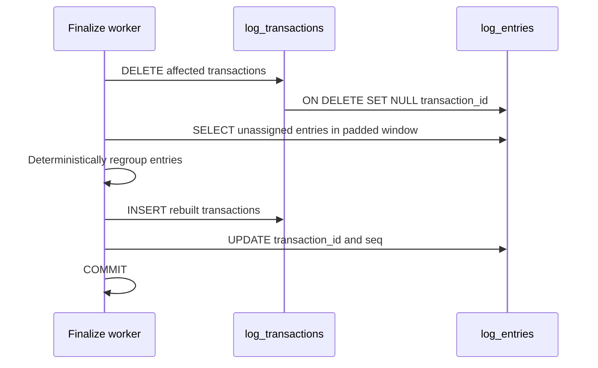

# Current log regroup and data deletion behavior

**Snapshot time:** 2026-07-28 12:10:14 BST

**Repository commit:** `30f0216fd8b0b5b7bbb2d0a71cf5ba639be65e0f`

**Commit summary:** `30f0216 codex doc`

**Alembic head:** `f3b8d1e07c92`

**Document purpose:** Record the verified current behavior before the PostgreSQL low-level redesign.

## Status and scope

This document describes the behavior implemented at the snapshot above.
It is not a proposed design and does not indicate that future schema changes have been implemented.

The behavior was checked against:

- `app/persistence/models/log_entry.py`
- `app/persistence/models/log_transaction.py`
- `app/services/mnp_log_ingestion/pipeline/derive_transactions.py`
- `app/services/logspace_cleanup.py`
- `app/api/v1/logs.py`

Future architecture and migration work should compare the new behavior with this snapshot.

## Current source-of-truth relationship

`log_entries` is the lossless source of truth for the log-ingestion subsystem.
`log_transactions` is derived from those entries by Stage 2 stitching.

Each `log_entry` currently contains mutable derived assignment columns:

- `transaction_id`
- `seq`

`log_entries.transaction_id` references `log_transactions.id` using `ON DELETE SET NULL`.



Deleting a `log_transaction` does not delete the associated `log_entries`.
PostgreSQL clears the derived assignment by setting `log_entries.transaction_id` to `NULL`.
The raw entry body, timestamp, source file, line number, parsed fields, entry hash, and other source information remain stored.

## Stage 1 ingestion behavior

Stage 1 parses raw log content and inserts `log_entries`.
It uses tenant-scoped content deduplication through the unique key `(customer_code, entry_hash)`.
Insertion uses `ON CONFLICT DO NOTHING`.

Stage 1 also records the timestamp range affected by newly inserted entries in `log_regroup_pending`.
That range later drives scoped Stage 2 reconstruction.

Stage 1 does not initially create the final transaction grouping.
The `transaction_id` and `seq` fields are populated later by Stage 2.

## Stage 2 persistence behavior

Stage 2 groups ordered entries into transaction builders.
For every builder, it calculates a deterministic transaction ID.
It inserts a `log_transactions` row and then assigns the builder's entries by updating:

```text
log_entries.transaction_id
log_entries.seq
```

The deterministic transaction identity normally allows the same input entries to recreate the same transaction ID after regrouping.

## Scoped window regroup behavior

The normal pending-window finalization path calls `regroup_window`.

For one tenant and one padded time window, it performs:

1. Delete every affected `log_transactions` row whose start falls inside the rebuild range.
2. Let `ON DELETE SET NULL` clear `transaction_id` on the affected entries.
3. Select the now-unassigned entries across the full padded window.
4. Re-run the transaction-grouping algorithm.
5. Insert replacement `log_transactions` rows.
6. Write new `transaction_id` and `seq` assignments onto the entries.
7. Commit the window.



The delete, re-read, recreation, and reassignment for one scoped window occur in one database transaction.
Readers see either the state before the commit or the rebuilt state after the commit.
They should not see the intermediate state produced inside the uncommitted transaction.

If an error occurs before the commit, PostgreSQL rolls back the window.
The deleted transactions and cleared assignments are restored by the rollback.
Raw entries are not lost.

## Pending-window failure behavior

`finalize_pending` processes coalesced dirty ranges as bounded sub-windows.
Each sub-window uses its own database session and transaction.
Successfully committed sub-windows remain complete even if a later sub-window fails.

When a run fails:

- Its pending records remain open for retry.
- Its attempt count and last error are updated separately.
- Other independent runs can continue.
- A repeatedly failing range is eventually marked abandoned and excluded from automatic retry.

An abandoned range can leave some raw entries without a correct derived transaction view.
This represents missing or stale derived data, not deletion of the underlying raw entries.
The abandoned range must be investigated and re-armed after the cause is corrected.

## Full regroup behavior

`regroup_all` is not atomic across the complete rebuild.
It currently:

1. Deletes the selected transactions.
2. Commits that deletion.
3. Reads all applicable raw entries.
4. Recreates transactions per customer.
5. Commits the rebuilt results.

If the process stops after the deletion commit and before reconstruction finishes, raw entries remain stored.
However, derived transactions can remain absent until a later successful regroup.

This condition is temporary derived-data loss or derived-view unavailability.
It is not raw log-data loss.

## Incremental regroup behavior

`regroup_incremental` also has a commit boundary between deletion and reconstruction.
It currently:

1. Deletes unsealed transactions.
2. Commits the deletion.
3. Finds entries whose `transaction_id` is `NULL`.
4. Rebuilds and commits replacement transactions.

If execution stops after step 2, raw entries remain present but can remain unassigned.
The transaction view can therefore be incomplete until the next successful regroup or repair.

## Operations that cause actual raw-data deletion

Regrouping is different from explicit deletion and retention operations.

### Deleting an ingestion job

`log_entries.job_id` references `jobs.id` with `ON DELETE CASCADE`.
Deleting the owning job permanently deletes its `log_entries`.
`log_transactions.job_id` also uses `ON DELETE CASCADE`.

This is real deletion of both raw and derived data.

### Purging a customer log space

The log-space cleanup service intentionally hard-deletes the customer-owned records.
Deleting the customer's jobs cascades into raw entries and derived transactions.

This is real and intentional raw-data deletion.

### Explicit log deletion API operations

The logs API contains explicit deletion paths for transactions and entries.
Deleting `log_entries` through those operations permanently removes raw log data.

## Current data-loss classification

| Operation | Raw `log_entries` lost | Derived transactions can be unavailable | Automatic database rollback protects the old state |
| --- | --- | --- | --- |
| Successful scoped `regroup_window` | No | No visible intermediate state | Not applicable after success |
| Failed scoped `regroup_window` before commit | No | No committed loss | Yes |
| Full regroup interrupted after delete commit | No | Yes | No, deletion was already committed |
| Incremental regroup interrupted after delete commit | No | Yes | No, deletion was already committed |
| Abandoned pending window | No | Yes, entries can remain unassigned or stale | The failed window itself rolls back |
| Delete owning ingestion job | Yes | Yes | Only if the outer delete transaction fails before commit |
| Purge customer log space | Yes | Yes | Only if the outer purge transaction fails before commit |
| Explicitly delete log entries | Yes | Possibly | Only if the delete transaction fails before commit |

## Current correctness invariants

The current regrouping design depends on the following invariants:

1. Raw entries remain present while derived transactions are rebuilt.
2. Deleting a transaction clears entry assignments rather than deleting entries.
3. The padded rebuild window contains every entry belonging to an affected transaction.
4. A transaction cannot legitimately span beyond the configured grouping boundary assumed by the padding logic.
5. Deterministic transaction IDs reproduce stable identities from the same anchor entry.
6. Every regroup query remains scoped to one customer.
7. A successful scoped window commits its delete and reconstruction atomically.
8. Open pending ranges remain available for retry unless deliberately dead-lettered.

Breaking any of these invariants can create missing, duplicated, incorrectly grouped, or cross-tenant derived transactions.
It does not necessarily delete raw entries, but it can make the operational transaction view incorrect.

## Current performance consequence

Although normal scoped regrouping is designed to preserve raw data, it repeatedly mutates the largest table.
Every regroup can update `log_entries.transaction_id` and `log_entries.seq`.
Deleting transactions also clears `transaction_id` through the foreign key.

This creates:

- Heap updates on `log_entries`.
- Index maintenance for assignment-related indexes.
- Dead tuples.
- Vacuum pressure.
- Write amplification.
- Repeated changes to recent unsealed entries.

The proposed low-level PostgreSQL design should preserve the lossless behavior while removing mutable transaction assignment from `log_entries`.

## Future comparison checklist

When the schema or regrouping algorithm changes, compare the new implementation against this snapshot:

- Is `log_entries` still the source of truth?
- Can any regroup operation delete raw entries?
- Is assignment state still stored on `log_entries`?
- Is delete and reconstruction atomic?
- Can a crash leave the derived view empty or incomplete?
- Are transaction IDs still deterministic?
- How are late and back-dated entries handled?
- How are abandoned windows repaired?
- What operations intentionally delete raw data?
- What audit record proves an intentional deletion?
- Are tenant boundaries enforced by every constraint and query?
- What new partition or foreign-key rules affect deletion?

