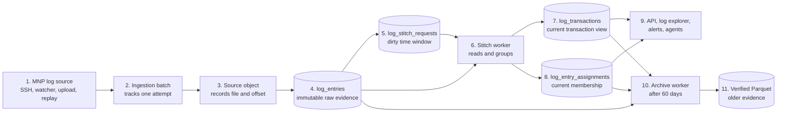
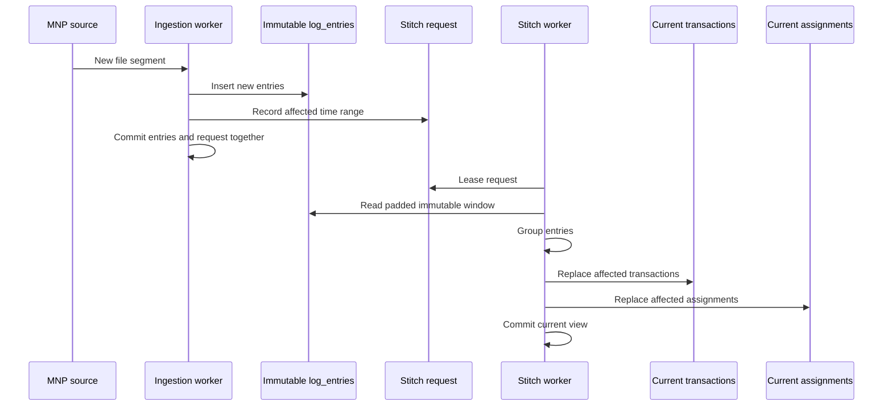
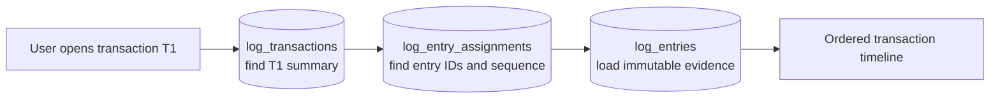
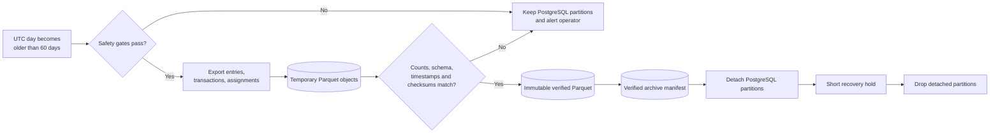
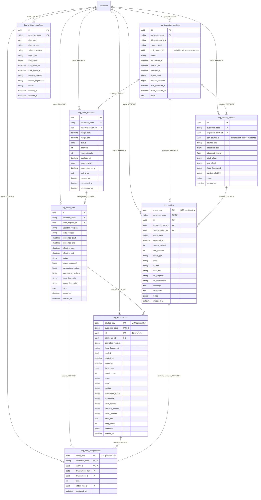
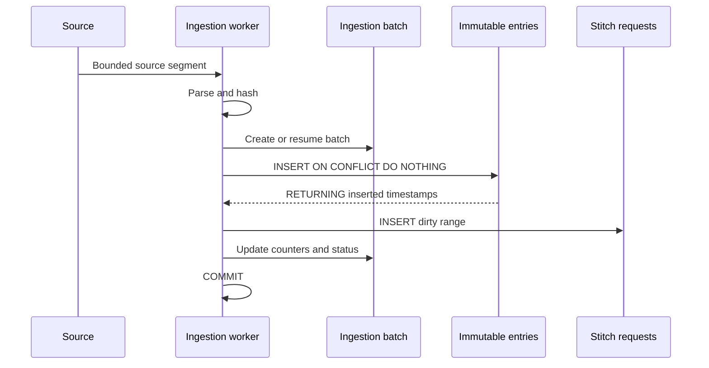
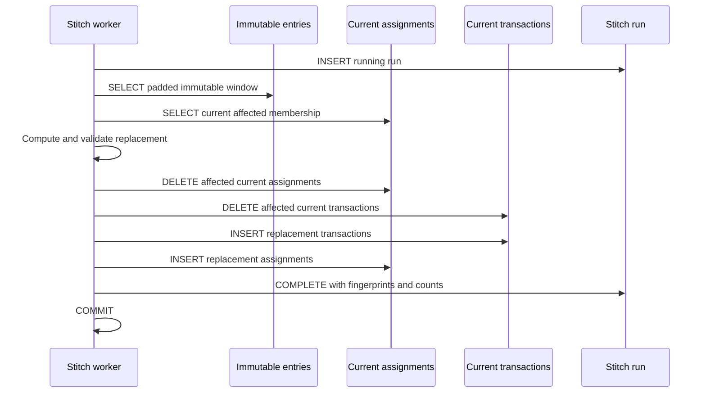

# MNP log-ingestion PostgreSQL low-level design

**Status:** Proposed for review

**Design snapshot:** 2026-07-28 12:22:24 BST

**Scope:** MNP log ingestion, transaction stitching, hot serving, and verified archival

**Out of scope:** Document uploads, RAG jobs, document chunks, embeddings, and vector stores

**Implementation authorized:** No

**Visual companion:** [2026-07-28_12-22_mnp-log-postgresql-low-level-design.html](2026-07-28_12-22_mnp-log-postgresql-low-level-design.html)

**Beginner grouped ER diagram:** [2026-07-28_15-49_mnp-log-grouped-er-diagram.md](2026-07-28_15-49_mnp-log-grouped-er-diagram.md)

**Beginner grouped ER HTML:** [2026-07-28_15-49_mnp-log-grouped-er-diagram.html](2026-07-28_15-49_mnp-log-grouped-er-diagram.html)

## 1. Confirmed decisions

The following decisions were confirmed before this design was written:

1. `log_entries` becomes strictly immutable after a successful insert.
2. PostgreSQL retains 60 days of hot MNP log data.
3. Data older than the hot boundary moves to verified Parquet before PostgreSQL partitions are removed.
4. PostgreSQL stores only the current entry-to-transaction assignment.
5. Grouping-run metadata is retained, but historical copies of every assignment are not retained in PostgreSQL.
6. Exact historical assignment snapshots are produced in Parquet when required for ML reproducibility or investigation.
7. The design is restricted to the MNP log-ingestion domain.

## 2. Design goals

The design must:

- Preserve raw MNP log evidence without Stage 2 mutation.
- Preserve replay and deduplication guarantees.
- Rebuild transaction windows without updating `log_entries`.
- Keep current transaction views fast.
- Make a failed rebuild atomic.
- Support late and back-dated input.
- Bound PostgreSQL storage and maintenance through daily partition retention.
- Preserve tenant isolation.
- Support at least 1 million raw entries per day with headroom.
- Provide stable transaction identities where the current deterministic-ID rule permits.
- Produce verifiable Parquet archives before removing hot data.
- Retain enough lineage to identify which stitch run and algorithm produced a current transaction.

## 3. Current-schema diagnosis

The current Stage 1 insert path is already mostly append-only.
The principal mutation happens during Stage 2.

The current schema stores these derived fields on `log_entries`:

- `transaction_id`
- `seq`

Stage 2 deletes affected `log_transactions`.
The `ON DELETE SET NULL` foreign key clears `log_entries.transaction_id`.
Stage 2 then reads unassigned entries and writes new `transaction_id` and `seq` values back onto the same raw rows.

This protects raw content from normal regroup deletion, but it makes the largest table mutable.
The result is heap updates, index maintenance, dead tuples, vacuum pressure, and repeated write amplification on the live tail.

The proposed design separates immutable evidence from mutable current interpretation.

## 3.1 Simple mental model

The design separates four different kinds of information:

| Information | Table | Simple meaning |
| --- | --- | --- |
| Original evidence | `log_entries` | What the server actually wrote |
| Current interpretation | `log_transactions` | Which business transactions currently exist |
| Current membership | `log_entry_assignments` | Which raw entries currently belong to each transaction and in what order |
| Work and lineage | `log_stitch_requests` and `log_stitch_runs` | Why stitching ran and what produced the current result |

Think of `log_entries` as immutable paper receipts.
Think of a transaction as a folder containing related receipts.
Think of `log_entry_assignments` as the removable labels saying which folder contains each receipt.

When a late receipt arrives, the receipt collection does not change.
Only the folders and removable labels are replaced.

## 3.2 End-to-end data flow



### What happens at each step

1. An MNP log file or file segment arrives.
2. `log_ingestion_batches` records the attempt, status, byte count, and resulting timestamp range.
3. `log_source_objects` records the exact file, offset, fingerprint, and checksum.
4. Parsed entries are inserted into `log_entries`.
5. The same commit creates a durable stitch request for the affected time range.
6. A stitch worker reads the immutable entries and calculates the correct grouping.
7. The worker writes the current transaction summaries.
8. The worker writes the current entry membership and sequence.
9. APIs join transactions, assignments, and entries to show the current transaction timeline.
10. Once a UTC day is older than 60 days and passes all safety gates, the archive worker exports it.
11. PostgreSQL partitions are removed only after the Parquet data and manifest are verified.

## 3.3 Normal ingestion flow



The raw inserts and stitch request commit together.
The stitch worker can crash and restart without losing the request.
The current transaction and assignment replacement commits together.

## 3.4 Late-entry regroup example

Assume the current database contains:

```text
Immutable entries
E1  10:00:00  REQUEST
E2  10:00:01  MI CALL
E3  10:00:04  RESPONSE

Current transaction
T1  10:00:00 to 10:00:04

Current assignments
E1 -> T1, sequence 0
E2 -> T1, sequence 1
E3 -> T1, sequence 2
```

A late entry then arrives:

```text
E4  10:00:03  ERROR
```

The system performs:

```mermaid
flowchart LR
    L["Insert late E4"]
    R["Create stitch request<br/>around 10:00:03"]
    S["Read E1, E2, E3, E4<br/>from immutable entries"]
    C["Calculate corrected T1"]
    DA["Delete old current assignments<br/>E1, E2, E3"]
    DT["Delete old current T1"]
    NT["Insert corrected current T1"]
    NA["Insert current assignments<br/>E1=0, E2=1, E4=2, E3=3"]
    K["Commit all current-view changes"]

    L --> R --> S --> C --> DA --> DT --> NT --> NA --> K
```



After the commit:

```text
Immutable entries
E1  unchanged
E2  unchanged
E3  unchanged
E4  newly inserted and then unchanged

Current transaction
T1  corrected using E1, E2, E4, E3

Current assignments
E1 -> T1, sequence 0
E2 -> T1, sequence 1
E4 -> T1, sequence 2
E3 -> T1, sequence 3
```

Only current assignments and the current transaction view are replaced.
No raw entry is updated or deleted.

## 3.5 Read flow for one transaction

The API does not expect `transaction_id` to exist on `log_entries`.
It reads through the assignment table:



The join path is:

```text
log_transactions
    -> log_entry_assignments
        -> log_entries
```

The assignment index returns the entry IDs in sequence order.
The composite entry key then loads the immutable entries from at most two daily partitions for a cross-midnight transaction.

## 3.6 Sixty-day archive flow



Sixty days is the eligibility boundary, not permission to delete immediately.
Failed verification keeps the PostgreSQL partition intact.
Cross-midnight references can keep a transaction partition slightly longer than 60 days.

## 3.7 What is mutable and what is immutable

| Data | Insert | Update | Delete during regroup | Delete during retention |
| --- | --- | --- | --- | --- |
| `log_entries` | Yes | Never | Never | Partition removal after verified archive |
| `log_transactions` | Yes | Replaced as a current view | Yes, atomically replaced | Yes, after verified archive and reference checks |
| `log_entry_assignments` | Yes | Replaced as a current view | Yes, atomically replaced | Yes, before referenced entries and transactions |
| `log_stitch_requests` | Yes | Status, lease, retry, completion | No | Control-plane retention policy |
| `log_stitch_runs` | Yes | Final status and counts | No | Long-lived lineage or archived metadata |
| `log_archive_manifests` | Yes | Verification status | No | According to archive-governance policy |

## 3.8 Existing versus proposed summary

The complete beginner-friendly comparison is in [2026-07-28_15-49_mnp-log-grouped-er-diagram.md](2026-07-28_15-49_mnp-log-grouped-er-diagram.md).

| Existing implementation | Current limitation | Proposed design | Problem solved |
| --- | --- | --- | --- |
| Shared `jobs` table owns MNP entries and transactions | Mixes document and MNP lifecycles, and delete cascades can remove evidence | `log_ingestion_batches` with restricted deletion | MNP-specific lineage and safer evidence ownership |
| `log_entries` stores evidence, `transaction_id`, and `seq` | Stage 2 mutates the largest source-of-truth table | Immutable `log_entries` plus `log_entry_assignments` | No raw-table mutation during regroup |
| `source_file` text identifies provenance | Does not identify an exact file version or byte range | `log_source_objects` | Exact source, offset, fingerprint, and checksum |
| Unpartitioned `log_entries` | Large indexes and expensive retention | Daily UTC partitions | Bounded indexes and 60-day partition retention |
| Unpartitioned `log_transactions` linked to a job | No partition retention and limited derivation lineage | Partitioned transactions linked to stitch runs | Bounded serving store and reproducible lineage |
| `log_regroup_pending` records dirty ranges and retries | No first-class worker lease | `log_stitch_requests` | Crash recovery and safe multiple-worker claiming |
| `log_regroup_runs` records aggregate API status and JSON result | Limited per-window algorithm lineage | `log_stitch_runs` | Code version, algorithm, counts, and fingerprints |
| No verified archive ledger | Cannot prove Parquet safety before removal | `log_archive_manifests` | Auditable 60-day archive handoff |

The proposed design retains the current deterministic transaction identity, padded-window stitching, tenant isolation, late-data repair, retry, and dead-letter concepts.

## 4. Assignment-history options

Three assignment-history designs were evaluated.

### Option A: Current assignments only

PostgreSQL contains one current assignment per raw entry.
A successful regroup replaces the assignments for the affected window.

#### Advantages

- Smallest assignment table.
- Fastest transaction-detail joins.
- One assignment per entry can be enforced within the partition design.
- Lowest index and vacuum overhead.
- Simple 60-day retention.
- Clear operational meaning.

#### Disadvantages

- PostgreSQL cannot reconstruct every earlier grouping result.
- Debugging a historical algorithm change requires run metadata, logs, or an external snapshot.
- An ML dataset requiring exact old membership needs an immutable snapshot.

### Option B: Every assignment version

Each stitch run appends a complete new set of assignment rows.
Queries select the active version.

#### Advantages

- Complete historical reconstruction.
- Direct comparison of algorithm versions.
- Exact database-level lineage for every prior assignment.

#### Disadvantages

- Assignment growth can exceed raw-entry growth by a large factor.
- Frequently regrouped live entries generate many nearly identical rows.
- Current-view queries require version resolution.
- Indexes, retention, vacuum, and consistency checks become substantially more expensive.
- At 1 million entries per day, repeated live-tail versions can become operationally disproportionate.

### Option C: Current assignments plus change history

PostgreSQL stores the current assignment and also appends a change record whenever an entry moves.

#### Advantages

- Less duplication than full version snapshots.
- Entry movement can be audited.
- Current reads remain direct.

#### Disadvantages

- Still creates potentially high change volume.
- Reconstructing a complete historical transaction requires replaying changes.
- Retention and cross-partition reconstruction remain complicated.
- Most changes in the live tail are normal algorithm behavior rather than durable business events.

### Selected option

**Option A, current assignments only, is selected.**

It is the best fit because the operational product needs the current correct transaction view, while raw entries remain the permanent source of truth.
The expected volume makes indefinite assignment versioning unnecessarily expensive.

Historical observability is provided through:

- Immutable `log_stitch_runs` metadata.
- Algorithm and code versions.
- Input range and watermark.
- Input and output counts.
- Input and assignment fingerprints.
- Structured errors.
- Verified Parquet snapshots for ML datasets or investigations that require exact assignment reproduction.

## 5. Partition-granularity decision

### Options considered

| Option | Benefits | Costs |
| --- | --- | --- |
| Monthly partitions | Few partitions and simple administration | Up to one month of excess hot data, larger indexes, larger archive and recovery units |
| Weekly partitions | Moderate partition count and archive size | Retention does not align exactly with 60 days |
| Daily partitions | Exact retention control, bounded indexes, small repair and archive units | More partitions and stricter partition automation |

### Selected option

Use daily UTC range partitions.

At 60 hot days, each high-volume table has approximately 60 active daily partitions plus a small pre-created future window.
PostgreSQL can manage this partition count comfortably when queries always include bounded time predicates.

Daily partitions align with:

- The 60-day retention requirement.
- Approximately 1 million entries per normal day.
- Small archive and verification units.
- Fast partition removal.
- Narrow backfill and recovery operations.

## 6. Proposed bounded context

The MNP log-ingestion PostgreSQL plane contains:

| Table | Responsibility |
| --- | --- |
| `log_ingestion_batches` | One tracked ingestion attempt or source increment |
| `log_source_objects` | Provenance for a fetched or uploaded log object |
| `log_entries` | Immutable canonical raw entries |
| `log_transactions` | Current derived transaction view |
| `log_entry_assignments` | Current entry-to-transaction membership and sequence |
| `log_stitch_requests` | Durable dirty windows waiting for reconstruction |
| `log_stitch_runs` | Immutable execution and algorithm lineage |
| `log_archive_manifests` | Verified Parquet artifact ledger |

The existing SSH source and checkpoint tables remain upstream controls.
They may reference ingestion batches, but deleting an SSH source must continue to preserve previously ingested evidence.

## 7. Master ER diagram

The diagram below is proposed and is not the current implemented schema.



## 8. Key strategy

### 8.1 Why partition keys appear in primary keys

PostgreSQL requires every unique or primary-key constraint on a partitioned parent to include the partition key.
Daily partitioned tables therefore use composite keys.

The canonical raw-entry identity is:

```text
(event_day, customer_code, id)
```

The canonical transaction identity is:

```text
(started_day, customer_code, id)
```

The UUID remains the application-level stable identity.
The day and tenant are also carried in references so PostgreSQL can enforce partitioned foreign keys and tenant consistency.

### 8.2 Time convention

Partition keys use UTC calendar days.
Customer-local dates remain separate analytical and display fields.

This prevents daylight-saving changes from altering partition routing.

```text
event_day   = UTC date of occurred_at
started_day = UTC date of started_at
local_date  = customer-local date of started_at
```

### 8.3 Timestamp-less entries

Canonical timestamped entries require a valid `occurred_at`.
Timestamp-less parsed records use the reserved partition key `0001-01-01` and route to a dedicated limbo partition.

The parent constraint ensures:

```text
occurred_at IS NULL     <=> event_day = 0001-01-01
occurred_at IS NOT NULL <=> event_day = UTC date of occurred_at
```

The limbo partition is monitored and is not part of normal transaction stitching.
It is retained until corrected or explicitly archived under a quarantine dataset.

## 9. Proposed PostgreSQL schema

The SQL is an implementation-level proposal.
Names and migration sequencing remain subject to review.

### 9.1 Ingestion batches

```sql
CREATE TABLE log_ingestion_batches (
    id uuid PRIMARY KEY,
    customer_code varchar(64) NOT NULL
        REFERENCES customers(customer_code) ON DELETE RESTRICT,
    idempotency_key varchar(255) NOT NULL,
    source_kind varchar(32) NOT NULL
        CHECK (source_kind IN ('ssh', 'watcher', 'upload', 'replay', 'cold_backfill')),
    ssh_source_id uuid NULL,
    status varchar(24) NOT NULL
        CHECK (status IN ('pending', 'running', 'completed', 'failed', 'cancelled')),
    requested_at timestamptz NOT NULL DEFAULT now(),
    started_at timestamptz NULL,
    finished_at timestamptz NULL,
    bytes_read bigint NOT NULL DEFAULT 0 CHECK (bytes_read >= 0),
    entries_inserted bigint NOT NULL DEFAULT 0 CHECK (entries_inserted >= 0),
    min_occurred_at timestamptz NULL,
    max_occurred_at timestamptz NULL,
    error text NULL,
    UNIQUE (customer_code, id),
    UNIQUE (customer_code, idempotency_key),
    CHECK (min_occurred_at IS NULL OR max_occurred_at IS NULL
           OR min_occurred_at <= max_occurred_at)
);
```

`ssh_source_id` remains a soft reference in the initial design.
Deleting or renaming an SSH source must not invalidate historical ingestion lineage.
The source identity and source object metadata are copied into immutable provenance records.

### 9.2 Source objects

```sql
CREATE TABLE log_source_objects (
    id uuid PRIMARY KEY,
    customer_code varchar(64) NOT NULL
        REFERENCES customers(customer_code) ON DELETE RESTRICT,
    ingestion_batch_id uuid NOT NULL,
    ssh_source_id uuid NULL,
    source_key varchar(1024) NOT NULL,
    observed_size bigint NULL CHECK (observed_size IS NULL OR observed_size >= 0),
    observed_mtime double precision NULL,
    start_offset bigint NOT NULL DEFAULT 0 CHECK (start_offset >= 0),
    end_offset bigint NULL CHECK (end_offset IS NULL OR end_offset >= start_offset),
    head_fingerprint varchar(64) NULL,
    content_sha256 varchar(64) NULL,
    status varchar(24) NOT NULL
        CHECK (status IN ('observed', 'reading', 'ingested', 'failed', 'skipped')),
    created_at timestamptz NOT NULL DEFAULT now(),
    UNIQUE (customer_code, id),
    FOREIGN KEY (customer_code, ingestion_batch_id)
        REFERENCES log_ingestion_batches(customer_code, id)
        ON DELETE RESTRICT,
    UNIQUE (customer_code, ingestion_batch_id, source_key, start_offset)
);
```

### 9.3 Immutable entries

```sql
CREATE TABLE log_entries (
    event_day date NOT NULL,
    customer_code varchar(64) NOT NULL
        REFERENCES customers(customer_code) ON DELETE RESTRICT,
    id uuid NOT NULL,
    ingestion_batch_id uuid NOT NULL,
    source_object_id uuid NOT NULL,
    entry_hash varchar(64) NOT NULL,
    occurred_at timestamptz NULL,
    source_ordinal integer NOT NULL CHECK (source_ordinal >= 0),
    line_number integer NULL CHECK (line_number IS NULL OR line_number >= 1),
    entry_type varchar(32) NOT NULL,
    level varchar(8) NULL,
    thread varchar(16) NULL,
    user_ctx varchar(64) NULL,
    logger varchar(256) NULL,
    method varchar(128) NULL,
    mi_program varchar(32) NULL,
    mi_transaction varchar(64) NULL,
    result_status text NULL,
    record_count integer NULL,
    message text NULL,
    raw_body text NULL,
    fields jsonb NOT NULL DEFAULT '{}'::jsonb,
    ingested_at timestamptz NOT NULL DEFAULT now(),
    PRIMARY KEY (event_day, customer_code, id),
    UNIQUE (event_day, customer_code, entry_hash),
    FOREIGN KEY (customer_code, ingestion_batch_id)
        REFERENCES log_ingestion_batches(customer_code, id)
        ON DELETE RESTRICT,
    FOREIGN KEY (customer_code, source_object_id)
        REFERENCES log_source_objects(customer_code, id)
        ON DELETE RESTRICT,
    CHECK (
        (occurred_at IS NULL AND event_day = DATE '0001-01-01')
        OR
        (occurred_at IS NOT NULL
         AND event_day = (occurred_at AT TIME ZONE 'UTC')::date)
    )
) PARTITION BY RANGE (event_day);
```

Normal daily partitions are pre-created:

```sql
CREATE TABLE log_entries_2026_07_28
PARTITION OF log_entries
FOR VALUES FROM (DATE '2026-07-28') TO (DATE '2026-07-29');
```

The limbo partition is explicit:

```sql
CREATE TABLE log_entries_limbo
PARTITION OF log_entries
FOR VALUES FROM (DATE '0001-01-01') TO (DATE '0001-01-02');
```

There is no general default partition.
An insert for a day whose partition was not pre-created must fail loudly rather than silently accumulating in an unbounded default partition.

### 9.4 Stitch runs

`log_stitch_runs` is created before the derived tables because current transactions and assignments reference it.

```sql
CREATE TABLE log_stitch_runs (
    id uuid PRIMARY KEY,
    customer_code varchar(64) NOT NULL
        REFERENCES customers(customer_code) ON DELETE RESTRICT,
    stitch_request_id uuid NULL,
    algorithm_version varchar(64) NOT NULL,
    code_revision varchar(64) NOT NULL,
    requested_start timestamptz NOT NULL,
    requested_end timestamptz NOT NULL,
    effective_start timestamptz NOT NULL,
    effective_end timestamptz NOT NULL,
    status varchar(24) NOT NULL
        CHECK (status IN ('running', 'completed', 'failed', 'abandoned')),
    entries_scanned bigint NOT NULL DEFAULT 0 CHECK (entries_scanned >= 0),
    transactions_written bigint NOT NULL DEFAULT 0 CHECK (transactions_written >= 0),
    assignments_written bigint NOT NULL DEFAULT 0 CHECK (assignments_written >= 0),
    input_fingerprint varchar(64) NULL,
    output_fingerprint varchar(64) NULL,
    error text NULL,
    started_at timestamptz NOT NULL DEFAULT now(),
    finished_at timestamptz NULL,
    UNIQUE (customer_code, id),
    CHECK (requested_start <= requested_end),
    CHECK (effective_start <= requested_start),
    CHECK (effective_end >= requested_end)
);
```

### 9.5 Current transactions

```sql
CREATE TABLE log_transactions (
    started_day date NOT NULL,
    customer_code varchar(64) NOT NULL
        REFERENCES customers(customer_code) ON DELETE RESTRICT,
    id uuid NOT NULL,
    stitch_run_id uuid NOT NULL,
    derivation_version varchar(64) NOT NULL,
    input_fingerprint varchar(64) NOT NULL,
    sealed boolean NOT NULL DEFAULT false,
    started_at timestamptz NOT NULL,
    ended_at timestamptz NULL,
    local_date date NOT NULL,
    duration_ms integer NULL CHECK (duration_ms IS NULL OR duration_ms >= 0),
    source_file_start varchar(512) NULL,
    source_file_end varchar(512) NULL,
    flow_id uuid NULL,
    user_name varchar(64) NULL,
    user_id varchar(64) NULL,
    employee_name varchar(128) NULL,
    company varchar(16) NULL,
    warehouse varchar(16) NULL,
    warehouse_id varchar(16) NULL,
    division varchar(16) NULL,
    facility varchar(16) NULL,
    device_id varchar(64) NULL,
    device_name varchar(64) NULL,
    reqid varchar(128) NULL,
    method varchar(128) NULL,
    http_method varchar(8) NULL,
    endpoint_url text NULL,
    transaction_name varchar(128) NULL,
    transaction_type varchar(32) NULL,
    route varchar(32) NULL,
    item_number varchar(128) NULL,
    delivery_number varchar(64) NULL,
    picklist_suffix varchar(16) NULL,
    order_number varchar(64) NULL,
    reporting_number varchar(64) NULL,
    status varchar(24) NOT NULL
        CHECK (status IN ('success', 'soft', 'error', 'incomplete')),
    error_text text NULL,
    entry_count integer NOT NULL CHECK (entry_count >= 0),
    mi_program_count integer NOT NULL CHECK (mi_program_count >= 0),
    request_summary text NULL,
    response_summary text NULL,
    attributes jsonb NOT NULL DEFAULT '{}'::jsonb,
    derived_at timestamptz NOT NULL DEFAULT now(),
    PRIMARY KEY (started_day, customer_code, id),
    FOREIGN KEY (customer_code, stitch_run_id)
        REFERENCES log_stitch_runs(customer_code, id)
        ON DELETE RESTRICT,
    CHECK (started_day = (started_at AT TIME ZONE 'UTC')::date),
    CHECK (ended_at IS NULL OR ended_at >= started_at)
) PARTITION BY RANGE (started_day);
```

### 9.6 Current assignments

```sql
CREATE TABLE log_entry_assignments (
    entry_day date NOT NULL,
    customer_code varchar(64) NOT NULL
        REFERENCES customers(customer_code) ON DELETE RESTRICT,
    entry_id uuid NOT NULL,
    transaction_day date NOT NULL,
    transaction_id uuid NOT NULL,
    seq integer NOT NULL CHECK (seq >= 0),
    stitch_run_id uuid NOT NULL,
    assigned_at timestamptz NOT NULL DEFAULT now(),
    PRIMARY KEY (entry_day, customer_code, entry_id),
    FOREIGN KEY (entry_day, customer_code, entry_id)
        REFERENCES log_entries(event_day, customer_code, id)
        ON DELETE RESTRICT,
    FOREIGN KEY (transaction_day, customer_code, transaction_id)
        REFERENCES log_transactions(started_day, customer_code, id)
        ON DELETE RESTRICT,
    FOREIGN KEY (customer_code, stitch_run_id)
        REFERENCES log_stitch_runs(customer_code, id)
        ON DELETE RESTRICT
) PARTITION BY RANGE (entry_day);
```

The primary key enforces one current assignment for each canonical entry.
The assignment carries both partition routing keys so PostgreSQL enforces tenant-correct references.

The database cannot enforce global uniqueness of `(transaction_id, seq)` on this table because it is partitioned by `entry_day`, and one transaction may cross a UTC day boundary.
The stitch writer must enforce sequence uniqueness before insert.
A post-commit consistency check verifies it.

### 9.7 Stitch requests

```sql
CREATE TABLE log_stitch_requests (
    id uuid PRIMARY KEY,
    customer_code varchar(64) NOT NULL
        REFERENCES customers(customer_code) ON DELETE RESTRICT,
    ingestion_batch_id uuid NOT NULL,
    range_start timestamptz NOT NULL,
    range_end timestamptz NOT NULL,
    status varchar(24) NOT NULL
        CHECK (status IN ('pending', 'leased', 'completed', 'failed', 'abandoned', 'cancelled')),
    attempts integer NOT NULL DEFAULT 0 CHECK (attempts >= 0),
    max_attempts integer NOT NULL DEFAULT 3 CHECK (max_attempts > 0),
    available_at timestamptz NOT NULL DEFAULT now(),
    lease_owner varchar(255) NULL,
    lease_expires_at timestamptz NULL,
    last_error text NULL,
    created_at timestamptz NOT NULL DEFAULT now(),
    consumed_at timestamptz NULL,
    abandoned_at timestamptz NULL,
    UNIQUE (customer_code, id),
    FOREIGN KEY (customer_code, ingestion_batch_id)
        REFERENCES log_ingestion_batches(customer_code, id)
        ON DELETE RESTRICT,
    CHECK (range_start <= range_end),
    CHECK (
        (status = 'leased' AND lease_owner IS NOT NULL AND lease_expires_at IS NOT NULL)
        OR
        (status <> 'leased')
    )
);
```

The request table evolves the current pending-range journal into an independently claimable durable queue.
It permits multiple stitching worker processes while preserving per-tenant serialization.

After both request and run tables exist, add the tenant-safe optional request lineage:

```sql
ALTER TABLE log_stitch_runs
ADD CONSTRAINT fk_log_stitch_runs_request
FOREIGN KEY (customer_code, stitch_request_id)
REFERENCES log_stitch_requests(customer_code, id)
ON DELETE SET NULL (stitch_request_id);
```

### 9.8 Archive manifests

```sql
CREATE TABLE log_archive_manifests (
    id uuid PRIMARY KEY,
    customer_code varchar(64) NOT NULL
        REFERENCES customers(customer_code) ON DELETE RESTRICT,
    data_day date NOT NULL,
    dataset_kind varchar(32) NOT NULL
        CHECK (dataset_kind IN ('entries', 'transactions', 'assignments', 'limbo')),
    schema_version varchar(64) NOT NULL,
    object_uri text NOT NULL,
    row_count bigint NOT NULL CHECK (row_count >= 0),
    min_event_at timestamptz NULL,
    max_event_at timestamptz NULL,
    content_sha256 varchar(64) NOT NULL,
    source_fingerprint varchar(64) NOT NULL,
    status varchar(24) NOT NULL
        CHECK (status IN ('writing', 'written', 'verified', 'failed', 'superseded')),
    verified_at timestamptz NULL,
    created_at timestamptz NOT NULL DEFAULT now(),
    UNIQUE (customer_code, data_day, dataset_kind, schema_version, content_sha256),
    CHECK (
        (status = 'verified' AND verified_at IS NOT NULL)
        OR
        (status <> 'verified')
    )
);
```

## 10. Immutability enforcement

Application convention alone is insufficient for the canonical raw table.
The implementation should use role permissions and an update-rejection trigger.
Ordinary application roles receive no row-level `DELETE` permission.
Deletion remains available only to a separately authorized retention or customer-purge procedure.

### 10.1 Database roles

| Role | `log_entries` permissions |
| --- | --- |
| `mnp_ingest_writer` | `INSERT`, `SELECT` |
| `mnp_stitch_worker` | `SELECT` |
| `mnp_api_reader` | `SELECT` |
| `mnp_retention_owner` | Partition DDL and governed purge procedure |
| Application web role | No `UPDATE` or row-level `DELETE` |

### 10.2 Immutability trigger

```sql
CREATE FUNCTION reject_log_entry_update()
RETURNS trigger
LANGUAGE plpgsql
AS $$
BEGIN
    RAISE EXCEPTION 'log_entries is immutable and cannot be updated';
END;
$$;

CREATE TRIGGER log_entries_reject_update
BEFORE UPDATE ON log_entries
FOR EACH ROW EXECUTE FUNCTION reject_log_entry_update();
```

Retention removes detached partitions through a privileged reviewed procedure.
It does not issue row-level deletes against the parent.
An authorized single-tenant purge may issue a bounded row-level delete through a separate security-definer procedure with audit and confirmation controls.
No web, ingestion, stitching, or general worker role receives that capability.

## 11. Deduplication under partitioning

### 11.1 Options considered

#### Global dedup table

A separate narrow table could enforce global uniqueness of `(customer_code, entry_hash)`.
This gives the strongest database guarantee but adds one additional write and retained row for every raw entry.
It also complicates time-based deletion because the global uniqueness table is not naturally partition-prunable by event day.

#### Partition-local dedup

The partitioned parent enforces:

```text
UNIQUE (event_day, customer_code, entry_hash)
```

This works because the current `entry_hash` is calculated from the complete raw entry, which includes its timestamp.
An identical replay has the same timestamp and therefore routes to the same UTC daily partition.

### 11.2 Selected option

Use partition-local deduplication.

The insert contract is:

```sql
INSERT INTO log_entries (...)
VALUES (...)
ON CONFLICT (event_day, customer_code, entry_hash)
DO NOTHING;
```

This choice must be protected by tests proving:

- Identical replay routes to the same day.
- A rotated-file duplicate is suppressed.
- Two tenants can store identical content.
- Midnight UTC boundaries route correctly.
- An inconsistent supplied `event_day` is rejected by the check constraint.

If future parsers stop including the timestamp in the hash input, this decision must be revisited before release.

## 12. Index catalogue

Indexes are created on the partitioned parents so each child receives a corresponding local index.
Every high-volume access path begins with `customer_code` after partition pruning.

### 12.1 `log_entries`

| Index | Purpose |
| --- | --- |
| Primary key `(event_day, customer_code, id)` | Entry identity and assignment FK |
| Unique `(event_day, customer_code, entry_hash)` | Replay and rotation deduplication |
| `(customer_code, occurred_at, id)` | Window stitching and chronological raw reads |
| `(customer_code, ingestion_batch_id, occurred_at)` | Batch reconciliation |
| `(customer_code, source_object_id, source_ordinal)` | Source-object trace and deterministic provenance order |
| Optional `(customer_code, mi_transaction, occurred_at)` | MI transaction lookup, only if `EXPLAIN` and usage justify it |

Do not recreate standalone indexes for every low-cardinality entry field.
Message substring search should not force a large general-purpose B-tree index.
If raw text exploration becomes a measured requirement, evaluate a dedicated search projection or carefully scoped trigram index separately.

### 12.2 `log_transactions`

| Index | Purpose |
| --- | --- |
| Primary key `(started_day, customer_code, id)` | Transaction identity and assignment FK |
| `(customer_code, started_at DESC NULLS LAST, id)` | Main transaction feed |
| `(customer_code, local_date, started_at, id)` | Day view and stable pagination |
| `(customer_code, status, started_at DESC)` | Failure and notification scans |
| `(customer_code, reqid) WHERE reqid IS NOT NULL` | Exact request lookup |
| `(customer_code, order_number, started_at DESC) WHERE order_number IS NOT NULL` | Order filter |
| `(customer_code, item_number, started_at DESC) WHERE item_number IS NOT NULL` | Item filter |
| `(customer_code, delivery_number, started_at DESC) WHERE delivery_number IS NOT NULL` | Delivery filter |
| `(customer_code, method, started_at DESC) WHERE method IS NOT NULL` | Method filter |

Warehouse, user, and transaction-name indexes should be added only after realistic `EXPLAIN` measurements.
Avoid keeping both redundant single-column and tenant-first composite indexes.

### 12.3 `log_entry_assignments`

| Index | Purpose |
| --- | --- |
| Primary key `(entry_day, customer_code, entry_id)` | One current assignment per entry |
| `(customer_code, transaction_day, transaction_id, seq) INCLUDE (entry_day, entry_id)` | Fetch a transaction timeline |
| `(customer_code, stitch_run_id)` | Run consistency and cleanup verification |

Timeline queries must provide the transaction day.
For a transaction that can cross midnight, the entry-side query searches only the transaction day and the immediately following day.
The maximum transaction-span invariant prevents a scan across all 60 assignment partitions.

### 12.4 Queue and lineage tables

```sql
CREATE INDEX ix_log_stitch_requests_claim
ON log_stitch_requests (available_at, created_at)
WHERE status IN ('pending', 'failed');

CREATE INDEX ix_log_stitch_requests_customer_range
ON log_stitch_requests (customer_code, range_start, range_end)
WHERE status IN ('pending', 'leased', 'failed');

CREATE INDEX ix_log_stitch_requests_lease
ON log_stitch_requests (lease_expires_at)
WHERE status = 'leased';

CREATE INDEX ix_log_stitch_runs_customer_started
ON log_stitch_runs (customer_code, started_at DESC);

CREATE INDEX ix_log_archive_manifests_ready
ON log_archive_manifests (data_day, dataset_kind, customer_code)
WHERE status = 'verified';
```

## 13. Stage 1 transaction

Stage 1 must remain short, bounded, and idempotent.

For each bounded input batch:

1. Create or resume `log_ingestion_batches` using its tenant idempotency key.
2. Create the immutable `log_source_objects` provenance row.
3. Parse a bounded number of logical entries outside the database transaction where practical.
4. Compute `event_day` from `occurred_at` in UTC.
5. Bulk insert canonical entries with partition-local conflict handling.
6. Use `RETURNING occurred_at` from newly inserted rows to calculate the dirty range.
7. Insert one `log_stitch_requests` row for the inserted range.
8. Update batch counters.
9. Commit.

The dirty request and raw-entry insert must commit together.
A committed raw entry must not depend on an in-memory task to become discoverable by Stage 2.



If all entries are duplicates, no dirty request is created.

## 14. Stage 2 current-only replacement transaction

Stage 2 never updates or deletes `log_entries`.

For one customer and one bounded padded window:

1. Lease the stitch request.
2. Acquire a session-scoped advisory lock for the customer on a dedicated worker connection.
3. Create a running `log_stitch_runs` row.
4. Read current transactions whose anchor start is inside the destructive anchor range.
5. Read the assignments belonging to those affected transactions.
6. Read immutable entries inside the padded range that are either unassigned or assigned to an affected transaction.
7. Compute the complete replacement transaction and assignment sets outside the event loop and before destructive SQL.
8. Validate sequence uniqueness, tenant identity, window coverage, and deterministic IDs in memory.
9. Begin the short replacement transaction if computation used a separate snapshot.
10. Revalidate and lock the affected current transaction rows.
11. Delete affected assignment rows first.
12. Delete affected transaction rows second.
13. Insert replacement transaction rows.
14. Insert replacement current assignments.
15. Run bounded consistency assertions.
16. Mark the stitch run completed.
17. Mark the stitch request consumed.
18. Commit.
19. Release the session advisory lock in a `finally` path.

The replacement transaction uses explicit assignment deletion.
It does not use a transaction delete to mutate raw entries.



If any delete, insert, or assertion fails, the replacement transaction rolls back.
The previous current transactions and assignments remain visible.
Raw entries are unaffected in every case.

The candidate-entry rule is equivalent to:

```sql
SELECT e.*
FROM log_entries AS e
LEFT JOIN log_entry_assignments AS a
  ON a.entry_day = e.event_day
 AND a.customer_code = e.customer_code
 AND a.entry_id = e.id
LEFT JOIN affected_transactions AS x
  ON x.transaction_day = a.transaction_day
 AND x.customer_code = a.customer_code
 AND x.transaction_id = a.transaction_id
WHERE e.event_day BETWEEN :effective_start_day AND :effective_end_day
  AND e.customer_code = :customer_code
  AND e.occurred_at >= :effective_start
  AND e.occurred_at <= :effective_end
  AND (a.entry_id IS NULL OR x.transaction_id IS NOT NULL)
ORDER BY e.occurred_at, e.source_object_id, e.source_ordinal;
```

Entries assigned to an unaffected transaction are excluded even when they happen to lie inside the padded read range.
Newly ingested unassigned entries are included.

## 15. Window selection

The current padded-window correctness model is retained:

```text
effective_start = request.range_start - pad
effective_end   = request.range_end + pad
```

An affected transaction is selected when its anchor start lies within the destructive anchor range.
All entries in the full padded range are then considered for reconstruction.

The low-level implementation must retain an explicit maximum transaction-span invariant.
The initial value remains aligned with the existing 15-minute seal/pad behavior.

Any future increase in the allowed transaction span changes:

- Cross-day partition reads.
- Transaction-partition retention lag.
- Archive bundle dependencies.
- Window correctness tests.

That change requires an ADR update.

## 16. Serving queries

### 16.1 Transaction feed

```sql
SELECT ...
FROM log_transactions
WHERE started_day BETWEEN :day_from AND :day_to
  AND customer_code = :customer_code
  AND started_at >= :time_from
  AND started_at < :time_to
ORDER BY started_at DESC, id DESC
LIMIT :limit_plus_one;
```

Use keyset pagination for deep navigation.
Do not use large offsets.

### 16.2 Transaction timeline

```sql
SELECT
    a.seq,
    e.*
FROM log_entry_assignments AS a
JOIN log_entries AS e
  ON e.event_day = a.entry_day
 AND e.customer_code = a.customer_code
 AND e.id = a.entry_id
WHERE a.entry_day BETWEEN :transaction_day AND :transaction_day_plus_one
  AND a.customer_code = :customer_code
  AND a.transaction_day = :transaction_day
  AND a.transaction_id = :transaction_id
ORDER BY a.seq;
```

The query touches at most two daily assignment and entry partitions under the maximum-span invariant.

### 16.3 Raw-window exploration

Every raw exploration request must include:

- Customer.
- Lower time bound.
- Upper time bound.
- Hard result limit.

Unbounded raw substring scans are not permitted on the web path.

## 17. Concurrency and worker scaling

Stitch requests are leased with `FOR UPDATE SKIP LOCKED`.
Multiple workers can claim different tenants concurrently.

```sql
WITH candidate AS (
    SELECT id
    FROM log_stitch_requests
    WHERE status IN ('pending', 'failed')
      AND available_at <= now()
      AND attempts < max_attempts
    ORDER BY available_at, created_at
    FOR UPDATE SKIP LOCKED
    LIMIT 1
)
UPDATE log_stitch_requests AS q
SET status = 'leased',
    lease_owner = :worker_id,
    lease_expires_at = now() + interval '2 minutes',
    attempts = attempts + 1
FROM candidate
WHERE q.id = candidate.id
RETURNING q.*;
```

After claiming a request, the worker takes a session-scoped advisory lock on the tenant.
The worker commits immediately after obtaining the lock so no database transaction remains open during grouping computation.
The dedicated connection retains the session lock until the replacement succeeds or fails.
The durable lease recovers work from a crashed worker.
The advisory lock prevents two live workers from replacing overlapping current views simultaneously.

Long computations heartbeat the lease.
The short replacement transaction uses a fresh validation that the lease and tenant lock remain valid.
The worker releases the advisory lock in a `finally` block.

## 18. Sixty-day hot retention

### 18.1 Eligibility

A UTC day becomes archive-eligible when:

```text
data_day < current_utc_date - 60 days
```

Eligibility does not mean immediate deletion.
A day remains in PostgreSQL until all safety gates pass.

### 18.2 Safety gates

Before archiving day `D`:

- No open or leased stitch request overlaps `D`.
- The configured late-arrival grace has elapsed.
- The following day is stable enough to cover transactions crossing midnight.
- All required daily partitions exist and are readable.
- The source partition row count and fingerprint can be calculated.

### 18.3 Parquet layout

```text
mnp/
  schema_version=v1/
    customer_code=acme/
      data_day=2026-05-01/
        entries-<checksum>.parquet
        transactions-<checksum>.parquet
        assignments-<checksum>.parquet
        manifest-<checksum>.json
```

Each manifest records:

- Schema version.
- Customer.
- Data day.
- Dataset kind.
- PostgreSQL source partition.
- Row count.
- Min and max event timestamps.
- Column-level null counts for critical fields.
- Source fingerprint.
- Parquet content checksum.
- Export time.
- Verification time.
- Exporter code revision.
- Stitch algorithm versions present.

### 18.4 Verification

The archive worker must:

1. Export to a temporary object path.
2. Close and fsync or complete the object-store upload.
3. Read the Parquet footer and schema.
4. Verify row count.
5. Verify min and max timestamps.
6. Verify a deterministic source fingerprint.
7. Record a `verified` manifest.
8. Promote the object to its immutable final name.
9. Re-read the final object checksum.

Only verified manifests qualify a PostgreSQL partition for removal.
Because daily partitions contain multiple tenants, the partition is removable only after every tenant represented in that partition has verified manifests.

### 18.5 Coordinated partition removal

Assignments are partitioned by entry day.
Transactions are partitioned by start day.
A transaction beginning just before midnight can own entries on the following day.

The safe order is:

1. Verify Parquet for entries, assignments, and transactions for day `D`.
2. Verify the assignment archive for day `D + 1`.
3. Detach the `log_entry_assignments` partition for day `D`.
4. Validate no remaining hot assignments reference entries from day `D`.
5. Detach the `log_entries` partition for day `D`.
6. Detach the `log_entry_assignments` partition for day `D + 1` only when that day reaches its own retention point.
7. Detach the `log_transactions` partition for day `D` after no remaining hot assignment references it.
8. Hold detached tables for a short recovery period.
9. Drop the detached tables after final verification.

This means transaction partitions may remain slightly longer than exactly 60 days.
That small lag preserves referential integrity for cross-midnight transactions.

## 19. Late data older than 60 days

The hot partition should not be recreated automatically for very old event time.

Late data older than the hot boundary follows a cold-backfill workflow:

1. Store the source object in immutable cold staging.
2. Parse it into a temporary cold dataset.
3. Deduplicate against the archived manifest and Parquet data.
4. Rebuild the affected cold transaction snapshot.
5. Write a new immutable Parquet version.
6. Verify the replacement.
7. Mark the previous manifest superseded.

If an operator explicitly requests hot restoration, restore the complete affected day bundle into isolated staging first.
Do not mix a partial cold day into live partitions without a reviewed recovery plan.

## 20. Deletion semantics

### 20.1 Regrouping

Regrouping deletes only current assignments and current derived transactions inside one replacement transaction.
It never deletes or updates canonical entries.

### 20.2 Ingestion batch deletion

`log_entries.ingestion_batch_id` uses `ON DELETE RESTRICT`.
Deleting a batch cannot cascade into raw evidence.
Batch records are lineage and remain until their referenced hot and archived data reaches its governed retention outcome.

### 20.3 SSH source deletion

Deleting an SSH source does not delete batches, source objects, entries, transactions, assignments, or archives.
Historical source identity remains copied into provenance records.

### 20.4 Customer purge

A customer purge becomes an explicit multi-store workflow:

1. Authenticate and authorize the destructive request.
2. Freeze ingestion and stitching for the tenant.
3. Record an immutable purge request.
4. Remove or tombstone the tenant's Parquet objects according to policy.
5. Remove current assignments.
6. Remove current transactions.
7. Remove hot entry partitions or tenant rows through an approved retention procedure.
8. Remove control-plane lineage after evidence deletion is verified.
9. Remove the customer record last.

No general `ON DELETE CASCADE` from the customer or ingestion batch is allowed to erase raw MNP evidence accidentally.

## 21. Consistency invariants

The database and worker must maintain:

1. A canonical entry never changes after insertion.
2. Every normal entry routes to the UTC day derived from `occurred_at`.
3. Every canonical entry hash is unique within tenant and UTC day.
4. Every assignment references an existing entry in the same tenant.
5. Every assignment references an existing transaction in the same tenant.
6. Each entry has at most one current assignment.
7. Sequence numbers are unique and contiguous within each current transaction.
8. `log_transactions.entry_count` equals the current assignment count.
9. Transaction start and end times match the assigned entry window.
10. A completed stitch run's output fingerprint matches its current replacement set immediately after commit.
11. A consumed stitch request has at least one completed stitch run or an explicitly recorded no-op result.
12. No partition is detached before verified Parquet manifests exist.
13. No hot transaction is removed while a current assignment references it.
14. No hot entry is removed while a current assignment references it.
15. Every web query is tenant-scoped and time-bounded.

## 22. Consistency checks

Run bounded checks per tenant and day:

```sql
-- Orphan assignment entry references should be impossible with the FK.
SELECT count(*)
FROM log_entry_assignments a
LEFT JOIN log_entries e
  ON e.event_day = a.entry_day
 AND e.customer_code = a.customer_code
 AND e.id = a.entry_id
WHERE a.entry_day = :day
  AND a.customer_code = :customer
  AND e.id IS NULL;

-- Duplicate sequence positions must be zero.
SELECT transaction_day, transaction_id, seq, count(*)
FROM log_entry_assignments
WHERE entry_day BETWEEN :day AND :day + 1
  AND customer_code = :customer
GROUP BY transaction_day, transaction_id, seq
HAVING count(*) > 1;

-- Stored entry counts must match assignments.
SELECT t.started_day, t.id, t.entry_count, count(a.entry_id) AS actual
FROM log_transactions t
LEFT JOIN log_entry_assignments a
  ON a.customer_code = t.customer_code
 AND a.transaction_day = t.started_day
 AND a.transaction_id = t.id
WHERE t.started_day = :day
  AND t.customer_code = :customer
GROUP BY t.started_day, t.id, t.entry_count
HAVING t.entry_count <> count(a.entry_id);
```

## 23. Migration strategy

The migration must be online, reversible until cutover, and separated into measured stages.

### Stage 0: Baseline

- Record row counts, table sizes, index sizes, write rates, and query plans.
- Record current duplicate counts and assignment consistency.
- Confirm backups and recovery.
- Freeze the current-behavior document and Git revision.

### Stage 1: Add new control tables

- Create batches, source objects, stitch requests, stitch runs, and archive manifests.
- Backfill provenance from existing jobs where reliable.
- Do not change the serving path.

### Stage 2: Create partitioned shadow tables

- Create `log_entries_v2`, `log_transactions_v2`, and `log_entry_assignments_v2`.
- Pre-create daily partitions and indexes.
- Install immutability permissions and triggers on the shadow raw table.

### Stage 3: Backfill by bounded day

- Copy raw entries into daily v2 partitions without assignment mutation.
- Copy transactions.
- Convert current `transaction_id` and `seq` values into assignment rows.
- Calculate counts and fingerprints per tenant and day.
- Commit each day independently.

### Stage 4: Dual write Stage 1

- Insert new raw entries into the current and v2 paths under one controlled release.
- Compare insert counts, conflicts, dirty ranges, and hashes.
- Do not use v2 for serving yet.

### Stage 5: Shadow Stage 2

- Run current stitching as authoritative.
- Run v2 current-only stitching in shadow.
- Compare transaction IDs, statuses, entry membership, sequence, and summaries.
- Investigate every mismatch.

### Stage 6: Read cutover

- Stop new current Stage 2 execution.
- Drain pending windows.
- Run one final bounded synchronization.
- Switch transaction and detail reads to v2.
- Keep the old tables read-only for rollback.

### Stage 7: Write cutover

- Stop Stage 1 writes to the old raw table.
- Confirm v2 partitions, queue processing, and archive readiness.
- Remove the dual-write path only after the rollback window expires.

### Stage 8: Retire old structures

- Export and verify the old hot history.
- Detach old indexes and tables through a separate reviewed migration.
- Do not drop old tables in the same release as cutover.

## 24. Rollback boundaries

| Stage | Rollback |
| --- | --- |
| Before read cutover | Stop v2 workers and discard or rebuild shadow data |
| After read cutover, before write cutover | Route reads back to old tables |
| After dual-write write cutover | Pause ingestion, reconcile both stores, then route back only if old writes are complete |
| After old-table retirement | Restore from verified archive or backup through a recovery procedure |

No rollback may merge partially divergent assignment states without a full window reconstruction from immutable raw entries.

## 25. Required `EXPLAIN` proofs

Before implementation approval, test realistic data volumes and capture plans for:

- Main transaction feed.
- Day-filtered transaction matrix.
- Transaction timeline join.
- Stage 2 padded raw-entry read.
- Affected assignment lookup.
- Stitch-request claim.
- Notification error scan.
- Archive extraction by tenant and day.

Required plan properties:

- Partition pruning is visible.
- Tenant-first local indexes are used.
- No large unbounded sort appears.
- No scan touches all 60 daily partitions for a single transaction detail.
- Row estimates are reasonably accurate after `ANALYZE`.

## 26. E2E verification matrix

The implementation must prove:

- Reingesting the same file produces no duplicate entries.
- Rotation overlap produces no duplicates.
- Two tenants can ingest identical raw content.
- A transaction spanning two source files stitches correctly.
- A transaction spanning UTC midnight stitches correctly.
- Late input inside 60 days rebuilds the correct current window.
- Cold input older than 60 days follows the cold-backfill path.
- A failed replacement transaction preserves the previous current view.
- A crashed stitch worker releases through lease expiry and retries once.
- Concurrent workers do not rebuild overlapping windows for one tenant.
- Raw entries reject update and row-level delete.
- An SSH source deletion preserves previously ingested data.
- A batch deletion is blocked while evidence references it.
- Daily Parquet verification detects changed row counts or checksums.
- No partition can be removed without verified manifests.
- Transaction and assignment queries remain responsive during training or archive activity.
- The API health endpoint remains responsive during a large stitch backfill.

## 27. Operational alerts

Alert on:

- Missing partition for today or the next seven days.
- Any attempted raw-entry update or row delete.
- Limbo partition growth.
- Stitch queue oldest age.
- Expired stitch leases.
- Dead-lettered stitch requests.
- Stitch input/output fingerprint mismatch.
- Assignment consistency failure.
- Archive verification failure.
- A partition older than the retention target that cannot be detached.
- Disk free space below the maintenance threshold.
- Autovacuum or dead-tuple growth on assignments or transactions.

## 28. Expected result

The selected design changes the write pattern from:

```text
Insert raw entries
Delete transactions
Set raw entry assignments to NULL
Recreate transactions
Update raw entries with assignments
```

to:

```text
Insert immutable raw entries
Compute replacement current view
Delete current assignment rows
Delete current transaction rows
Insert current transaction rows
Insert current assignment rows
Commit atomically
```

The source-of-truth table becomes append-only during its hot lifetime.
Stage 2 churn moves into smaller derived tables designed for replacement.
Daily partitions provide bounded indexes, precise archive units, and controlled 60-day retention.
Verified Parquet preserves older evidence and exact ML snapshots without keeping indefinite assignment versions in PostgreSQL.
