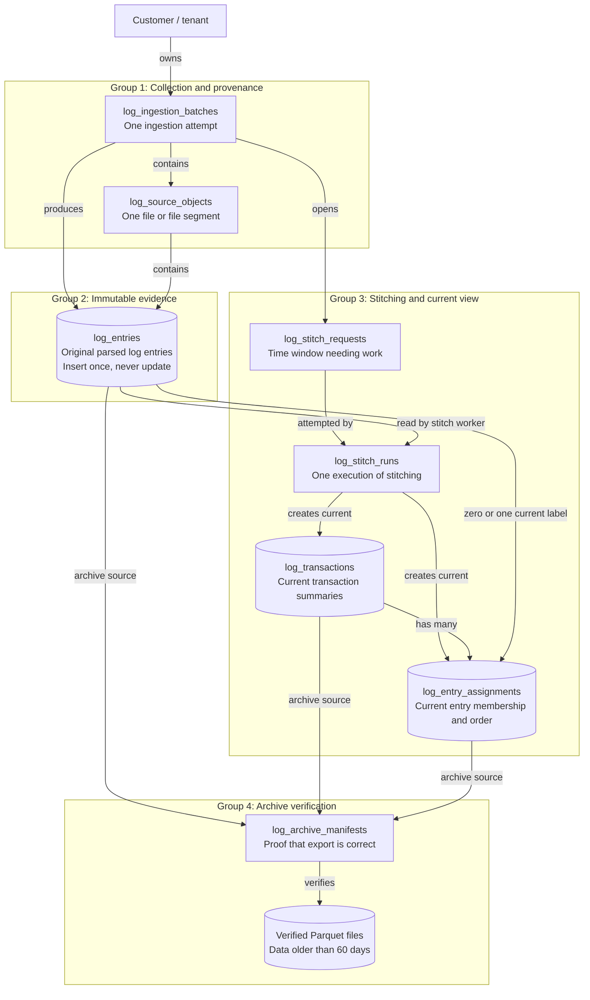
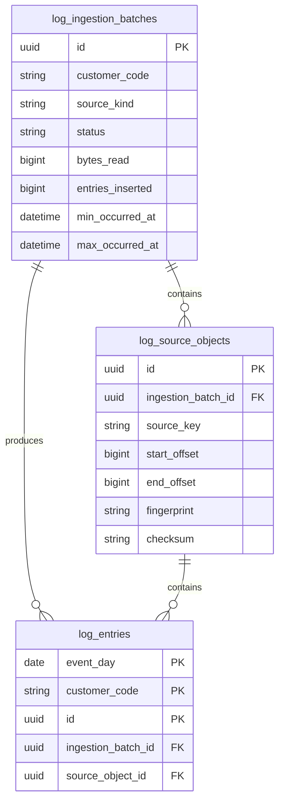
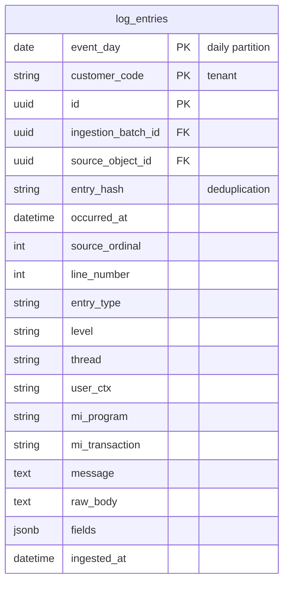
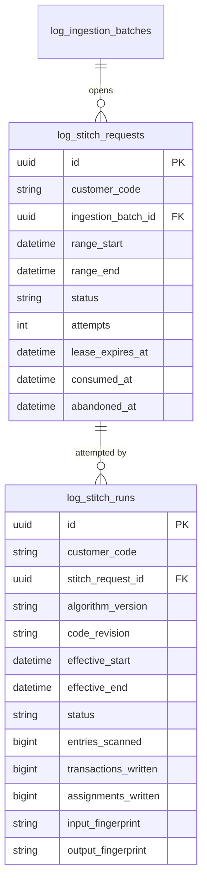
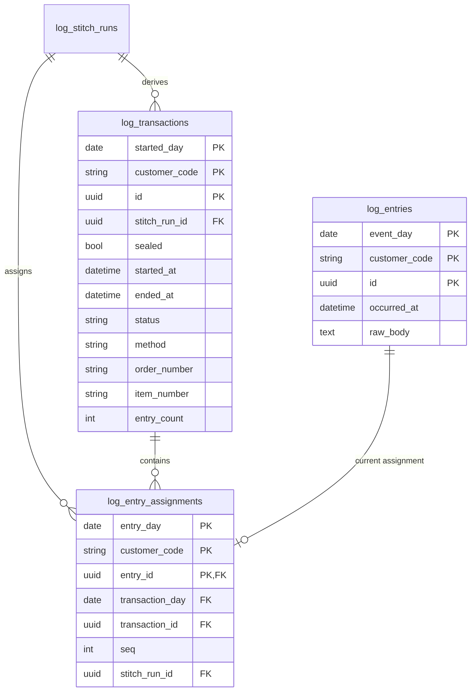
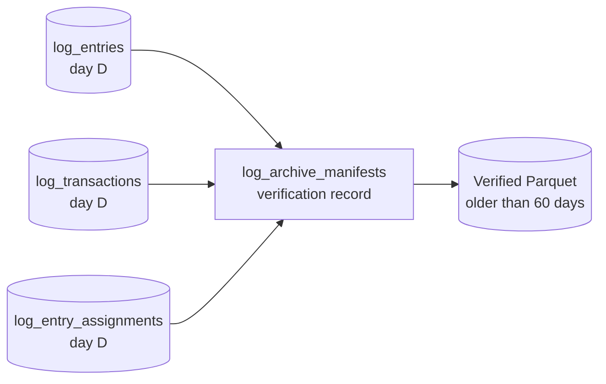
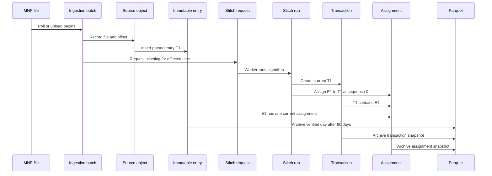
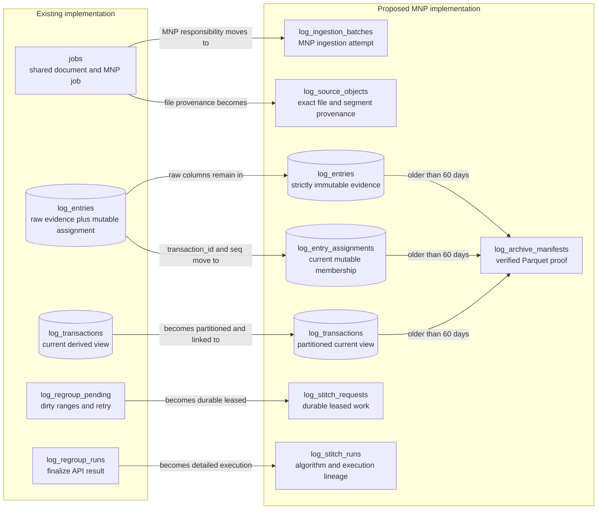

# MNP log grouped ER diagram for beginners

**Status:** Proposed design explanation

**Snapshot:** 2026-07-28 15:49:34 BST

**Scope:** Proposed MNP log-ingestion tables only

**Detailed schema:** [2026-07-28_12-22_mnp-log-postgresql-low-level-design.md](2026-07-28_12-22_mnp-log-postgresql-low-level-design.md)

**Interactive HTML:** [2026-07-28_15-49_mnp-log-grouped-er-diagram.html](2026-07-28_15-49_mnp-log-grouped-er-diagram.html)

## 1. Start with four groups, not eight tables

The proposed tables are easier to understand when grouped by responsibility:

| Group | Question it answers | Tables |
| --- | --- | --- |
| Collection and provenance | Where did this data come from? | `log_ingestion_batches`, `log_source_objects` |
| Immutable evidence | What did the MNP server actually write? | `log_entries` |
| Stitching and current view | How is the raw evidence currently grouped? | `log_stitch_requests`, `log_stitch_runs`, `log_transactions`, `log_entry_assignments` |
| Archive verification | Where is older verified data stored? | `log_archive_manifests`, plus Parquet files |

## 2. Grouped architecture diagram

This is the easiest high-level view:



## 3. The simplest analogy

Imagine a box of paper receipts.

### `log_entries` are the receipts

Each receipt records what the MNP server wrote.
Receipts are never rewritten.

### `log_transactions` are folders

Each folder represents one interpreted business transaction.
A folder contains a summary such as start time, end time, user, method, order number, and status.

### `log_entry_assignments` are removable labels

Each label says:

```text
Receipt E1 belongs to folder T1 at position 0.
Receipt E2 belongs to folder T1 at position 1.
Receipt E3 belongs to folder T1 at position 2.
```

If a late receipt appears, the receipts stay unchanged.
The system replaces the affected folders and labels.

### Stitch requests and runs are work tickets

`log_stitch_requests` says that a time range needs reconstruction.
`log_stitch_runs` records who processed the ticket, which algorithm was used, whether it succeeded, and what it produced.

### Archive manifests are shipping receipts

After 60 days, data is exported to Parquet.
The manifest proves what was exported, how many rows it contained, and which checksum was verified.

## 4. Group 1: Collection and provenance



### `log_ingestion_batches`

One row represents one ingestion attempt.

Examples:

- One SSH polling cycle.
- One uploaded log file.
- One directory-watcher operation.
- One replay operation.

It answers:

- Did ingestion succeed?
- How many bytes were read?
- How many new entries were inserted?
- What event-time range was affected?

It does not store the raw log message.

### `log_source_objects`

One row represents one exact source object or source segment.

Examples:

- `eSmartServerLog.txt`, bytes 5000 to 9000.
- A rotated file with a specific fingerprint.
- An uploaded file with a specific checksum.

It answers:

- Which file did the entry come from?
- Which offset was read?
- Was this a rotated or changed file?
- What fingerprint or checksum identified it?

It does not represent a business transaction.

## 5. Group 2: Immutable evidence



### `log_entries`

This is the most important table.
It is the source of truth.

One row represents one logical MNP log entry.
It may contain multiple physical text lines when those lines form one logical message.

It answers:

- What did the server write?
- When did it happen?
- Which source file and offset produced it?
- What parsed fields were extracted?

It does not contain:

- The current transaction ID.
- The current sequence inside a transaction.

Those mutable interpretations belong in `log_entry_assignments`.

## 6. Group 3: Stitching control



### `log_stitch_requests`

This is a durable work ticket.

It says:

```text
Customer ACME received new or late data from 10:00 to 10:05.
That time range needs stitching.
```

It answers:

- What range needs work?
- Is a worker processing it?
- How many times has it failed?
- Should it retry?
- Was it completed or abandoned?

### `log_stitch_runs`

This is the execution record for a work ticket.

One request can have multiple runs when an attempt fails and retries.

It answers:

- Which code and grouping algorithm ran?
- What effective padded window was read?
- How many entries were scanned?
- How many transactions and assignments were written?
- Did the run succeed?
- What input and output fingerprints were produced?

It provides history without storing a complete copy of every historical assignment.

## 7. Group 3: Current transaction view



### `log_transactions`

This is the current transaction summary.

It answers:

- When did the transaction start and finish?
- Was it successful, soft, error, or incomplete?
- Which user, warehouse, method, order, item, or delivery was involved?
- How many entries currently belong to it?

It is derived and replaceable.
It is not the original evidence.

### `log_entry_assignments`

This is the bridge between raw evidence and the current transaction.

One row means:

```text
Entry E1 currently belongs to transaction T1 at sequence 0.
```

The primary key allows at most one current assignment for each entry.

It answers:

- Which transaction currently owns this entry?
- In what order should the entry appear?
- Which stitch run produced the assignment?

This table exists so `log_entries` can remain immutable.

## 8. Why the assignment table is necessary

Without `log_entry_assignments`, the system would need to write mutable interpretation back onto `log_entries`.

```text
Current design:
log_entries.transaction_id = T1
log_entries.seq = 0
```

The proposed design moves those values:

```text
log_entries
E1 contains only immutable evidence.

log_entry_assignments
E1 -> T1, sequence 0.
```

When stitching changes:

```text
Delete affected assignment rows.
Delete affected transaction rows.
Insert corrected transaction rows.
Insert corrected assignment rows.
Commit everything together.
```

Raw entries remain untouched.

## 9. Group 4: Archive verification



### `log_archive_manifests`

This table does not contain the archived rows.
It contains proof about the archived files.

It answers:

- Which customer and UTC day were exported?
- Which dataset was exported?
- Where is the Parquet object?
- How many rows were written?
- Which schema version was used?
- Did timestamps, fingerprints, and checksums match?
- When was verification completed?

PostgreSQL partitions cannot be removed until the required manifests are verified.

### Verified Parquet

Parquet is not a PostgreSQL table.
It is the historical storage format for data older than the hot period.

It stores:

- Immutable entries.
- Transaction snapshots.
- Assignment snapshots.

## 10. One complete story

Follow one entry through the system:



## 11. Which table should I inspect?

| Your question | Start with |
| --- | --- |
| Did ingestion succeed? | `log_ingestion_batches` |
| Which file and offset produced this data? | `log_source_objects` |
| What did the MNP server actually write? | `log_entries` |
| Which time range is waiting for stitching? | `log_stitch_requests` |
| Why did stitching fail or produce this version? | `log_stitch_runs` |
| What are the current business transactions? | `log_transactions` |
| Which raw entries belong to this transaction? | `log_entry_assignments`, then `log_entries` |
| Was an old day safely exported? | `log_archive_manifests` |
| Where is data older than 60 days? | Verified Parquet |

## 12. What changes and what does not

| Table | Why it changes |
| --- | --- |
| `log_ingestion_batches` | Status and counters advance while ingestion runs |
| `log_source_objects` | Usually append-only provenance |
| `log_entries` | Insert-only and never updated |
| `log_stitch_requests` | Lease, retry, completion, or abandonment state changes |
| `log_stitch_runs` | Final status and counts are completed after execution |
| `log_transactions` | Current affected rows are atomically replaced during regroup |
| `log_entry_assignments` | Current affected rows are atomically replaced during regroup |
| `log_archive_manifests` | Export and verification state advances |

## 13. The three most important relationships

If you remember only three relationships, remember these:

```text
1. Source provenance

log_ingestion_batches
    -> log_source_objects
        -> log_entries

2. Current transaction timeline

log_transactions
    -> log_entry_assignments
        -> log_entries

3. Stitching lineage

log_stitch_requests
    -> log_stitch_runs
        -> log_transactions and log_entry_assignments
```

The first relationship explains where evidence came from.
The second relationship builds what users see.
The third relationship explains why the current view exists.

## 14. Existing implementation compared with the proposal

The proposal is an evolution of the existing MNP implementation.
It keeps the working ingestion and stitching concepts, but changes where responsibilities live.



## 15. Table-by-table comparison

### `jobs` compared with `log_ingestion_batches`

#### Existing responsibility

The existing `jobs` table represents both document/RAG jobs and MNP log-ingestion files.
`log_entries.job_id` and `log_transactions.job_id` reference it with `ON DELETE CASCADE`.

#### Existing limitation

- One table mixes two different domains.
- MNP provenance is represented mainly by filename and storage key.
- Deleting an MNP job can cascade into raw entries and derived transactions.
- It does not naturally represent one SSH polling increment, file offset, or replay range.

#### Proposed change

MNP ingestion uses `log_ingestion_batches`.
Document/RAG processing may continue using `jobs` outside this design.

#### Problem solved

- Separates MNP operational lineage from document processing.
- Records MNP-specific counts and event-time ranges.
- Uses `ON DELETE RESTRICT` so deleting a control record cannot accidentally erase raw evidence.
- Supports SSH, watcher, upload, replay, and cold-backfill modes directly.

### Existing `source_file` text compared with `log_source_objects`

#### Existing responsibility

`log_entries.source_file` stores a filename.
SSH checkpoints separately remember remote path, size, modification time, offset, and head fingerprint.

#### Existing limitation

- A filename alone does not identify an exact file version or byte range.
- Provenance information is split between entries, checkpoints, fetch results, and JSON.
- Deleting an SSH source intentionally preserves logs, but the exact historical source context is not normalized with each ingestion batch.

#### Proposed change

`log_source_objects` records one exact file or segment with source key, offset range, observed size, modification time, fingerprint, and checksum.

#### Problem solved

- Makes replay and rotation provenance explicit.
- Identifies precisely which source segment produced an entry.
- Preserves historical provenance even if the SSH source configuration later changes or is deleted.

### Existing `log_entries` compared with immutable `log_entries`

#### Existing responsibility

The existing table stores:

- Raw and parsed log evidence.
- Source filename and line number.
- The current `transaction_id`.
- The current sequence `seq`.

Stage 2 updates `transaction_id` and `seq`.
Deleting a transaction sets `transaction_id` to `NULL`.

#### Existing limitation

- The source-of-truth table is not strictly immutable.
- Regrouping repeatedly updates the largest table.
- Assignment indexes and heap rows create write amplification and dead tuples.
- Raw evidence and current interpretation have different lifecycles but share one row.
- The table is not time-partitioned for 60-day retention.

#### Proposed change

`log_entries` retains only canonical evidence and provenance.
It is daily partitioned, insert-only, and protected against updates.

#### Problem solved

- Stage 2 cannot mutate raw evidence.
- Retention uses verified daily partition archival rather than large row deletes.
- Raw evidence and current interpretation can scale independently.
- Indexes become specific to ingestion, window reading, and provenance.

### New `log_entry_assignments`

#### Existing equivalent

There is no separate table today.
Its information is currently stored in:

```text
log_entries.transaction_id
log_entries.seq
```

#### Existing limitation

Changing the current grouping requires updating raw-entry rows.

#### Proposed change

One assignment row contains:

```text
entry E1 currently belongs to transaction T1 at sequence 0
```

#### Problem solved

- Makes raw entries immutable.
- Gives the mutable current relationship its own smaller table.
- Allows assignments and transactions to be replaced atomically.
- Enforces at most one current assignment per entry.

### Existing `log_transactions` compared with proposed `log_transactions`

#### Existing responsibility

The existing table stores the current derived transaction summary.
It already has deterministic IDs, tenant fields, statuses, business dimensions, timestamps, counts, and summaries.

#### Existing strengths retained

- Deterministic transaction UUID.
- Rebuildable derived view.
- Promoted query dimensions.
- Success, soft, error, and incomplete status.
- Sealed transaction concept.

#### Existing limitation

- It is unpartitioned.
- It is coupled to shared `jobs` through `job_id`.
- It does not directly identify the exact stitch execution and algorithm that produced the row.
- Many legacy single-column indexes compete with the preferred tenant-first access pattern.

#### Proposed change

The proposed table:

- Uses daily `started_day` partitions.
- Removes MNP dependence on the shared document job.
- References `log_stitch_runs`.
- Stores derivation version and input fingerprint.
- Uses a smaller tenant-first index catalogue.

#### Problem solved

- Bounded indexes and retention.
- Better algorithm lineage.
- Cleaner MNP ownership.
- Faster tenant and time-scoped serving queries.

### Existing `log_regroup_pending` compared with `log_stitch_requests`

#### Existing responsibility

The current pending table records:

- Customer.
- Optional job.
- Dirty start and end time.
- Consumption time.
- Retry count.
- Last error and attempt.
- Abandonment time.

This is already a strong durable dirty-window journal.

#### Existing limitation

- Worker ownership is not represented as a durable lease.
- There is no explicit available time or lease expiry.
- Status is inferred from nullable timestamps.
- It is tied to the generic job identity.
- Horizontal worker claiming is not a complete first-class contract.

#### Proposed change

`log_stitch_requests` keeps the dirty-range concept and adds:

- Explicit status.
- MNP ingestion-batch reference.
- Lease owner.
- Lease expiry.
- Retry availability time.
- Maximum attempts.

#### Problem solved

- Multiple workers can claim independent work safely.
- Crashed worker leases can expire and recover.
- Queue state is easier to inspect.
- The same table supports single-host and multiple-host workers.

### Existing `log_regroup_runs` compared with `log_stitch_runs`

#### Existing responsibility

The current run table records the externally requested finalize operation:

- Running, completed, or failed status.
- Number of windows.
- Number of pending rows consumed.
- Error.
- JSON result.

#### Existing limitation

- Detailed per-window execution lineage is mostly inside JSON and logs.
- Algorithm version and code revision are not first-class columns.
- Input and output fingerprints are not recorded.
- Transactions and entry assignments do not reference the run that produced them.

#### Proposed change

`log_stitch_runs` records one bounded execution with:

- Request and effective windows.
- Algorithm version.
- Code revision.
- Input and output fingerprints.
- Entries scanned.
- Transactions and assignments written.
- Final status and error.

#### Problem solved

- Explains exactly how the current derived view was produced.
- Supports comparisons during algorithm migration.
- Provides ML and operational lineage without storing every historical assignment.

### New `log_archive_manifests`

#### Existing equivalent

There is no normalized verified-Parquet manifest table in the current MNP schema.

#### Existing limitation

- PostgreSQL contains the retained hot and historical log data.
- Retention depends on row deletion and database maintenance.
- There is no database ledger proving that a daily Parquet export was complete before deletion.

#### Proposed change

One manifest records the customer, UTC day, dataset kind, schema version, URI, row count, time range, source fingerprint, checksum, and verification status.

#### Problem solved

- Makes the 60-day archive boundary safe and auditable.
- Prevents partition removal before export verification.
- Supports historical analytics and ML without scanning hot PostgreSQL tables.

## 16. Existing SSH tables

The following existing tables remain part of upstream transport control:

- `log_ssh_sources`
- `log_ssh_file_checkpoints`
- `log_ssh_fetch_runs`

They are not replaced by the new stitching tables.

### `log_ssh_sources`

Continues to store how to connect to a remote MNP log source and whether polling is enabled.

### `log_ssh_file_checkpoints`

Continues to remember the last safely read offset and rotation fingerprint for each remote path.

### `log_ssh_fetch_runs`

Continues to track an externally requested or scheduled SSH fetch operation.

### Proposed integration

An SSH fetch run may create one or more `log_ingestion_batches`.
Each batch creates `log_source_objects`, immutable entries, and stitch requests.

```text
log_ssh_fetch_runs
    -> log_ingestion_batches
        -> log_source_objects
            -> log_entries
```

This preserves the difference between:

- Transport activity: connecting, listing, reading, retrying, and fetching.
- Data ingestion: parsing, deduplicating, inserting, and opening dirty windows.

## 17. Problem-to-solution summary

| Existing problem or gap | Proposed solution | Expected result |
| --- | --- | --- |
| Raw rows also hold mutable transaction assignment | Move assignment to `log_entry_assignments` | Immutable source of truth |
| Regroup updates the largest table | Replace smaller derived tables only | Less write amplification and vacuum pressure |
| Shared document and MNP `jobs` identity | Add MNP-specific `log_ingestion_batches` | Clear domain ownership and safer deletion |
| Filename-only entry provenance | Add `log_source_objects` | Exact file, segment, fingerprint, and checksum lineage |
| Unpartitioned hot log tables | Daily UTC partitions | Bounded indexes and precise retention |
| Job deletion cascades into raw logs | Use restricted MNP lineage references | Prevent accidental evidence deletion |
| Pending ranges lack durable worker leases | Add leased `log_stitch_requests` | Crash recovery and multiple-worker scaling |
| Run detail is mostly JSON and logs | Add detailed `log_stitch_runs` | Reproducible algorithm and execution lineage |
| No verified cold-storage ledger | Add `log_archive_manifests` | Safe 60-day Parquet handoff |
| Many broad indexes | Use partition-pruned tenant-first indexes | Lower write cost and predictable query plans |
| Full or incremental regroup can commit deletion before recreation | Atomic assignment and transaction replacement | Previous current view survives failure |

## 18. What does not change

The proposal does not discard the useful parts of the current system.

The following concepts remain:

- Raw entries are the canonical evidence.
- Transaction stitching is driven by dirty time windows.
- Transactions use deterministic identity.
- Late data can rebuild sealed historical windows inside the hot period.
- Tenant scoping remains mandatory.
- Stitching remains bounded by padded windows.
- Poison windows retry and eventually dead-letter.
- SSH checkpoints continue protecting incremental reads and rotation recovery.
- Users continue reading transaction summaries and ordered entry timelines.

The main change is separation of responsibilities, not replacement of the MNP domain logic.
