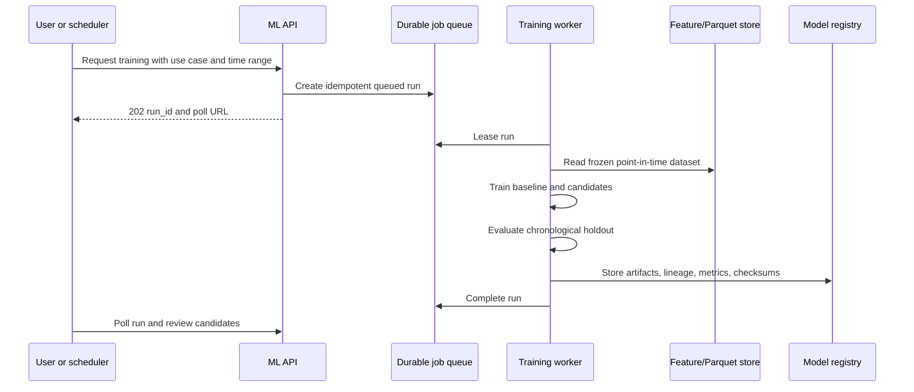
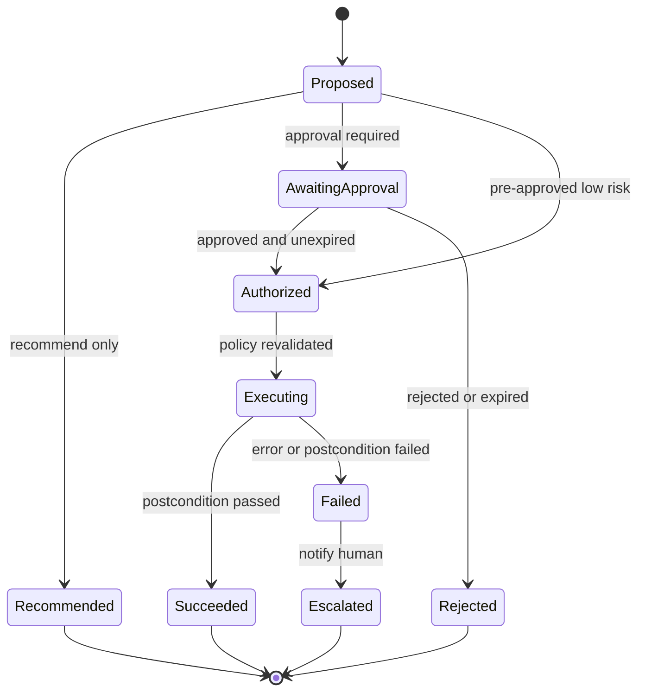

# Scalable data processing, machine learning, and agent platform

**Status:** Proposed for review

**Date:** 2026-07-27

**Scope:** Architecture only

## 1. Executive decision

The platform should evolve as a modular data and ML system built around the existing FastAPI, PostgreSQL, log-ingestion, RAG, notification, and log-agent capabilities.
It should run as several isolated process roles on one self-hosted machine first, while using durable database queues and shared artifact interfaces that permit those roles to move to multiple hosts later.

PostgreSQL remains the operational system of record and control plane.
Raw and derived analytical history moves through a medallion-style data plane using partitioned hot tables, Parquet, and an object-store interface.
Separate workers perform feature generation, training, evaluation, batch prediction, real-time scoring, incident creation, and governed action execution.

The first production ML use case should be transaction failure-risk prediction because the repository already contains a usable operational outcome label in `log_transactions.status`.
Duration prediction and demand forecasting should follow on the same platform.
Root-cause classification needs a curated incident-resolution label and therefore requires a human feedback workflow before it can be considered supervised learning.

Agents may investigate, recommend, open incidents, notify teams, request pipeline runs, and propose remediation.
They must never receive direct infrastructure credentials or unrestricted side-effect tools.
All actions go through a durable proposal, policy, approval, execution, and audit workflow.

## 2. Confirmed requirements

### Functional requirements

- Ingest and process at least 1 million log rows per day, with headroom above that rate.
- Retain 3 to 6 months of data.
- Support exploratory analysis and log exploration.
- Train and compare multiple machine learning models.
- Produce real-time predictions where practical and batch predictions where appropriate.
- Detect anomalies and warn when operations appear likely to fail.
- Forecast demand, volume, and duration.
- Classify failures and, once labels exist, predict likely root causes.
- Open incidents and notify teams.
- Trigger governed feature, training, and retraining pipelines.
- Support copilots that investigate data and recommend or request actions.
- Run on one self-hosted machine initially.
- Scale to multiple hosts without redesigning data contracts or workflows.

### Non-functional requirements

- Tenant isolation must apply to every table, queue, artifact, metric, prediction, incident, and action.
- Training must not block the FastAPI event loop or compete directly with the serving database.
- All large reads must be bounded, streamed, partition-pruned, or executed outside the web tier.
- Jobs must survive process and machine restarts.
- Training must be reproducible from a dataset manifest, feature version, code revision, parameters, and random seed.
- Predictions must identify the exact model version and feature version that produced them.
- Model promotion must be reversible.
- Agent actions must be auditable, idempotent, policy-controlled, and fail closed.
- The system must expose operational and ML observability.

## 3. Capacity model

One million raw rows per day produces approximately:

| Retention | Raw rows |
| --- | ---: |
| 90 days | 90 million |
| 180 days | 180 million |

The design must also tolerate bursts above the daily average.
At exactly 1 million rows per day, the average arrival rate is only about 12 rows per second, but file catch-up and remote-fetch bursts can be orders of magnitude higher.
Capacity tests must therefore use both sustained ingestion and burst backfill workloads.

Storage cannot be sized accurately from row count alone.
Before implementation, measure the actual p50, p95, and p99 stored bytes per `log_entries` row, including indexes and TOAST data.
The capacity formula is:

`required_hot_bytes = rows_per_day × hot_days × bytes_per_row × index_factor × headroom`

Use at least 30 percent free disk headroom for PostgreSQL maintenance and temporary operations.
SSD or NVMe is a baseline requirement for the hot operational store.

## 4. Current repository baseline

The repository already provides several sound foundations:

- FastAPI and async SQLAlchemy provide the web and persistence layers.
- PostgreSQL coordinates web and worker processes.
- `log_entries` is the lossless Stage 1 source of truth.
- `log_transactions` is a rebuildable Stage 2 serving entity with deterministic IDs.
- `log_regroup_pending` is a durable dirty-window journal.
- The embedding queue demonstrates database-mediated asynchronous work.
- Notifications use a durable outbox and per-channel delivery records.
- The log copilot uses tenant-scoped, read-only tools.
- Production deployment already separates the web tier from a dedicated background worker.

The principal gaps are:

- Raw and derived log tables are not yet partitioned for 90 to 180 million retained rows.
- Operational serving, historical analytics, and future training would compete for one PostgreSQL workload.
- The current background worker is a singleton for all loops and is not an independently scalable execution plane.
- There is no feature registry, training-run tracker, model registry, prediction store, drift monitor, or model promotion workflow.
- There is no incident and action-approval control plane.
- Authentication and RBAC are not implemented, so side-effecting agent execution is currently unsafe.
- Existing outcome labels support failure and duration work, but root-cause and demand annotations require additional definition and curation.

## 5. Target architecture

### 5.1 Logical component view

```mermaid
flowchart LR
    Sources["Files, SSH/SFTP, uploads, APIs"] --> Ingest["Ingestion workers"]
    Ingest --> Raw[("Bronze: partitioned log_entries")]
    Ingest --> Dirty[("Durable dirty-window/outbox")]
    Dirty --> Stitch["Transaction stitching workers"]
    Stitch --> Serve[("Silver: partitioned log_transactions")]
    Serve --> API["FastAPI serving APIs"]
    Serve --> Feature["Feature workers"]
    Raw --> Archive["Verified Parquet export"]
    Serve --> Archive
    Archive --> Lake[("Object store / local S3 interface")]
    Lake --> Train["Training and evaluation workers"]
    Feature --> Online[("Online feature snapshots")]
    Feature --> Lake
    Train --> Registry[("Model registry and artifacts")]
    Registry --> Score["Real-time and batch scoring workers"]
    Online --> Score
    Score --> Pred[("Predictions")]
    Pred --> Incident["Incident service"]
    Incident --> Notify["Notification outbox"]
    Incident --> Copilot["Investigation copilot"]
    Copilot --> Proposal[("Action proposals")]
    Proposal --> Policy["Policy and approval service"]
    Policy --> Executor["Allowlisted action executor"]
    Executor --> Audit[("Immutable audit events")]
```

### 5.2 Deployment view

Run the following roles separately even when they share one host:

| Role | Responsibility | Scaling model |
| --- | --- | --- |
| Web API | Bounded reads, commands, status polling | Multiple stateless processes |
| Ingestion worker | Fetch, parse, deduplicate, append | Scale by source or tenant |
| Stitching worker | Convert dirty windows into transactions | Scale by tenant/window claims |
| Feature and scoring worker | Online features and low-latency inference | Scale by queue partitions |
| Training worker | Dataset build, model tournament, evaluation | Scale independently, CPU/RAM isolated |
| Archive worker | Export, verify, manifest, retention | Single scheduler with resumable jobs |
| Notification worker | Durable channel delivery | Scale through leased claims |
| Action executor | Execute approved allowlisted playbooks | Isolated credentials and strict concurrency |

On one host, systemd services or containers should supervise each role.
CPU, memory, I/O priority, and concurrency limits should prevent training from starving ingestion or the API.

On multiple hosts, workers claim jobs using PostgreSQL leases and access model or dataset artifacts through an S3-compatible object-store interface.
No in-memory queue or process-global task registry may be required for correctness.

## 6. Data architecture

### 6.1 Bronze layer

`log_entries` remains the lossless source of truth.
The proposed future schema makes it append-only and partitions it by event month.
A default or quarantine partition holds invalid or timestamp-less records.

The existing `(customer_code, entry_hash)` replay invariant must be preserved.
Partitioning changes PostgreSQL unique-index rules, so the migration design must prove duplicate handling across partition boundaries before approval.

### 6.2 Silver layer

`log_transactions` remains the canonical operational and ML entity.
It should be partitioned by `started_at` month and indexed for tenant-first access patterns.
Only sealed transactions should normally enter stable training datasets.
Provisional real-time predictions may be revised when a transaction becomes sealed.

The proposed append-only raw design moves mutable transaction membership into a separate assignment table.
That change is substantial and requires its own migration plan, E2E replay tests, and performance proof.

### 6.3 Gold layer

Gold datasets contain purpose-specific aggregates and labels:

- Transaction failure examples.
- Transaction duration examples.
- Transaction counts by tenant, warehouse, method, and fixed time bucket.
- Error and incident root-cause examples.
- Operational service-level and capacity aggregates.

Gold datasets must be versioned by:

- Feature-set name and version.
- Event-time window.
- Entity selection predicate.
- Label definition.
- Source watermark.
- Code revision.
- Dataset checksum.

### 6.4 Hot and cold retention

Keep recent serving data in PostgreSQL.
Export older partitions to Parquet through an idempotent archive job.
The archive sequence is:

1. Freeze or identify a stable source watermark.
2. Export the partition to a temporary artifact.
3. Compute row counts, min/max timestamps, schema fingerprint, and checksums.
4. Write an immutable manifest.
5. Verify the exported dataset against the source.
6. Promote the artifact to its final path.
7. Detach or drop the PostgreSQL partition only after verification.

The exact hot period should be decided from measured user-query behavior.
A reasonable starting proposal is 30 to 90 days hot and the remainder of the 3 to 6 month retention window in Parquet.

### 6.5 Storage choices

| Concern | Initial choice | Multi-host evolution |
| --- | --- | --- |
| Operational records | PostgreSQL | PostgreSQL primary plus replicas or managed-compatible cluster |
| Durable job control | PostgreSQL queues with leases | Same, until measured broker need |
| Analytical files | Parquet on local object-store interface | MinIO cluster or cloud object storage |
| Local analytical engine | DuckDB | DuckDB, Trino, ClickHouse, or warehouse based on measured concurrency |
| Model artifacts | Object store with checksums | Same interface on shared object storage |
| Vector retrieval | Existing pgvector or Qdrant abstraction | Scale selected backend independently |

Kafka is deliberately deferred.
At the stated starting scale, a transactional outbox and leased PostgreSQL queues provide simpler correctness and operations.
Introduce a broker only when measured fan-out, replay throughput, or independent consumer scale exceeds the database queue design.

## 7. Machine learning lifecycle

### 7.1 Use-case portfolio

| Use case | Target | Initial label | Serving mode |
| --- | --- | --- | --- |
| Failure-risk prediction | Probability of eventual error | Final sealed transaction status | Real-time and batch |
| Duration prediction | Expected completion time | Final `duration_ms` | Real-time |
| Demand forecasting | Future transaction counts by bucket | Historical bucket counts | Scheduled batch |
| Anomaly detection | Deviation from learned baseline | Usually unsupervised, later confirmed by operators | Streaming and batch |
| Root-cause classification | Incident cause category | Human-confirmed incident resolution | Batch training, real-time inference |
| Remediation recommendation | Ranked safe playbooks | Historical approved actions and outcomes | Agent-assisted |

### 7.2 Label audit

The statement that the data “has labels” is partly confirmed.
`log_transactions.status` supplies a direct operational outcome label, and `duration_ms` supplies a regression target.
Demand can be derived from event counts.

Root-cause labels are not established merely because `error_text` exists.
Free text is evidence, not a verified cause.
Introduce a root-cause taxonomy and store operator-confirmed incident resolutions before training a supervised root-cause model.

### 7.3 Feature views

Maintain separate point-in-time feature contracts:

- `transaction_start_v1` contains only information available when the request begins.
- `transaction_live_v1` adds elapsed time and partial event counts available at the scoring instant.
- `transaction_final_v1` contains completed outcome context for retrospective analysis, but must not train a pre-failure model with leaked target fields.
- `demand_bucket_v1` contains fixed interval counts and calendar or operational covariates.

Each prediction stores the feature-set version and a feature snapshot fingerprint.
Offline training must reconstruct features using event time, not current state.

### 7.4 Model scanning and tournament

“Scanning models” should be implemented as a controlled model tournament:

1. Build one frozen, leakage-checked dataset.
2. Train a simple baseline.
3. Train several eligible algorithms with bounded hyperparameter search.
4. Evaluate all candidates on chronological holdout data.
5. Compare performance, latency, artifact size, explainability, and operational cost.
6. Reject candidates that fail data-quality, fairness, calibration, latency, or stability gates.
7. Register every candidate and its metrics.
8. Promote only an approved candidate to shadow or production.

Candidate families may include:

- Logistic regression as an interpretable failure baseline.
- Gradient-boosted trees for structured failure and duration prediction.
- Isolation Forest or robust statistical detectors for anomalies.
- Seasonal naive, exponential smoothing, and gradient-boosted lag models for demand forecasting.
- Text embeddings plus a supervised classifier for root-cause categories after labels exist.

The architecture must not assume that the most complex model wins.
A candidate must materially beat the baseline while meeting latency and maintainability gates.

### 7.5 Training workflow

Training must execute outside request handlers.
CPU-heavy transformations and algorithms must run in a separate process, not merely an asyncio coroutine.

### 7.6 Model registry and promotion

The proposed registry records:

- Tenant or global scope.
- Use case and model name.
- Immutable semantic version.
- Training run.
- Algorithm and parameters.
- Dataset manifest URI and checksum.
- Feature-set version.
- Code revision.
- Metrics and evaluation slices.
- Artifact URI and checksum.
- Lifecycle stage: candidate, shadow, production, archived.
- Approver, promotion time, and rollback target.

Model promotion is a metadata change, never an artifact overwrite.
Keep the previous production version available for immediate rollback.

### 7.7 Real-time inference

The transaction pipeline should emit a durable scoring event after a relevant transaction state change commits.
A scoring worker loads the tenant and use-case production model into a bounded cache, constructs the correct point-in-time feature view, and writes an idempotent prediction.

Prediction identity should include:

- Customer.
- Entity ID.
- Entity state or feature fingerprint.
- Model version.
- Prediction kind.

High-risk predictions create or update a deduplicated incident and publish through the existing durable notification outbox.
Scoring failure must not roll back ingestion or transaction stitching.

### 7.8 Batch inference and forecasting

Batch prediction workers process explicit tenant and time partitions with checkpoints.
Demand forecasts operate on fixed time buckets rather than raw log entries.
Backfills write new versioned predictions and supersede older results instead of silently overwriting history.

## 8. MLOps quality gates

### Data gates

- Required columns and types match the feature contract.
- No target or post-outcome leakage is present.
- Training data includes only permitted tenants and time windows.
- Label distribution and missingness remain within configured tolerances.
- Dataset checksum and row counts are recorded.

### Evaluation gates

- Chronological holdout is mandatory.
- Precision, recall, F1, calibration, and alert volume are reported for failure models.
- MAE, median absolute error, and high-percentile error are reported for duration.
- Forecast error is compared with seasonal naive baselines.
- Metrics are sliced by customer, warehouse, method, and time period where sample size permits.
- Real-time scoring p95 and p99 latency meet the serving budget.

### Promotion gates

- Candidate beats the approved baseline by the agreed margin.
- Artifact checksum and compatibility checks pass.
- Shadow results show acceptable alert volume and stability.
- A human approves the first production promotions.
- Rollback is tested.

### Monitoring gates

- Input schema drift.
- Feature missingness and distribution drift.
- Prediction distribution and confidence drift.
- Delayed ground-truth performance.
- Alert precision and operator feedback.
- Data freshness and scoring lag.
- Model age and retraining policy.

Retraining may be scheduled or triggered by drift, but deployment of a newly trained model remains a separate governed decision.

## 9. Agentic and copilot architecture

### 9.1 Separation of reasoning and execution

The existing investigation copilot should remain read-only.
Side effects belong to a separate action-control plane.

### 9.2 Authority ladder

| Mode | Meaning | Example |
| --- | --- | --- |
| Recommend only | Agent records advice but cannot execute | Restart a production service |
| Human approval | Agent proposes an action and waits for an authorized approver | Trigger pipeline, retrain, controlled restart |
| Pre-approved low risk | Explicit allowlisted action may execute within strict bounds | Open incident, attach evidence, send deduplicated alert |

Unknown actions always resolve to recommend-only and execution denied.

### 9.3 Action proposal

Every proposal records:

- Tenant.
- Actor and model identity.
- Incident and evidence references.
- Action type and typed parameters.
- Risk tier.
- Requested blast radius.
- Rationale.
- Policy version.
- Idempotency key.
- Expiry.

### 9.4 Approval and execution

The executor must revalidate immediately before execution:

- Authenticated actor and tenant membership.
- Current policy and kill switch.
- Approval scope and expiry.
- Action allowlist and parameter schema.
- Blast-radius maximum.
- Rate limit and cooldown.
- Idempotency.
- Target health and preconditions.

Executors use narrow service credentials and action-specific adapters.
Each playbook defines a dry run, timeout, postcondition, and compensation or rollback where possible.

### 9.5 Current security blocker

The current repository does not implement real authentication or RBAC.
Therefore the proposed action executor must remain disabled until identity, tenant membership, roles, service accounts, and authorization tests are implemented.
This is a release blocker, not a future enhancement.

## 10. Proposed control-plane data model

This is a proposal only and must not be treated as the current schema.

| Entity | Purpose |
| --- | --- |
| `ml_jobs` | Durable leased queue for feature, training, evaluation, and prediction work |
| `ml_training_runs` | Reproducible run metadata and status |
| `ml_model_versions` | Immutable registry records and lifecycle |
| `ml_predictions` | Idempotent versioned inference results |
| `ml_incidents` | Deduplicated operational incident lifecycle |
| `ml_action_requests` | Agent or human action proposals and execution state |
| `ml_action_approvals` | Scoped approval decisions and policy snapshots |
| `ml_audit_events` | Append-only security and lifecycle audit trail |

All operational indexes begin with `customer_code`.
Large datasets and model binaries live in object storage and are referenced by URI and checksum.

## 11. Proposed API contracts

Long-running commands return `202 Accepted` and a poll URL.
Every cross-tenant lookup returns not found rather than revealing object existence.

| Method and path | Purpose |
| --- | --- |
| `POST /api/v1/ml/training-runs` | Queue a reproducible model tournament |
| `GET /api/v1/ml/training-runs/{id}` | Poll training and evaluation status |
| `GET /api/v1/ml/models` | List model versions and stages |
| `POST /api/v1/ml/models/{id}/promote` | Request or approve stage promotion |
| `POST /api/v1/ml/predictions/score` | Queue bounded on-demand scoring |
| `GET /api/v1/ml/predictions` | Query bounded predictions |
| `GET /api/v1/ml/incidents` | Query tenant incidents |
| `POST /api/v1/ml/actions` | Record a governed action proposal |
| `POST /api/v1/ml/actions/{id}/approve` | Approve within an explicit scope and expiry |
| `GET /api/v1/ml/actions/{id}` | Inspect policy, execution, and audit state |

Idempotency keys are required for every mutating command.
Pagination and hard maximums are required for every list.

## 12. Reliability model

Durable jobs use:

- `pending`, `running`, `succeeded`, `failed`, `cancelled`, and `dead` states.
- Attempt count and maximum attempts.
- `available_at` for retry scheduling.
- Lease owner and lease expiry.
- Heartbeats for long work.
- Idempotency key.
- Structured error and final result.

Workers claim bounded batches with `FOR UPDATE SKIP LOCKED`.
An expired lease makes abandoned work recoverable.
Poison jobs dead-letter after a bounded number of attempts and produce an operational alert.

Training, scoring, notification, and remediation failures are isolated from ingestion.
No downstream ML failure may corrupt or delay the source-of-truth write path.

## 13. Observability

### Platform metrics

- Ingest rows and bytes per second.
- Dirty-window age and stitch lag.
- Queue depth, oldest age, lease expiry, retry, and dead-letter counts.
- PostgreSQL query latency, locks, bloat, vacuum, disk, and replication state.
- Parquet export throughput and verification failures.

### ML metrics

- Feature freshness and missingness.
- Training duration and failure rate.
- Scoring throughput and latency.
- Prediction and alert distributions.
- Model performance after labels arrive.
- Drift by tenant and feature.

### Agent metrics

- Proposals by type and risk.
- Approval, rejection, and expiry rates.
- Execution success, rollback, and postcondition failure.
- Duplicate suppression.
- Policy denials and kill-switch activity.

Every request, run, prediction, incident, and action carries a correlation ID.

## 14. Key risks and mitigations

| Risk | Mitigation |
| --- | --- |
| PostgreSQL contention between serving and ML | Export analytical data, separate workers, resource limits, bounded queries |
| Target leakage | Point-in-time feature contracts and automated leakage tests |
| Weak or incorrect labels | Label audit, human confirmation, taxonomy versioning |
| Alert fatigue | Calibrated thresholds, deduplication, budgets, shadow mode |
| Tenant data leakage | Tenant-first schema, server-injected scope, RBAC, cross-tenant tests |
| Lost background work | Durable leased queues and idempotency |
| Unsafe agent action | Separate action plane, allowlist, approval, kill switch, audit |
| Model regression | Baselines, chronological evaluation, shadowing, promotion gates, rollback |
| Single-host resource exhaustion | Separate roles, CPU/RAM/I/O limits, NVMe, capacity alerts |
| Premature platform complexity | Defer Kafka, Kubernetes, and a distributed feature store until measurements justify them |

## 15. Decisions required before implementation

The following items need explicit approval:

1. Approve PostgreSQL plus Parquet/object storage as the initial operational and analytical split.
2. Approve the first production use case as failure-risk prediction.
3. Define whether models are tenant-specific, global with tenant features, or hybrid.
4. Define the acceptable false-alert budget and failure-model recall target.
5. Define a root-cause taxonomy and responsible label owners.
6. Choose the first hot-retention period within the proposed 30 to 90 day range.
7. Approve the proposed control-plane entities.
8. Approve authentication and RBAC as a prerequisite for action execution.
9. Define the first allowlisted low-risk actions.
10. Approve the phased roadmap and its release gates.

