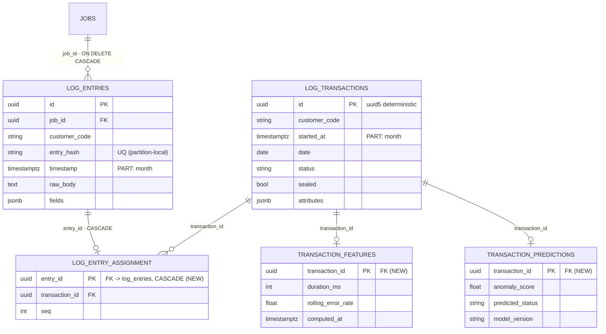
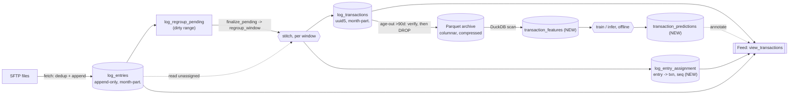

# Data architecture at scale: ingestion, serving, and ML for log_entries / log_transactions

A design review and hardened target architecture for the two core log tables, so the same data can be ingested at scale, served to the transaction-view feed, and mined by machine learning - each on storage suited to its job.
This version is **code-verified**: every claim was checked against the actual write path (`parse_insert.py`, `derive_transactions.py`) and read path (`logs.py`), not the docs alone.

Companion visual: `docs/data-architecture-scale-ml.html`.
Related: `docs/logs-view-transactions-query-flow-and-sort-fix.md`, `docs/transactions-view-load-spike-and-db-concepts-primer.md`, `docs/transaction-log-ingestion-design.md`, `docs/stage2-stitching-stall-postmortem-and-fix.md`.

## Goals

- Ingest at ~100x today's volume, across many tenants.
- Keep the transaction-view feed fast.
- Add ML predictions: anomaly/error prediction, duration/volume forecasting, classification/tagging.
- Run on a single self-hosted VM today; scale out later without a rewrite.
- Keep ~90 days hot (instantly queryable in the feed); archive older data.
- Be robust to every documented window/seal/catchup/backfill/deletion scenario.

## Verdict

Keep the source-of-truth-plus-derived split - it is a working CQRS pattern and `log_transactions` is fully rebuildable from `log_entries` via deterministic ids.
Change three things: the Stage-2 update-in-place on `log_entries`, the lack of partitioning, and running every workload from one row-store.
Reading the code confirmed the change is safe and mostly *improves* the write path, but surfaced three items that must be designed explicitly (Section 5) and a set of edge cases that must be handled (Section 7).

## The unavoidable trade-off

100x + full ML + robustness on one rotational HDD cannot all hold forever - that disk is the wall and it already failed.
This design removes the self-inflicted damage (so one VM goes far further) and keeps every layer portable (native partitions, Parquet, standard SQL) so scaling out is a config change, not a rewrite.
The one non-negotiable hardware step is SSD/NVMe.

---

## 0. How the pipeline works today (the window model)

Foundational context the redesign must preserve.
This absorbs the visuals from the former `docs/log-pipeline.html` (now folded into `docs/data-architecture-scale-ml.html`).

**Two decoupled stages.**
Stage 1 (fetch) pulls files and appends their lines to a pool of timestamped `log_entries`, and each file flags the min/max time-range it touched (`log_regroup_pending`).
Stage 2 (stitch) groups entries into `log_transactions` **by time, not by file**, so a request in one rotated file and its response in the next reassemble automatically.

**One poll -> one stitch -> N clusters.**
All of a poll's files are ingested first; then `finalize_pending` runs once per customer.
It does not take one giant `min..max` window - it sorts the dirty ranges and merges them into clusters, where a range joins the current cluster only if it starts within **30 min (= 2 x the 15-min pad)** of that cluster's running end, else it opens a new cluster.
So a stale range weeks in the past can never merge into today's live cluster and balloon a rebuild.

**The three numbers.**
- `hi - lo` = the cluster/run width - data-driven, no maximum (seconds in steady state, hours/days after downtime).
- **6 h** (`log_regroup_max_window_seconds`) - caps the sub-window a run is *sliced* into for committing, never the run itself; a 14 h run -> 3 commits.
- **±15 min** (`log_regroup_pad_seconds` = seal window) - every rebuilt window is padded each side so a transaction is never cut at the edge; consecutive sub-windows overlap here and rebuild the seam identically (lossless).

Total commits for a stitch = sum over clusters of `ceil(cluster_span / 6h)`.

**Backfill is lossless, order-independent, idempotent.**
A late/old file inserts entries with their old timestamps and marks an old pending range; the next stitch rebuilds exactly that old window (deleting + rebuilding sealed transactions too), with the same deterministic ids - regardless of arrival order.

**Failure isolation + dead-letter.**
Each cluster commits on its own transaction under a per-customer advisory lock; a failing cluster stays open and is retried, and after `log_regroup_max_attempts` (default 3) is ABANDONED (dead-lettered) with a CRITICAL alert so one poison window can't burn the 120 s timeout every poll.
Re-arm with `POST /logs/regroup/reset-abandoned`.

**Resume after downtime.**
The SSH poller uses a bounded forward-only resume + a circuit breaker (auto-disable after ~10 min of failure); `entry_hash` dedup makes every re-read correct; the backlog then drains cluster-by-cluster.

The redesign changes **none** of this control flow - only where `regroup_window` *writes* (Section 5).

---

## 1. What is wrong today (verified against the code)

1. Stage 2 UPDATEs `transaction_id`/`seq` onto `log_entries` rows after insert (`derive_transactions.py:520-522`), and deletes cascade `transaction_id -> NULL` (`log_entry.py:52-54`, `ON DELETE SET NULL`).
   Those columns are indexed, so every rewrite rewrites indexes: 0% HOT, ~10 updates per insert, ~91% dead-tuple bloat, a 40 GB heap, and `VACUUM`/`DELETE` that cannot even run on a disk with bad sectors.
   The per-5-second re-grouping of the unsealed tail (`regroup_incremental` / `regroup_window`) rewrites the same tail entries ~180 times before they seal - the churn source.
2. Neither table is partitioned, so retention means `DELETE` + `VACUUM` (both read the whole table and hit bad sectors), and one bad sector poisons the entire table.
3. Ingestion (write-heavy), serving (low-latency reads), the notification engine (recent reads), and future ML (full scans) all share one row-store with conflicting needs.

What is **already good** (do not change):
- Stage 1 is **already append-only**: `pg_insert(LogEntry).on_conflict_do_nothing(index_elements=["customer_code","entry_hash"]).returning(timestamp)` (`parse_insert.py:58-61`).
- The dirty window is derived from `RETURNING` timestamps, never a scan, to avoid reading old/bad blocks (`parse_insert.py:117-132`).
- Deterministic ids: `uuid5(customer_code + anchor_entry.entry_hash)` (`derive_transactions.py:430-443`) - a regroup reproduces the same id.
- `finalize_pending` is already the live path (the count-change grouping worker is disabled by default): per-run own session, sub-windows <=6 h each committing independently, per-customer advisory lock, 3-attempt dead-letter (`derive_transactions.py:747-866`).

---

## 2. Correction to an earlier claim

The reads are **not** 409-gated.
`read_pending_state` (`logs.py:69-98`) is a **soft** gate: reads always succeed and carry a `pending_regroup` flag; `finalize=true` stitches first.
The design must preserve soft, always-consistent reads (Stage 1 only adds entries, so a query never shows a half-built transaction) - not a 409.

---

## 3. Target architecture (medallion / CQRS)

### Layer 1 - Ingest: `log_entries` append-only + month-partitioned
- Keep Stage 1 exactly as-is (already append-only, dedup, RETURNING window).
- Move the grouping result off the raw table into `log_entry_assignment(entry_id, transaction_id, seq)`; `log_entries` is never rewritten.
- Range-partition `log_entries` by month on `timestamp`.
- Retention = `DROP PARTITION` (instant, reads nothing, sidesteps bad sectors).

### Layer 2 - Serve: `log_transactions` month-partitioned, ~90-day hot
- Range-partition `log_transactions` by month on `started_at`.
- Detach partitions older than ~90 days to the archive; feed and notification engine only read recent (hot) partitions.
- Feed entry fetch joins `log_entry_assignment`, then the Python per-transaction sort already shipped (`logs.py` `_entry_sort_key`).

### Layer 3 - Archive + analytics/ML store: Parquet + DuckDB (same VM)
- Aged-out months export to compressed Parquet (~5-10x smaller), then the PG partition is dropped.
- DuckDB (embedded, no server) runs full-scan analytical/ML feature queries over Parquet - never touching OLTP Postgres.
- Parquet is portable: moving the archive to object storage / a warehouse later is a path change, not a rewrite.

### Layer 4 - ML: offline features + predictions table
- Batch feature build (DuckDB over Parquet + recent hot) -> `transaction_features`.
- Train offline; model artifacts on disk, not the DB.
- Inference -> small `transaction_predictions` table keyed by `transaction_id`, cheap for the feed to join.
- Anomaly/error, duration/volume forecast, classification/tagging - text tagging reuses the existing pgvector/Qdrant embeddings.

---

## 4. Data flow (worked, with the new table)

```
raw lines --Stage1 INSERT ON CONFLICT--> log_entries (raw, append-only, month-partitioned)
                                              |  + log_regroup_pending(range_start,range_end)
                                        Stage2 finalize_pending -> regroup_window (per pending window)
                                              |--> log_transactions   (deterministic id, month-partitioned)
                                              '--> log_entry_assignment (entry_id -> txn_id, seq)   [replaces UPDATE of log_entries]
feed  = log_transactions (hot month)  JOIN log_entry_assignment  JOIN log_entries    (soft-gated, always consistent)
age>90d = export month to Parquet -> verify -> DROP PARTITION
ML    = DuckDB over Parquet -> transaction_features -> model -> transaction_predictions  (joined into feed)
```

### ER diagram (target schema)



`log_entries` loses its `transaction_id`/`seq` columns (they move to `LOG_ENTRY_ASSIGNMENT`), which is what makes it append-only.
`log_regroup_pending` is unchanged (a soft-referenced control table that drives which windows regroup) and is omitted here for clarity.
Months older than 90 days are exported to Parquet (external, not a PG table) and their partitions dropped.

### Data-flow diagram



The write path never rewrites `log_entries`; the archive/ML lane runs entirely off the OLTP store.

---

## 5. The three code-grounded changes (must be explicit, not assumed)

### 5.1 Replace the `transaction_id IS NULL` detection with a window-scoped anti-join
`transaction_id IS NULL` is the "needs grouping" signal in three sites (`derive_transactions.py:594, 607, 669`).
Once the column moves, "unassigned" = "no row in `log_entry_assignment`", i.e. `NOT EXISTS (SELECT 1 FROM log_entry_assignment a WHERE a.entry_id = e.id)`.
Do this **only window-scoped** (`timestamp BETWEEN lo_p AND hi_p`, partition-pruned) via the already-live `finalize_pending -> regroup_window` path.
The global `regroup_incremental` NULL-scan (`:594`, whole-table `SELECT DISTINCT customer_code`) must be reworked to be window/time-bounded - a global anti-join over the append-only table does not scale.

### 5.2 Preserve `UNIQUE(customer_code, entry_hash)` under partitioning (the linchpin)
This constraint + `ON CONFLICT DO NOTHING` is the single correctness guarantee behind every resume/rotation/catchup scenario in the fetch docs.
Postgres requires a unique index on a partitioned table to include the partition key, so a plain global `UNIQUE(customer_code, entry_hash)` is not allowed when partitioning by `timestamp`.
It is salvageable because `entry_hash = sha256(raw_body)` **includes the ms timestamp** (`parse_insert.py:41-43`), so an identical line always has an identical timestamp and routes to the **same** monthly partition.
Therefore a **partition-local** unique on `(customer_code, entry_hash)` still catches every duplicate.
The `ON CONFLICT` inference target and the index definition must be adjusted accordingly (include the partition key / rely on the partition-local index), and this must be **tested explicitly** - it is the invariant all the fetch docs depend on.

### 5.3 Replace `ON DELETE SET NULL` re-mark with an explicit same-transaction assignment delete
`regroup_window` deletes transactions then reselects unassigned entries **in one transaction, no intermediate commit** (`derive_transactions.py:649-652`), relying on the cascade being visible to the same-transaction reselect.
Replace the cascade with an explicit `DELETE FROM log_entry_assignment WHERE transaction_id IN (<deleted ids>)` inside the same window transaction (more portable than an `ON DELETE CASCADE` FK across partitioned tables), preserving identical MVCC visibility.

---

## 6. Scalability fixes the code review surfaced (needed for 100x)

1. **`_persist` loads every transaction id for the customer into a Python set** (`derive_transactions.py:492-494`) to skip existing/sealed ids.
   At 100x this is O(all transactions) memory per persist call.
   Scope the existing-id check to the **window/partition** being rebuilt, not the whole customer.
2. **`regroup_all` loads all entries per customer into one session** (`derive_transactions.py:563-569`).
   Backfill must run **per-month partition**, committing per partition, resumable - never the whole customer at once.
3. **`log_entry_assignment` is the new churn hotspot** (the unsealed tail is delete+reinsert every finalize).
   It is small and month-partitioned, so give the **current-month** partition aggressive autovacuum; old partitions are read-only.
4. **Partition count must stay bounded.**
   Partition primarily by month (retention window -> a handful of hot partitions).
   Do **not** sub-partition by tenant by default (`customer_code` is already the leading index column); only isolate a "whale" tenant into its own partitioned table if profiling demands, to avoid months x tenants partition explosion and planner overhead.
5. **Pre-create partitions ahead of time** (pg_partman or a scheduled job) so inserts never hit a missing partition; keep a monitored `DEFAULT` partition as a safety net (see 7.1).

---

## 7. Edge cases and how the design handles them

### 7.1 Timestamp-less entries
Entries can have `timestamp = NULL` (`log_entry.py:72`; `parse_insert.py` inserts `ts` possibly None), and windowed regroup skips them (`parse_insert.py:176-177` writes no pending window when lo/hi are None; `regroup_window` filters by timestamp).
Range partitioning by `timestamp` cannot place NULLs.
Handle with a `DEFAULT` partition for NULL/limbo timestamps; these entries are only grouped by a full `regroup_all` (which orders `timestamp NULLS LAST`).
Alarm if the DEFAULT partition grows beyond a small threshold (indicates a parser/timezone problem).

### 7.2 Transaction spanning a month boundary
A transaction spans at most the **seal window** (900 s / 15 min) - the code guarantees this (`_regroup_pad` floored at the seal window, losslessness proof `derive_transactions.py:642-647`).
So a boundary-straddling transaction has all entries within 15 min of the boundary, in two adjacent monthly partitions; reads and windowed regroup handle this transparently (partitioned tables are query-transparent; padded windows already cross boundaries).
**Retention rule:** lag the `log_entries` partition drop behind the `log_transactions` drop by >= the seal window, so no live transaction can reference a dropped entry partition. This bound is exact, not a guess.

### 7.3 Late-arriving / back-dated data
- **Older than seal but within the 90-day hot window:** normal windowed regroup handles it - `regroup_window` deletes sealed transactions in the padded window and rebuilds (`:657-661`), the documented back-fill-into-sealed fix.
- **Older than the retention horizon (its hot partition already dropped):** do not try to recreate a dropped hot partition (its neighbours may already be archived).
  Route such data to an **archive-append / cold-ingest** path (write to Parquet / a cold staging table) rather than the hot store.
  Define a `reingest_horizon = retention_window` and only archive+drop a month once it is older than `retention + grace`, where grace exceeds the realistic maximum back-fill lag, so a month is not dropped while back-fill is still plausible.

### 7.4 Archive/drop atomicity (no data loss on retention)
The archival job must: export month -> Parquet, **verify row count + checksum against the partition**, write a manifest, and only **then** `DROP PARTITION`.
Never drop before the export is verified.
If late data appended after export but before drop, re-export (idempotent; deterministic ids make re-export safe).

### 7.5 Feed read consistency across the two-query gap
`view_transactions` reads `log_transactions` then reads entries/assignment in a second query.
A concurrent window commit in between is safe because transaction ids are **deterministic**: a rebuilt transaction keeps the same id, so the assignment rows still point at the same id and the join stays consistent.
The window's delete+reinsert commits atomically (`regroup_window` single transaction), so a reader sees the pre- or post-rebuild state, never a torn one.

### 7.6 Assignment/transaction consistency (orphan guard)
If a transaction were deleted without its assignment rows (a bug), entries would look assigned (has assignment) yet be invisible to the feed (no transaction).
The explicit same-transaction delete (5.3) prevents this by construction.
Add a cheap periodic consistency check: assignment rows whose `transaction_id` has no matching `log_transactions` row (should be zero); re-derive the affected window if found.

### 7.7 Out-of-order / bulk ingest id clash
`_persist` skips a builder whose deterministic id is already sealed (`derive_transactions.py:500, 527-529`), leaving its entries unassigned; the repair is a full regroup.
Under the design this is unchanged: a skipped builder simply writes no assignment rows, and a `regroup_all` (per-month, resumable) is the repair - now read-only on `log_entries`.

### 7.8 Deletion contracts (must not regress)
- **Delete one SSH source:** keeps `log_entries`/`log_transactions` (no FK to the source; source is a text label).
  The new `log_entry_assignment` must have **no FK to the source**, so a source-delete never cascades through it.
- **Purge a customer:** deletes `log_entries`/`log_transactions` via the `Job` FK `ON DELETE CASCADE` plus regroup state, in one transaction.
  Add `log_entry_assignment` to that cascade chain (FK to `log_entries.id` or `log_transactions.id` `ON DELETE CASCADE`) so a purge removes it atomically.
- **DROP PARTITION retention** is a new deletion mode not previously covered; it must obey 7.2 (lag) and 7.4 (verified export).

### 7.9 Concurrency: purge vs in-flight regroup
A customer purge deletes `log_regroup_pending`/`log_transactions` while a regroup may hold the per-customer advisory lock.
Purge should take the same `pg_advisory_xact_lock(hashtext(customer_code))` (or run after disabling the source) so it does not race a mid-flight window rebuild.

### 7.10 Catchup storm after downtime
The SSH circuit breaker (`ssh_auto_disable_after_failures`, ~10 min) and bounded timestamp-resume already cap the ingest backlog after an outage; dedup makes any re-read correct.
The design must not remove these; the append-only + partitioned entries make the *stitching* side of a catchup drain cheaper (windowed, per-partition, dead-lettered), so a backlog drains without rewriting the 40 GB table.

### 7.11 Timezone / partition-key skew
`log_transactions.date` is the customer-LOCAL day (`derive_transactions.py:169`) but partitioning is by the UTC `timestamp`/`started_at` instant.
Near month-end a local-day-Jan transaction can sit in the UTC-Dec partition.
This is benign for reads (queries pin `customer_code`+`date`, which is a column, and the partition is transparent) and is covered for retention by the 7.2 lag.
DST is safe because timestamps are stored as UTC instants.

### 7.12 ML edge cases
- A prediction references a transaction that gets re-derived: safe, deterministic id is stable.
- Cold start (no history for a new tenant): features degrade gracefully to global priors; predictions are optional metadata, never block the feed.
- Model/version drift: `transaction_predictions` carries `model_version`; stale predictions are recomputable from the archive.
- Prediction retention: keep predictions at least as long as the hot transactions they annotate; they are tiny.

---

## 8. Phased migration (each phase ships independently, lowest-risk first)

1. **Append-only entries:** add `log_entry_assignment`; change `_persist` to write assignments (5.3); rework detection to window-scoped anti-join (5.1); update the feed join.
   Removes the outage's root cause. Ship behind a flag; verify `log_transactions` byte-identical (deterministic ids + existing tests).
2. **Partition both tables by month** (+ assignment); resolve the unique constraint (5.2); add partition pre-creation + DEFAULT partition + monitoring (6.5, 7.1).
3. **90-day retention:** verified Parquet export -> DROP PARTITION with the seal-window lag (7.2, 7.4); late-data policy (7.3).
4. **ML layer:** feature build + `transaction_predictions` + first model (anomaly/error), then forecasting and classification.
5. **Hardware:** SSD/NVMe (prerequisite for real 100x); optional second node becomes the archive/ML host.

Scalability fixes (Section 6.1-6.2) land with Phase 1-2 since they are prerequisites for 100x, not later polish.

---

## 9. Verification

- **Correctness:** `log_transactions` byte-identical after moving assignments off `log_entries` (deterministic ids; existing view/pagination tests pass).
- **Dedup (5.2):** re-ingest the same file after the partition change and assert zero new rows (the linchpin invariant); test a rotation cold-resume across a month boundary.
- **Ingestion churn:** `log_entries` shows ~0 dead tuples after Phase 1 (`pg_stat_user_tables`); `log_entry_assignment` current-month partition vacuums cleanly.
- **Retention:** `DROP PARTITION` reclaims space instantly with no full scan; assert no live transaction references a dropped entry partition (7.2 lag holds).
- **Backfill:** `regroup_all` per-month is read-only on `log_entries` and reproduces identical ids/assignment.
- **Boundary/late data:** a transaction straddling month-end renders whole; back-dated data within horizon regroups; beyond horizon routes to archive-append.
- **ML:** a DuckDB feature query over Parquet matches the equivalent Postgres aggregate on a sample month; a first anomaly model scores a holdout set with reported metrics.
