# Database ER Diagram

A visual map of the database so you can understand the data model at a glance.
This document is generated from the SQLAlchemy models under `app/persistence/models/` and the raw-SQL vector table in `app/persistence/vectorstore/pgvector.py`.
It is documentation only, so nothing here changes the running system.

## How to read this (beginner primer)

If you are new to database diagrams, read this short section first.

- **Table (entity):** a spreadsheet-like collection of rows.
  Each box in a diagram is one table, and the lines inside the box are its columns.
- **Primary Key (PK):** the column that uniquely identifies each row in a table.
  Here almost every table uses a `uuid` column named `id` as its PK.
- **Foreign Key (FK):** a column that points at the PK of another table, creating a link between them.
  Example: `chunks.job_id` points at `jobs.id`, so every chunk "belongs to" one job.
- **Cardinality (the crow's foot):** the shape at the end of a line tells you "how many".
  `||` means exactly one, and `o{` (the crow's foot) means zero-or-many.
  So `jobs ||--o{ chunks` reads as "one job has zero or many chunks".

### Solid vs dashed lines

This is the most important convention in this document.

- **Solid line (`--`) = a real, database-enforced foreign key.**
  The database itself guarantees the link and will cascade or null it on delete.
- **Dashed line (`..`) = a logical "soft" reference with no database constraint.**
  The link exists in the application's logic only.
  The biggest example is `customer_code`, the multi-tenant partition key that appears on almost every table but is a real foreign key in only one place.

## Big picture

The schema is built around two "spines" that hold everything together.

1. **The ingestion spine: `jobs.id`.**
   A `job` is one uploaded/ingested file.
   Deleting a job cascades and deletes all of its derived rows (chunks, entities, embedding queue items, log entries, log transactions).
2. **The tenant spine: `customer_code`.**
   Nearly every table carries a `customer_code` string so data is partitioned per customer.
   It is enforced as a foreign key only from `customer_display_names` and `logspace_presence` into `customers`; everywhere else it is a soft convention.

The tables fall into eight subsystems: RAG documents/embeddings, WMS log ingestion, remote SSH log fetching, the customer registry, saved views, notifications, idempotency keys, and the warehouse analytics platform.

### Master overview (enforced foreign keys only)

This diagram shows only the real, database-enforced foreign keys, so you can see the true structural skeleton without clutter.

The nine `analytics_*` tables of subsystem 8 appear nowhere in it, and that is not an omission: they have no foreign keys at all. Every link they have is soft.

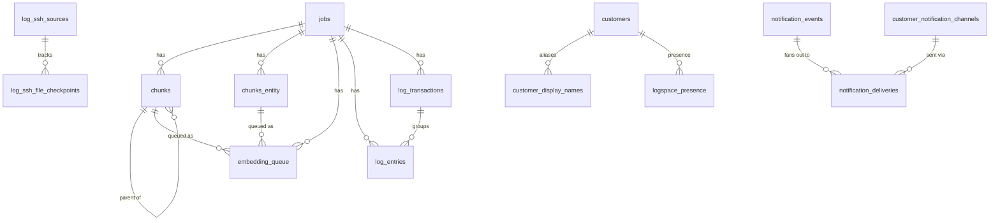

### Tenant partitioning (`customer_code`, soft links)

`customer_code` is the multi-tenant key.
It is a real foreign key only from `customer_display_names` and `logspace_presence` to `customers` (solid lines below).
On every other table it is a soft convention with no constraint (dashed lines below).

```mermaid
erDiagram
    customers ||--o{ customer_display_names : "FK (enforced)"
    customers ||--o{ logspace_presence : "FK (enforced)"

    customers ||..o{ jobs : "tenant key (soft)"
    customers ||..o{ log_entries : "tenant key (soft)"
    customers ||..o{ log_transactions : "tenant key (soft)"
    customers ||..o{ log_regroup_pending : "tenant key (soft)"
    customers ||..o{ log_regroup_runs : "tenant key (soft)"
    customers ||..o{ log_ssh_sources : "tenant key (soft)"
    customers ||..o{ log_ssh_file_checkpoints : "tenant key (soft)"
    customers ||..o{ log_ssh_fetch_runs : "tenant key (soft)"
    customers ||..o{ log_source_objects : "tenant key (soft)"
    customers ||..o{ saved_views : "tenant key (soft)"
    customers ||..o{ customer_notification_channels : "tenant key (soft)"
    customers ||..o{ notification_rules : "tenant key (soft)"
    customers ||..o{ notification_events : "tenant key (soft)"

    customers ||..o{ analytics_pending_windows : "tenant key (soft)"
    customers ||..o{ analytics_facts : "tenant key (soft)"
    customers ||..o{ analytics_fact_ledger : "tenant key (soft)"
    customers ||..o{ analytics_metrics : "tenant key (soft)"
    customers ||..o{ analytics_hourly_rollups : "tenant key (soft)"
    customers ||..o{ analytics_daily_rollups : "tenant key (soft)"
    customers ||..o{ analytics_monthly_rollups : "tenant key (soft)"
    customers ||..o{ analytics_tenant_state : "tenant key (soft)"
    customers ||..o{ analytics_quality_issues : "tenant key (soft)"
```

## Subsystem 1: RAG documents and embeddings

This is the core retrieval-augmented-generation pipeline.
A file becomes a `job`, the job is split into `chunks` (and richer `chunks_entity` rows), and each piece is queued in `embedding_queue` to be turned into a vector.
The vectors themselves live in a separate raw-SQL `embeddings` table (pgvector), keyed by an application-level string id rather than a foreign key.

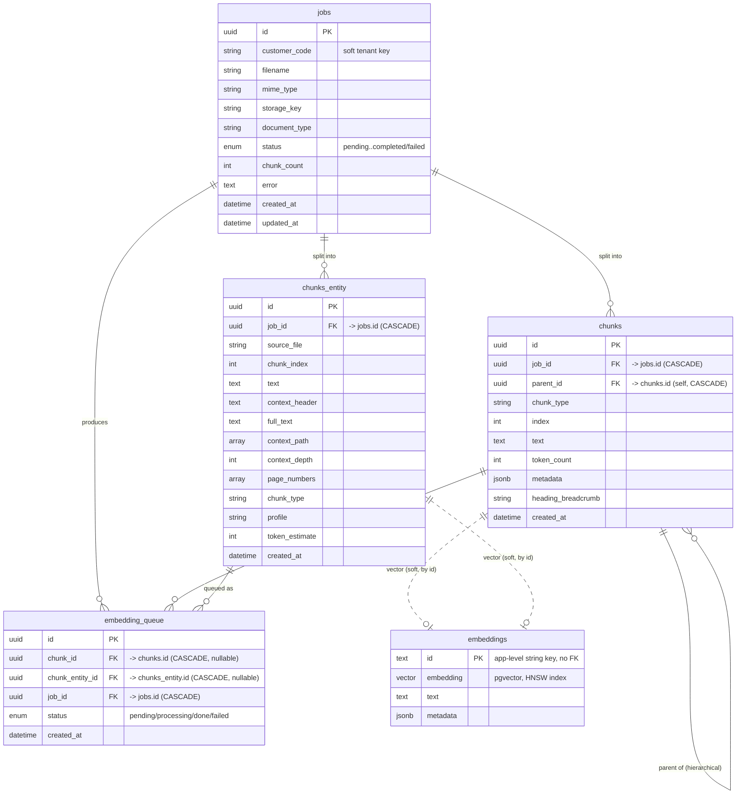

Note: `embeddings` is created by raw SQL (not an ORM model) and holds the vector plus an HNSW cosine index.
Its `id` is a string that the application sets to the chunk or entity id, so the link is logical, not a database foreign key.

## Subsystem 2: M3 WMS log ingestion

This is the log-analysis pipeline for the M3 warehouse system.
Raw log lines are stored losslessly as `log_entries` (Stage 1), then derived into one row per API request/response cycle as `log_transactions` (Stage 2).
All three tables here are **range-partitioned by UTC day** (migration `a1f6d70b3e92`) - see "Daily partitioning" below.
One transaction groups many entries.
`log_regroup_pending` and `log_regroup_runs` coordinate the async re-derivation of "dirty" time windows.

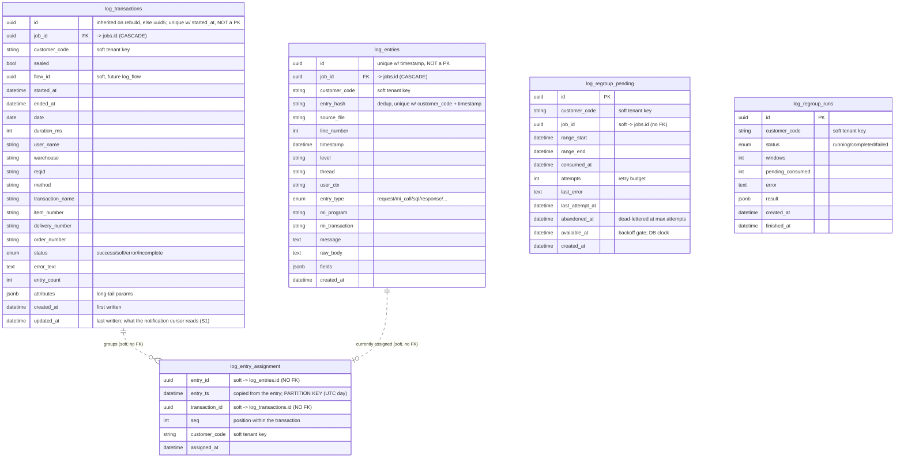

### `log_entry_assignment` - why `log_entries` is now append-only

Stage 2 used to write the grouping result back onto `log_entries` (`transaction_id` / `seq`) and clear it again through an `ON DELETE SET NULL` cascade.
`transaction_id` is indexed, so every rewrite touched the heap *and* the index, and the unsealed tail is regrouped repeatedly before it seals.
Measured on production 2026-08-05: **105,838,123 updates at 0.0% HOT** on 1.9M rows - roughly 55 rewrites per row.
That was the write amplification, dead-tuple churn and vacuum pressure behind the outage.

Separating the current interpretation from the raw evidence fixes it.
**Both foreign keys were removed** (migration `f04b7c29ae13`) so the table can be partitioned by day.
A foreign key makes the referenced table's partitions impossible to remove - `DETACH PARTITION` and `DROP TABLE` both refuse while one exists - and retention *is* dropping partitions.
Removing them also made the hottest write path ~4x faster: 200k assignment inserts went from 1,060 ms (two FK triggers, 200,000 calls each) to 249 ms.

The cost is that deletes no longer cascade, so every path that removes entries or transactions clears the assignments explicitly: `logspace_cleanup.purge_logspace`, the full wipe and date-range delete in `logs.py`, and `regroup_all` / `regroup_incremental` / `regroup_window` in `derive_transactions.py`.

"At most one current assignment per entry" is now a `UNIQUE NULLS NOT DISTINCT (entry_id, entry_ts)` rather than a primary key.
Not a primary key, because PostgreSQL forces PK columns to `NOT NULL` and `entry_ts` must stay nullable (`log_entries.timestamp` is).
`NULLS NOT DISTINCT` is what preserves the guarantee for timestamp-less entries - a plain `UNIQUE` treats two NULLs as different.

The column order is load-bearing: `entry_id` FIRST. Measured on 300k rows, looking up by `entry_id` alone takes 0.046 ms with `(entry_id, entry_ts)` and **10.8 ms** with `(entry_ts, entry_id)` - a sequential scan, because `entry_id` is no longer seekable.
Three hot paths filter on `entry_id` with no time bound.

The `log_entries.transaction_id` / `seq` columns and their index are **gone** (migrations `d5b830e14f72`, `e93c47a15b08`).
`DROP COLUMN` is a catalog operation in PostgreSQL, not a rewrite - measured at 0.1s on a 48 MB table with the relfilenode unchanged - so there was no reason to defer it.
`log_entries` is now strictly insert-only: five consecutive regroups of the same window perform **0** row updates, against ~55 rewrites per row before.

Note: `log_transactions.flow_id` is a nullable hook for a future `log_flow` table and has no foreign key today.

### How `log_transactions.id` is decided

A transaction is deleted and rebuilt whenever Stage 2 re-stitches its time window, so its id has to survive that.

A NEW group gets `uuid5(customer_code + anchor entry hash)`, where the anchor is the REQUEST entry if the group has one and the earliest entry otherwise.
That is content-derived, and content changes: a backfilled file can add an earlier line, or supply the REQUEST line that failed to parse, which moves the anchor and therefore the id.
Measured on production, 1.3% of transactions have no REQUEST entry and are exposed to this.

So a REBUILT group does not recompute its id, it inherits one.
`regroup_window` reads `{entry_id -> transaction_id}` from `log_entry_assignment` before deleting those rows, and each rebuilt group reuses the id of the transaction that owned the plurality of its entries (`app/services/mnp_log_ingestion/pipeline/continuity.py`).
A merge keeps the larger contributor's id; a split keeps it for the larger half and the remainder mints a fresh one.

Two consequences worth stating, because the schema cannot enforce either:

- Only a transaction being rebuilt in that same window may have its id reused.
  `uq_log_transactions_id` is `UNIQUE NULLS NOT DISTINCT (id, started_at)` rather than unique on `id`, because a partitioned table requires the partition key inside the constraint.
  Two rows sharing an id but differing in `started_at` therefore land in different partitions and are accepted silently.
- For the same reason, one id may never be awarded to two rebuilt groups.

### Daily partitioning

`log_entries`, `log_transactions` and `log_entry_assignment` are range-partitioned by UTC day (migration `a1f6d70b3e92`).
They are the only tables cut by DAY: subsystem 8's tables are partitioned monthly and yearly, and `partitioning.py` now carries a per-table grain.
Everything below is about these three.
The keys are `timestamp`, `started_at` and `entry_ts` respectively; `app/persistence/partitioning.py` is the single source of truth for which table is cut on which column, and what a day's partition is called.

Retention was `DELETE` + `VACUUM`, both of which read the whole table - on a heap that reached 40 GB, on a disk with bad sectors.
It is now `DROP TABLE <partition>`: a file unlink, no row scan, nothing left to vacuum.
`log_entry_assignment` is co-partitioned with `log_entries` on the same grain deliberately, so a day's entries and that day's assignments are dropped together and retention can never strand one without the other.

Three consequences show up in the schema above.

**No table has a PRIMARY KEY any more.**
PostgreSQL requires a unique constraint on a partitioned table to contain every partition-key column, and silently forces PK columns to `NOT NULL`.
All three partition keys are nullable - the parser genuinely emits entries whose timestamp will not parse - so a PK would make those rows un-insertable.
Identity is a `UNIQUE NULLS NOT DISTINCT` instead: `(id, timestamp)`, `(id, started_at)`, `(entry_id, entry_ts)`.
The key is present but never first, for the same measured reason as `log_entry_assignment` above.
The ORM models still declare `primary_key=True` on the id column, but that is row identity for SQLAlchemy only - the DDL it implies is invalid here and is never used, because Alembic is the sole schema builder.

**`log_entries` dedup grew a column**: `(customer_code, entry_hash)` became `(customer_code, entry_hash, timestamp)`.
This stays a correct dedup key because `entry_hash` is a sha256 over the raw line *including* its millisecond timestamp text, so an identical replay parses to the same instant and routes to the same partition.
`parse_insert.py`'s `ON CONFLICT` must name all three columns or the insert fails outright.
The one way the two can disagree is a customer's display timezone being changed between ingests, which re-parses the same text to a different UTC instant.
That is now blocked: `PATCH /customers/{code}` refuses a timezone change with **409** once the tenant has entries, unless `allow_mixed_timezones=true` (see `app/services/timezone_change_guard.py`).

**Every table has a `DEFAULT` partition** catching NULL-key rows, which is what makes timestamp-less entries insertable at all.

Partitions are maintained by `app/services/workers/log_partition_worker.py`, hourly.
It provisions `log_partition_precreate_days` (14) of runway ahead of today and drops days past `log_partition_retention_days` (60).
Creation is the dangerous half - an insert into a day with no partition fails outright - so a creation failure logs CRITICAL and the remaining runway is reported on every tick.

Partition health is exposed on `GET /api/v1/logs/regroup/status` as an additive `partitions` block (`days_ahead`, `oldest_day`, `newest_day`, `retention_days`, `default_partition_rows`, `healthy`).
It is global rather than tenant-scoped, and rides on that endpoint only because the AUTO-POLL card already polls it.

Dropping sits behind three gates: the day is past retention, no OPEN `log_regroup_pending` window overlaps it, and **entries lag transactions by one day**.
That last one is the midnight rule.
A transaction spans at most the seal window, so one starting at 23:58 owns entries until ~00:13 the next day; dropping day N's entries while a day N-1 transaction still referenced them would leave that transaction rendering half-empty.
So `log_transactions` is dropped for day D and `log_entries` + `log_entry_assignment` only for day D-1.
The cost is one extra day of entry storage and the bound is exact, not a safety guess.

## Subsystem 3: Remote SSH log fetching

This subsystem pulls raw log files from customer servers over SSH.
A `log_ssh_source` is one remote server/directory to poll.
`log_ssh_file_checkpoints` remembers how far each remote file has been read (so re-fetches are incremental), and `log_ssh_fetch_runs` records each fetch attempt.

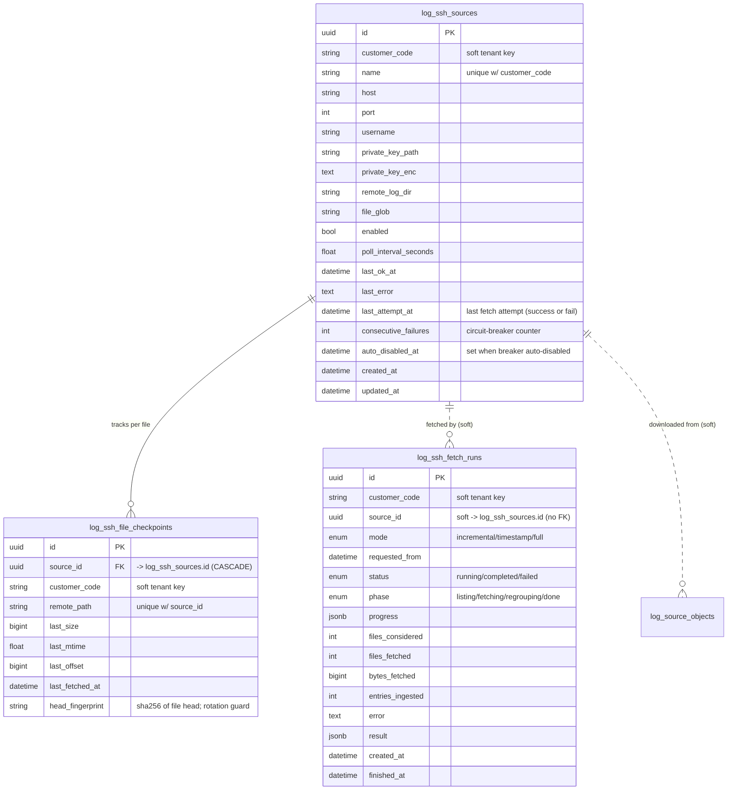

Note: `log_ssh_fetch_runs.source_id` is nullable and has no foreign key.
A null value means the run covered all enabled sources; otherwise it points at one source.

### `log_source_objects` - the fetch/parse handoff

One row is one contiguous byte range downloaded from a remote log file and saved to object storage, plus whether it has been parsed yet.
It exists so the SSH fetcher can stop parsing inline: the fetcher inserts this row and advances `log_ssh_file_checkpoints.last_offset` in **one transaction**, then releases the SSH connection and the per-host lock, and a separate worker (`app/services/workers/log_parse_worker.py`) leases the row and runs Stage 1.

The single transaction is load-bearing.
The checkpoint is a promise that everything behind it is handled; advancing it without this row would skip those bytes forever, and writing this row without advancing it would re-download them.

It also carries the retry budget that the fetch path previously lacked (`attempts` / `max_attempts` / `available_at` / `last_error`), giving it the same dead-letter semantics `log_regroup_pending` already has for Stage 2.

`source_id` deliberately has **no** foreign key: deleting an SSH source must never delete ingestion evidence, the same rule `log_ssh_fetch_runs.source_id` follows.
`job_id` is likewise a soft reference and is transitional - it disappears when `jobs` is retired from the log path.

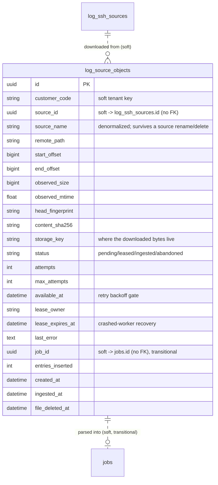

Deletion: `log_source_objects` has no job or tenant foreign key, so a tenant purge deletes it explicitly and unlinks the referenced files first (`app/services/logspace_cleanup.py`).
A **date-range** log delete deliberately leaves it alone - these rows describe byte ranges, not log dates.

## Subsystem 4: Customer registry

The tenant directory.
`customers` is the canonical list of tenants (each a "log space" of one `kind`: `permanent` or `disposable`), `customer_display_names` holds alternate display names per tenant, and `logspace_presence` records who is currently in a space.
A disposable owns a brand-new `customer_code` (1:1) and carries `owner_name` + `expires_at` (auto-purged when due); a permanent carries admin-set `name`/`description`/`environment` (`live`|`test`).
`inactive` is derived from `active=false`, not an `environment` value.
This is the one subsystem where `customer_code` is a real, enforced foreign key (into `customers`).

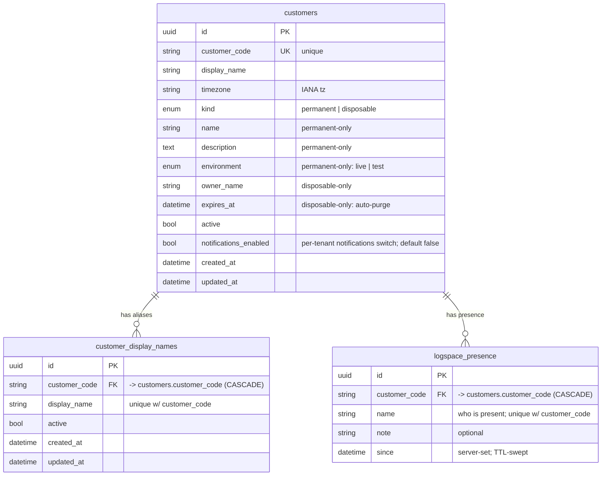

## Subsystem 5: Saved views

A saved view is a stored analysis or filter snapshot that a user can name, assign, comment on, and close.
It is self-contained: the analysis state, the review comment thread, and the closure record all live in JSONB columns on the single `saved_views` table, so it has no foreign keys.

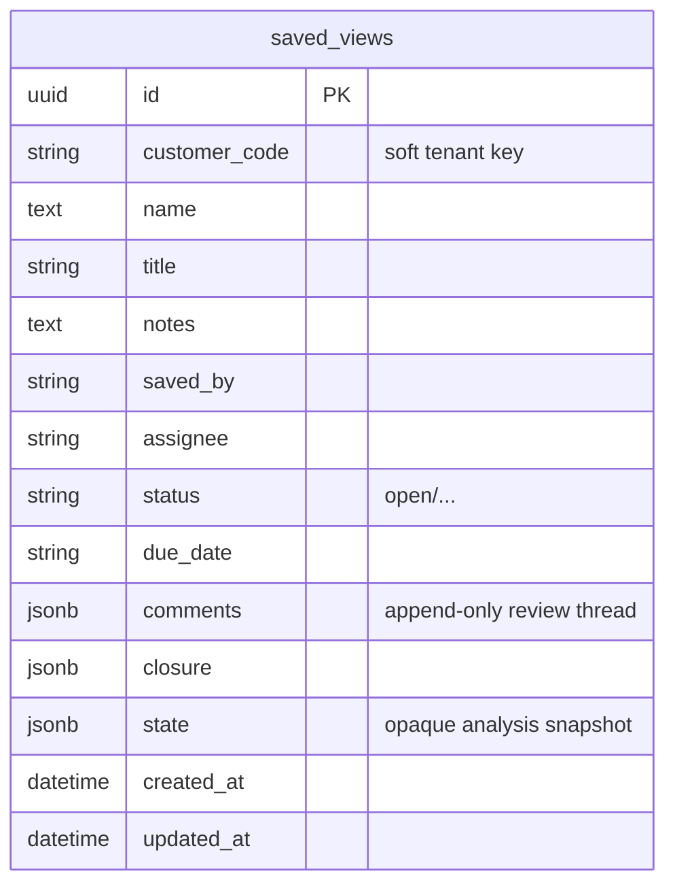

## Subsystem 6: Notifications and alerting

A data-driven alerting pipeline with a durable outbox so no alert is lost during an outage.
`notification_rules` decide WHEN to alert, `customer_notification_channels` decide WHERE alerts go, `notification_events` is the durable outbox of published alerts, and `notification_deliveries` tracks each (event x channel) send attempt with retries and backoff.

### Two switches, and both must be on

`customers.notifications_enabled` (migration `e4b28f5c9107`) is the SUBSYSTEM switch for a tenant; a rule's own `status` is the switch for that rule.
They mean different things, so they are separate columns: turning the subsystem off for a customer must not silently rewrite all their rules.
It replaced a deployment-wide env flag that was read ONCE at process boot to decide whether the worker task was ever created - a shape that made a UI toggle impossible rather than merely inconvenient, since flipping it at runtime had nothing to observe it.
The worker now always runs and reads the flag each tick, so a change takes effect within one poll interval with no restart.

One predicate, `app/services/notifications/tenant_gate.enabled()`, is applied in exactly three places, and they must never disagree:

- `NotificationRepository.list_active_rules` - a switched-off tenant's rules are not evaluated;
- `dispatcher._claim_due` - and its already-queued alerts stop going out, staying `pending` rather than being discarded, so re-enabling resumes them;
- `consumer_cursors.notifications_position` - and its frozen cursors do not hold retention hostage.

The third is the dangerous one and is the reason the predicate is shared rather than copied.
A switched-off customer keeps rules whose `status` is still active, so their `cursor_at` simply stops advancing.
Publishing that frozen minimum would pin partition retention for the WHOLE INSTANCE, because retention gates drops on it - one tenant's notification preference would quietly stop the disk being reclaimed.
A disabled tenant is not a slow reader; it is not a reader.

Streaming rules read `log_transactions` **incrementally**, via `notification_rules.cursor_at` (migration `c7a02f68b1d4`).
The cursor is a `log_transactions.updated_at` - the LAST-WRITE time, not `started_at` which is when the log line happened.
It read `created_at` until S1. Sealing became an explicit UPDATE, which does not refresh `created_at`, so a sealed row would have fallen permanently behind the cursor and `stability.py`'s `incomplete AND sealed` alert could never have fired.
That distinction is load-bearing: a week-old file backfilled today produces rows with an old `started_at` but a new `created_at`, so a cursor on `started_at` would silently never see them.
`log_transactions` carries a composite `(customer_code, updated_at)` index for exactly this (migration `c4e17b9d5a83`), matching both the filter and the sort.
The older single-column `created_at` index (`b3d914c7ea52`) is retained but no longer serves the feed.
Because the table is partitioned, both had to be built per-partition and attached, since PostgreSQL refuses `CREATE INDEX CONCURRENTLY` on a partitioned parent.

The engine never reads closer to the present than `notification_cursor_lag_seconds`.
`created_at` is stamped when Python builds the row rather than when Postgres commits it, so a long Stage 2 transaction can commit a row whose timestamp already sits behind the cursor; without the lag that row is never read, and dedupe cannot recover something never seen.
Dedupe by `dedup_key` remains as the safety net - the cursor prevents re-reading, dedupe prevents re-sending.

Streaming rules also skip transactions that are still changing.
Stage 2 rebuilds its unsealed tail every cycle, so an `incomplete` transaction (REQUEST seen, no RESPONSE yet) routinely becomes `success` minutes later - and because `dedup_key` is stable per (rule, transaction), an alert fired on the in-flight version could never be corrected.
So `incomplete` is held until `sealed`; `error`, `soft` and `success` alert immediately, since delaying them by the 15-minute seal window would defeat the point of alerting.
Set `notification_alert_only_sealed` to require a seal for every status.
The gate is applied in SQL (`app/services/notifications/rules/stability.py`) because every Stage 2 rebuild refreshes `created_at`, so an in-flight transaction would otherwise re-enter the cursor feed on every tick until it sealed.

Digest (window) rules do not use the cursor at all; they summarise a completed interval and keep their own `rule:{id}:window:{n}` dedup key.

Delivery is paced.
`customer_notification_channels.config` may carry `{"max_per_minute": N}`, overriding `notification_channel_max_per_minute`; the budget is measured by counting `notification_deliveries` already delivered inside the window, so it stays correct across restarts and worker processes without a counter table.
A delivery beyond the budget is **rescheduled, never dropped**, and is not a failure - `attempts` is untouched and no error is recorded, or 50 quiet deferrals would dead-letter a perfectly good alert.
The drain also claims round-robin across tenants, so one tenant's flood no longer fills every batch while another's single alert waits.
An HTTP 429 raises `ChannelRateLimited` carrying the server's own `Retry-After`, which is honoured instead of the generic backoff ladder and likewise does not consume the retry budget.

Pacing protects the webhook; a per-rule **burst cap** protects the person reading the channel, since 500 cards delivered slowly is still 500 cards.
Past `notification_rule_burst_cap` (overridable per rule with `{"burst_cap": N}` in `match`), further deliveries are created with status **`suppressed`** rather than `pending` - recorded, never claimed by the drain, and represented by one rollup summary card per completed window.
Suppressed rows are deliberately created rather than skipped: the rule cursor has already moved past those transactions, so nothing else would record what the summary covered.
Rollup summaries carry their rule's id for provenance but are exempt from the cap by event type - otherwise the cap would suppress the very card reporting the suppression.

Only channel types that can actually deliver may be configured.
`POST /{customer}/channels` refuses a type that is registered but unimplemented (Slack, WhatsApp), separately from one it has never heard of, since those need different reactions from the caller.
Any such channel that already exists dead-letters on its FIRST attempt rather than after 50: a missing implementation is permanent, unlike a disabled channel someone may re-enable.

### `consumer_cursors` - retention must not outrun its readers

`consumer_cursors` holds one row per incremental reader of `log_transactions`: `consumer` (the name), `position` (a write-time watermark meaning "everything strictly before here is consumed") and `updated_at` (a heartbeat).
Analytics still measures its own frontier on `log_transactions.created_at` (`consume.py:_FRONTIER_COLUMN`); S3 moves that to `updated_at` as well, and until it does the two readers deliberately track different columns.

The partition worker already refuses to drop a day Stage 2 has not finished stitching.
It now also refuses to drop a day a live consumer has not finished READING - `days_blocked_by_consumers`, gated on the minimum position across the registry.
Without it, dropping day 70 while a reader sits at day 70 destroys that data permanently and the reader simply skips the gap.

This is deliberately separate from a subsystem's INTERNAL cursors.
`notification_rules.cursor_at` tracks each rule independently, because one rule being replayed must not drag another's position; what notifications publishes here is the minimum across its active rules - the oldest data the subsystem as a whole still needs.

The analytics reader follows exactly that pattern under the name `analytics:warehouse-v1`.
Its internal cursor is `analytics_tenant_state.source_write_frontier`, one per tenant, and what it publishes here is the MINIMUM across tenants.
Per-tenant is not an optimisation: this table holds one row per consumer while retention is global, so a tenant that is far ahead would otherwise advance the position past a tenant that is far behind, and the partition worker would drop source partitions the lagging tenant had never read.
A tenant that has processed nothing has a NULL frontier and suppresses publishing entirely, because SQL's `MIN` would otherwise skip it and publish a claim that is too far ahead.

A consumer that stops reporting for `consumer_cursor_stale_after_seconds` (24 h) is treated as gone: it stops blocking retention and is logged CRITICAL.
That is the survivable failure - blocking forever fills the disk, which is a total outage, while losing data for one dead consumer is contained - but it is made loud rather than silent.
The table is created empty and nothing is backfilled: an invented position would assert that a consumer has read data it never saw, and retention would believe it.

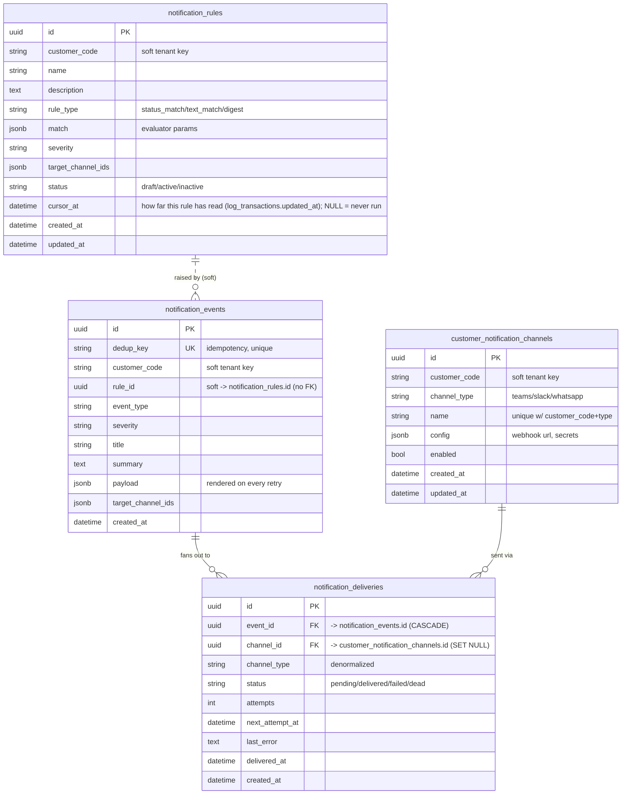

Note: `notification_events.rule_id` records which rule raised the event (provenance) but has no foreign key, so an event survives even if its rule is later deleted.

## Subsystem 7: Idempotency keys

Server-side de-duplication for mutating POSTs (see `app/middleware/idempotency.py`).
A client sends an `Idempotency-Key` header; the first request is recorded here and its JSON response cached, so a retry or double-submit with the same key replays the stored response instead of duplicating the side effect.
Self-contained (no foreign keys); tenant-scoped by `customer_code`, with `UNIQUE(customer_code, idem_key)` as the atomic de-dup guard and `expires_at` for TTL cleanup.

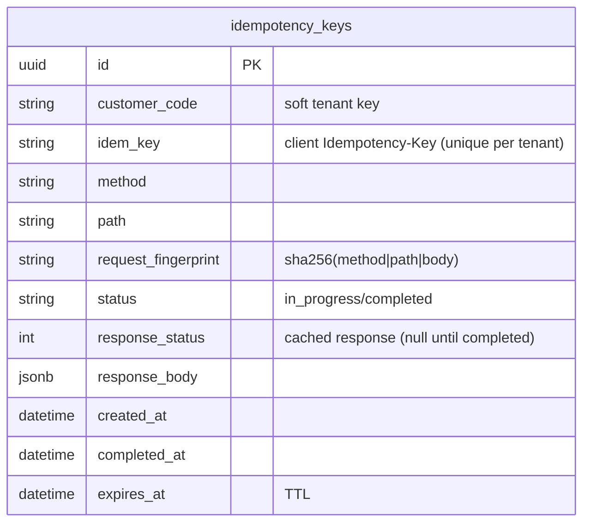

## Subsystem 8: Warehouse analytics platform

Aggregates the derived `log_transactions` into metrics a user defines from the interface.
Nine tables, added by migration `a7c31f9e2b48` (Phase 1 of `docs/analytics-ml-architecture/final_architecture.md`).

**It has no foreign keys at all.**
Not one, anywhere - which is why it contributes nothing to the master overview above.
`customer_code` is a soft tenant key here exactly as it is on the log tables, and `definition_id` and `source_transaction_id` are soft references too.
That is deliberate: five of these tables are partitioned, and a foreign key from a partitioned child made the log partitions undroppable once already (see `log_entry_assignment` above).
The cost is that a tenant purge must delete from every one of them explicitly, because nothing cascades on their behalf.

**Why the design is unusual.**
`log_transactions` is not append-only: 98.7% of rows are rewritten after they are first written, because a transaction is stitched from ~15 log lines and a late line rebuilds it.
So the analytics worker cannot add numbers up as they arrive - a rebuilt row would be counted twice.
Instead it compares a whole time RANGE against what it previously recorded, and applies the difference.
That is what makes `analytics_facts` one row per transaction rather than an append-only stream, and what makes `source_version_hash` load-bearing: a matching fingerprint means a recheck writes nothing at all.

**Two tables that look redundant and are not.**
`analytics_facts` holds each transaction's CURRENT contribution; `analytics_fact_ledger` holds every version of it, append-only.
Without the ledger a rebuild overwrites history, so a machine-learning training set could not be reproduced months later once the raw entries had been dropped at 60 days.

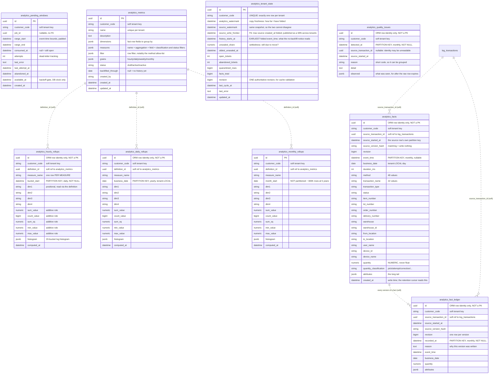

### One writer per table

For every analytics table the rule is absolute: **exactly one component may write it.**
Two writers to one aggregate is how totals silently diverge, and it is not recoverable without a full rebuild.
The existing log tables do not follow that rule and pretending otherwise would be misleading - the one-writer rule is what the analytics work commits to, not a property inherited from the pipeline.

| Table | Sole writer |
| --- | --- |
| `analytics_pending_windows` | the ticket publisher, inside the transaction that changed the data |
| `analytics_facts`, `analytics_fact_ledger`, `analytics_tenant_state`, `analytics_quality_issues` | the analytics worker |
| `analytics_hourly_rollups`, `analytics_daily_rollups`, `analytics_monthly_rollups` | the rollup folder |
| `analytics_metrics` | the API that the interface writes definitions through |

### Rollups store additive ROLES, never finished answers

The measure columns are named for what they compose as - `sum_value`, `count_value`, `sum_sq`, `min_value`, `max_value`, `histogram` - rather than numbered `measure1..measure8`.

That is the complete set of additive primitives: sums and counts direct, averages as sum+count, variance as sum/sum_sq/count, percentiles as a 20-bucket log histogram, first and last as min/max.
Naming them makes the rule structural instead of conventional: **there is no column an average could be written into**, so "averaging twelve monthly averages is not the yearly average" stops being something a reviewer has to catch.
Averages and percentiles are finished at READ time from the stored components.

Folding is then one uniform operation at every level and for every metric - sums add, counts add, mins take the min, maxes take the max, histograms add element-wise - and nothing consults which measure it is looking at.

The cost, accepted deliberately: a definition needing one sum and two counts cannot share one set of role columns, so a row is keyed per **(definition, measure, dimensions, bucket)**.
The consumption metric therefore emits three rows per bucket rather than one.

### Mixed-grain partitioning

Unlike subsystem 2, these tables are **not** all cut by day.
`app/persistence/partitioning.py` carries a per-table `Grain` (daily, monthly or yearly), and `app/services/workers/log_partition_worker.py` carries a per-table retention policy.

| Table | Partition key | Grain | Retention |
| --- | --- | --- | --- |
| `analytics_facts` | `event_time` | monthly | **never dropped** |
| `analytics_fact_ledger` | `recorded_at` | monthly | **never dropped** |
| `analytics_daily_rollups` | `business_date` | yearly | **never dropped** |
| `analytics_hourly_rollups` | `bucket_start` | daily | 90 days |
| `analytics_quality_issues` | `detected_at` | monthly | 365 days |
| `analytics_monthly_rollups` | - | not partitioned | forever |

The three marked "never dropped" are not merely long-lived.
Their raw source is dropped at 60 days, so a dropped partition there could not be rebuilt from anything at all.
Before the retention policy could be stated per table, registering one of them would have had the worker delete it a month at a time - which is why the partition manager had to be extended before this schema could exist.

**Nullable keys differ from subsystem 2 on purpose.**
`analytics_facts.event_time` is nullable because it inherits that from `log_transactions.started_at`: a transaction whose entries all lack a parsable timestamp has none.
The other four keys are computed by the worker and are `NOT NULL` - a rollup bucket, a ledger write instant and a quarantine timestamp are always known.
Allowing a NULL there would mean a row that no bucket owns, sitting in a `DEFAULT` partition that no reader prunes and no retention pass reclaims.

Every partitioned table still gets a `DEFAULT` partition, but here it is insurance against a key falling outside the provisioned runway rather than against a NULL.

## Full relationship reference

### Enforced foreign keys (solid lines)

| Parent | Child column | On delete |
| --- | --- | --- |
| `jobs.id` | `chunks.job_id` | CASCADE |
| `jobs.id` | `chunks_entity.job_id` | CASCADE |
| `jobs.id` | `embedding_queue.job_id` | CASCADE |
| `jobs.id` | `log_entries.job_id` | CASCADE (re-added by `a1f6d70b3e92`; `LIKE` does not copy foreign keys) |
| `jobs.id` | `log_transactions.job_id` | CASCADE (re-added by `a1f6d70b3e92`) |
| `chunks.id` | `chunks.parent_id` (self) | CASCADE |
| `chunks.id` | `embedding_queue.chunk_id` | CASCADE |
| `chunks_entity.id` | `embedding_queue.chunk_entity_id` | CASCADE |

| `log_ssh_sources.id` | `log_ssh_file_checkpoints.source_id` | CASCADE |
| `customers.customer_code` | `customer_display_names.customer_code` | CASCADE |
| `customers.customer_code` | `logspace_presence.customer_code` | CASCADE |
| `notification_events.id` | `notification_deliveries.event_id` | CASCADE |
| `customer_notification_channels.id` | `notification_deliveries.channel_id` | SET NULL |

The nine `analytics_*` tables add **no rows to this table**. They have no enforced foreign keys of any kind, including to `jobs`, so nothing cascades on their behalf and a tenant purge must delete from each of them explicitly.

### Soft references (dashed lines, no database constraint)

| Logical parent | Referencing column | Meaning |
| --- | --- | --- |
| `customers.customer_code` | `customer_code` on jobs, log_entries, log_transactions, log_regroup_pending, log_regroup_runs, log_ssh_sources, log_ssh_file_checkpoints, log_ssh_fetch_runs, log_source_objects, saved_views, idempotency_keys, the notification tables, and all nine `analytics_*` tables | tenant partition key |
| `analytics_metrics.id` | `definition_id` on the three rollup tables | which definition a rollup row belongs to; no FK because a FK from a partitioned child made the log partitions undroppable once already |
| `log_transactions.id` | `analytics_facts.source_transaction_id` | which transaction this fact was derived from; no FK, and deliberately survives the transaction being dropped at 60 days |
| `log_transactions.id` | `analytics_fact_ledger.source_transaction_id` | same, per version |
| `log_transactions.id` | `analytics_quality_issues.source_transaction_id` | nullable: a row can be unusable precisely because its identity could not be read |
| `jobs.id` | `log_regroup_pending.job_id` | nullable, no FK |
| `log_ssh_sources.id` | `log_ssh_fetch_runs.source_id` | nullable, no FK (null = all sources) |
| `log_ssh_sources.id` | `log_source_objects.source_id` | nullable, no FK - deleting a source must not delete ingestion evidence |
| `jobs.id` | `log_source_objects.job_id` | nullable, no FK; transitional, set by the parse worker |
| `notification_rules.id` | `notification_events.rule_id` | provenance, no FK |
| future `log_flow` | `log_transactions.flow_id` | Phase-3 hook, no FK |
| `log_entries.id` | `log_entry_assignment.entry_id` | FK removed in `f04b7c29ae13` so daily partitions can be dropped; cleared explicitly by every delete path |
| `log_transactions.id` | `log_entry_assignment.transaction_id` | same |

| `chunks.id` / `chunks_entity.id` | `embeddings.id` (string) | app-level key into the pgvector table |
