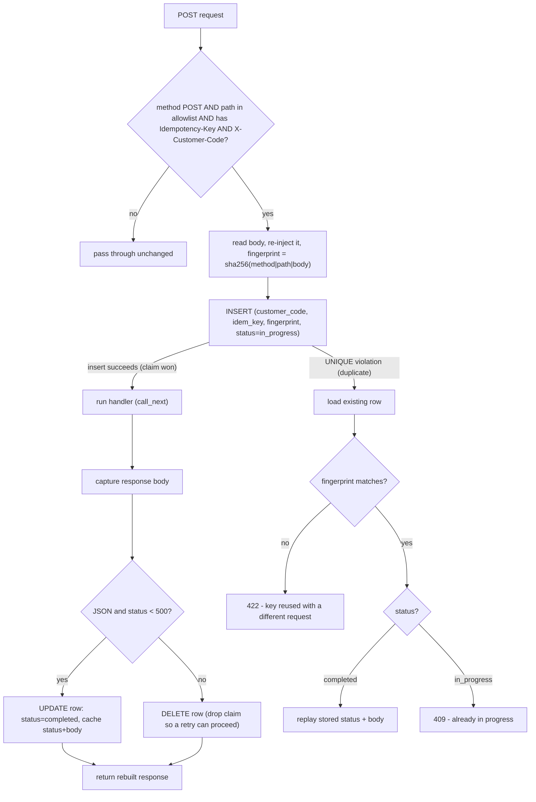

# Idempotency (backend) - low-level design

Server-side request de-duplication for mutating POSTs, so a retry or accidental double-submit does not create a duplicate side effect.
This document describes the backend implementation; the client side (key generation, submit guards, read-path concurrency) is documented in the frontend repo at `matrix-log-explorer/docs/idempotency.md`.

## Why this exists

A user who double-clicks "Save", or a client that retries a request after a flaky network, can send the same mutating request twice.
Without protection that creates two saved views, two comments, or two model calls.
The fix is the standard `Idempotency-Key` pattern (as used by Stripe and others): the client sends a unique key per logical action, the server runs the operation once, caches the response, and replays that same response for any duplicate carrying the same key.

## Core principles

- **HTTP method semantics.** GET / HEAD are already safe and idempotent, so the feed reads (`GET /transactions/view`) are NOT covered here - re-reading is harmless and must always return fresh data. Only unsafe methods (POST that creates/appends/charges) need a key. Applying idempotency keys to reads would be an anti-pattern (the tool for reads is caching, not keys).
- **Opt-in, never surprising.** The mechanism is a strict pass-through unless a request is a POST, on an explicit allowlist, and carries an `Idempotency-Key`. A client that sends no key behaves exactly as before. This is what makes the change zero-regression.
- **Atomic claim via a database uniqueness constraint.** Correctness under concurrency comes from `UNIQUE(customer_code, idem_key)`, not from application locking. Two racing duplicates both try to INSERT; the database lets exactly one win.
- **Replay the response, do not just block.** A completed key replays the original status + body (so a client that never received the first response still gets the real result on retry), rather than returning a generic error.
- **Tenant-scoped.** Keys are namespaced by `customer_code`, so keys from different logspaces can never collide.
- **Bounded retention.** Keys expire (TTL), so the table self-cleans and a key is only "the same operation" for a sensible window.

## Design patterns used

- **Middleware (cross-cutting concern).** De-duplication is orthogonal to business logic, so it lives in one ASGI middleware, not scattered per-endpoint. Adding an endpoint to the allowlist is the only change needed to cover it.
- **Single-flight / claim-check.** The first request "claims" the key (`in_progress`), does the work, then "completes" it. Concurrent duplicates observe the claim and back off.
- **Capture-and-replay (write-through response cache).** The first response is captured and stored keyed by the idempotency key; duplicates are served from that store.
- **Fingerprint guard.** A hash of the request body detects a key reused for a different request (a client bug) and rejects it instead of silently replaying the wrong response.

## Components

| Piece | File |
| --- | --- |
| Middleware | `app/middleware/idempotency.py` (`IdempotencyMiddleware`) |
| Persistence model | `app/persistence/models/idempotency_key.py` (`IdempotencyKey`, `IdempotencyStatus`) |
| Migration | `alembic/versions/d2f6b9c04a18_add_idempotency_keys.py` |
| Registration | `app/main.py` (`app.add_middleware(IdempotencyMiddleware)`) |
| Setting | `app/settings.py` (`idempotency_ttl_hours`, default 24) |
| Tests | `tests/test_idempotency_chunk14.py` |
| Schema doc | `docs/database-er-diagram.md` (Subsystem 7) |

## Data model - `idempotency_keys`

One row per (tenant, key). Columns:

- `id` (uuid PK).
- `customer_code` - tenant scope, read from the `X-Customer-Code` header.
- `idem_key` - the client-supplied `Idempotency-Key`.
- `method`, `path` - the operation the key belongs to.
- `request_fingerprint` - `sha256(method | path | body)`, hex; guards against a key reused for a different request.
- `status` - `in_progress` while the first request runs, `completed` once its response is captured.
- `response_status`, `response_body` (JSONB) - the cached response (NULL until completed; only JSON, non-5xx responses are stored).
- `created_at`, `completed_at`, `expires_at` - lifecycle + TTL.
- `UNIQUE(customer_code, idem_key)` - the atomic de-dup guard.
- Index on `expires_at` for cheap sweeping.

## Allowlist

Only these JSON POSTs are covered (matched by regex in `_ALLOWLIST`):

- `POST /api/v1/logs/saved-views`
- `POST /api/v1/logs/saved-views/{id}/comments`
- `POST /api/v1/logs/saved-views/{id}/comments/{cid}/replies`
- `POST /api/v1/logs/debug/ask`

Deliberately excluded:

- `/ingest` and `/upload` - multipart / large bodies; buffering the body to fingerprint it would be wasteful. These are guarded on the client (in-flight button disable) plus the pipeline's existing `entry_hash` de-dup.
- Endpoints with natural guards already: `/fetch-remote` (409 if a run is in progress), `/ssh-sources` (409 on duplicate name), `/regroup/finalize` (idempotent no-op).
- All GETs, including the feed.

## Request flow



Narrative:

1. **Filter.** Non-POST, non-allowlisted, or keyless requests are forwarded untouched - the middleware does not even read their body.
2. **Fingerprint.** For a covered request, read the body and compute `sha256(method | path | body)`.
3. **Claim.** Insert an `in_progress` row and commit. The `UNIQUE(customer_code, idem_key)` constraint makes this the atomic gate.
4. **First request wins the insert.** Run the handler via `call_next`, capture the response body, and if it is JSON with status < 500, store it and mark the row `completed`. A 5xx or non-JSON response deletes the claim so a genuine retry can still run. Then return a rebuilt response with the same bytes.
5. **Duplicate loses the insert (IntegrityError).** Reload the existing row and decide:
   - fingerprint differs -> `422` (the key was reused for a different request).
   - `completed` -> replay the stored `response_status` + `response_body`.
   - `in_progress` -> `409` (the first request is still running; this is the double-click-while-serving case).

## The body re-injection gotcha (important)

The middleware must read the request body to fingerprint it, but a `BaseHTTPMiddleware` that consumes the body leaves the ASGI receive stream exhausted, so the downstream handler would then read an empty body (and 400).
The fix is to re-inject the buffered body before calling downstream:

```python
body = await request.body()
async def _replay():
    return {"type": "http.request", "body": body, "more_body": False}
request._receive = _replay
```

This is only done for covered requests; everything else is forwarded without touching the body.
This is why the allowlist is limited to small JSON bodies - we never buffer a large multipart upload.

## Response capture

The response returned by `call_next` is a streaming response; its body is consumed once via `response.body_iterator`, so we read it into memory, use it for caching, and then rebuild a plain `Response` with the same bytes / status / headers / media type.
Only JSON responses under 500 are cached, because those are the deterministic results worth replaying.
Our covered endpoints all return small JSON objects and no background tasks, so this is safe.

## Semantics: replay-within-TTL (not in-flight-only)

A `completed` key replays its response for the whole TTL window (default 24h), not just while the first request is running.
This is intentional: it protects the "client sent the request, never received the response, retried" case - the retry gets the real created resource, not a duplicate.
In practice the frontend generates a fresh key per user action, so a deliberate later action (for example, saving again) uses a new key and re-executes, returning the updated result.
The replay therefore only ever affects a true same-key retry, which is exactly the double-submit / network-retry case.

## Failure and edge handling

- **Concurrent duplicates.** The loser of the INSERT race sees `in_progress` and gets `409`. No double side effect.
- **Handler errors (5xx) / non-JSON.** The claim row is deleted so the operation is retryable; nothing wrong is cached.
- **Key row swept mid-flight.** If the row vanished (TTL) between the failed insert and the reload, the request simply proceeds normally.
- **Missing `X-Customer-Code`.** Without a tenant the middleware passes through; the endpoint's own dependency handles the missing header (422) as before.

## Operations

- **TTL.** `settings.idempotency_ttl_hours` (env `IDEMPOTENCY_TTL_HOURS`) bounds retention; the `expires_at` index supports a cheap `DELETE WHERE expires_at < now()` sweep.
- **Inspecting keys.** `SELECT customer_code, idem_key, status, response_status, created_at FROM idempotency_keys ORDER BY created_at DESC LIMIT 20;`
- **Migration.** `d2f6b9c04a18` creates the table with plain (transactional) DDL - it is a new empty table, so no `CONCURRENTLY` is needed (unlike the index migrations).

## Testing

`tests/test_idempotency_chunk14.py` exercises the middleware end-to-end through a `TestClient` against `POST /saved-views`:

- same key + same body -> the second call replays the first response and only ONE row is created.
- same key + different body -> `422`.
- a pre-seeded `in_progress` row -> `409`.
- no key -> two independent rows (proves the mechanism is opt-in and non-regressive).

The test uses a `with TestClient(app)` fixture (one shared event loop, background workers disabled) because the app's pooled async engine is otherwise left bound to a per-request loop that closes.

## Extending

To cover a new mutating endpoint: add its path pattern to `_ALLOWLIST` in `app/middleware/idempotency.py`, ensure it returns JSON and requires `X-Customer-Code`, and have the client attach an `Idempotency-Key` header.
No new table or migration is needed.
