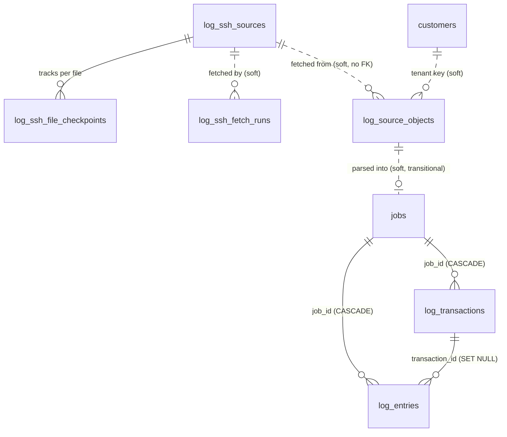

# Decouple SSH fetching from log parsing via `log_source_objects`

**Scope:** the fetch path only.
Nothing about partitioning, retention, the assignment-table split, or ML.

**Constraint:** no regression to any downstream functionality, and go slow.
Every step below is independently shippable and reversible.

**Visual companion:** [2026-08-02_15-47_log-source-objects-fetch-parse-decoupling.html](2026-08-02_15-47_log-source-objects-fetch-parse-decoupling.html)
Open it in a browser for the data-flow diagrams, the table-responsibility grouping, and the checkpoint-movement scenarios.

---

## 1. Context

### What happens today

One poll tick does everything in a single unbroken sequence, per file:

| Step | Where |
| --- | --- |
| Download bytes over SFTP | `app/services/mnp_log_ingestion/remote/remote_fetcher.py:149` |
| Write bytes to `./uploads` | `app/services/mnp_log_ingestion/LogIngestion.py:31` |
| Create a `jobs` row | `app/services/mnp_log_ingestion/LogIngestion.py:34` |
| Parse and insert `log_entries` | `app/services/mnp_log_ingestion/pipeline/parse_insert.py:64` |
| Advance the file checkpoint | `app/services/mnp_log_ingestion/remote/remote_fetcher.py:386` |

The coupling is one line, `remote_fetcher.py:157`, which awaits parse+insert inside the byte-read loop.

The checkpoint advance at `remote_fetcher.py:386` sits in the `else` of a `try`, so it runs only when every step above it succeeded.
That is the current safety mechanism, and it works.

### Why it should change

**A database stall blocks unrelated network work.**
The per-host advisory lock (`remote_fetcher.py:598`) is held for the whole of `_fetch_source`.
While parse+insert runs, no other fetch can reach that server, including other tenants and operator-triggered fetches.

**A crash mid-parse orphans work.**
The file is on disk and the `jobs` row exists, but nothing records that the file still needs parsing.
Recovery is accidental: the checkpoint did not advance, so the next poll re-downloads the same bytes over the network and creates a second job.
The first job is stranded at `parsing` forever.

**Network failures and database failures share one retry policy.**
They want different backoff and different alerting.

**Nothing can clean up `./uploads`.**
`LocalStorage.delete` exists at `app/persistence/storage/local.py` but has no caller in the log path.
Every byte ever fetched is still on the disk, because nothing tracks whether it was successfully ingested.

### Why one table solves three problems

A row meaning *"bytes 5000-9000 of this file were downloaded, here is the fingerprint, and they still need parsing"* is simultaneously:

1. The durable work queue that decouples fetch from parse.
2. The exact provenance record that is missing today (`log_entries.source_file` is only a filename, and `log_ssh_file_checkpoints` is overwritten as the file advances, so it is transport state rather than history).
3. The log-specific ingestion table that starts getting logs out of the shared `jobs` table.

### The trap this design avoids

Naive decoupling advances the checkpoint after a successful download, then hands off.
If parsing later fails, those bytes are never re-read, which is silent data loss.

The fix is a transactional outbox: the checkpoint advance and the queue-row insert happen in **one** database transaction, so either both commit or neither does.

This exact pattern already exists one stage later in this codebase.
`parse_insert.py:177-179` inserts a `log_regroup_pending` row in the same transaction as the entries, which is why Stage 2 can fail entirely and still be retried.
Fetch to Stage 1 is the only hop lacking it.

---

## 2. The new table

```sql
CREATE TABLE log_source_objects (
    id uuid PRIMARY KEY,
    customer_code varchar(64) NOT NULL,        -- soft tenant key, matching every other log table

    -- provenance: must survive SSH source deletion
    source_id uuid NULL,                       -- soft ref, NO FK
    source_name varchar(255) NOT NULL,         -- denormalized so history survives a rename or delete
    remote_path varchar(1024) NOT NULL,
    start_offset bigint NOT NULL DEFAULT 0,
    end_offset bigint NOT NULL,
    observed_size bigint NULL,
    observed_mtime double precision NULL,
    head_fingerprint varchar(64) NULL,
    content_sha256 varchar(64) NULL,

    -- where the downloaded bytes are
    storage_key varchar(1024) NOT NULL,

    -- queue state, mirroring the proven log_regroup_pending dead-letter pattern
    status varchar(24) NOT NULL DEFAULT 'pending'
        CHECK (status IN ('pending','leased','ingested','failed','abandoned')),
    attempts int NOT NULL DEFAULT 0,
    max_attempts int NOT NULL DEFAULT 3,
    available_at timestamptz NOT NULL DEFAULT now(),
    lease_owner varchar(255) NULL,
    lease_expires_at timestamptz NULL,
    last_error text NULL,

    -- outcome
    job_id uuid NULL,                          -- soft ref, TRANSITIONAL
    entries_inserted int NOT NULL DEFAULT 0,
    created_at timestamptz NOT NULL DEFAULT now(),
    ingested_at timestamptz NULL,
    file_deleted_at timestamptz NULL,

    CHECK (end_offset >= start_offset)
);

CREATE INDEX ix_log_source_objects_claim
    ON log_source_objects (available_at, created_at)
    WHERE status IN ('pending','failed');

CREATE INDEX ix_log_source_objects_customer
    ON log_source_objects (customer_code, created_at DESC);

CREATE INDEX ix_log_source_objects_lease
    ON log_source_objects (lease_expires_at)
    WHERE status = 'leased';
```

### Deliberate choices

**`source_id` has no foreign key.**
Deleting an SSH source must never delete ingestion evidence.
This follows the existing precedent: `log_ssh_fetch_runs.source_id` is already documented as a soft reference with no FK in `docs/database-er-diagram.md`.

**`customer_code` stays a soft key.**
Every log table already treats it this way; only `customer_display_names` and `logspace_presence` enforce it.
Adding a hard FK on this one table would be inconsistent and would complicate purge ordering.

**`job_id` is a nullable soft reference and is transitional.**
The parse worker still creates a `Job` and records which one, so nothing downstream changes.
This column disappears when `jobs` is retired from the log path during the later partitioning work.

**No UNIQUE on `(source_id, remote_path, start_offset)`.**
A legitimate rotation re-read pulls `[0, size)` again, and a unique constraint would reject it.
Idempotency comes from the single fetch transaction; retries reuse the same row via `attempts` rather than inserting new ones.
`entry_hash` remains the correctness backstop, exactly as today.

---

## 3. Revised ER diagram



Solid `--` is a database-enforced foreign key.
Dashed `..` is a soft reference.
This matches the convention in `docs/database-er-diagram.md`.

No line touches `log_entries`.
Every existing relationship is unchanged.

---

## 4. Target flow

### Today

```
FETCHER (one unbroken sequence, holding the SSH connection and host lock throughout)
  download bytes
  save file to ./uploads
  create jobs row
  parse + insert log_entries
  advance checkpoint
```

### Proposed

```
FETCHER                                  PARSE WORKER
  download bytes                           lease a pending row (FOR UPDATE SKIP LOCKED)
  save file to ./uploads                   read the file from storage_key
  ┌── ONE TRANSACTION ───────────┐         parse + insert log_entries
  │  INSERT log_source_objects   │ ──────► insert log_regroup_pending
  │  UPDATE checkpoint offset    │         mark row 'ingested'
  └──────────────────────────────┘         trigger finalize for that customer
  release lock, fetch next file            delete the file (later step)
```

---

## 5. Retry, backoff, and dead-lettering

### The asymmetry this closes

Stage 2 already has a complete dead-letter mechanism.
Stage 1 has nothing equivalent, and the two failure modes it does have are wrong in opposite directions.

**What Stage 2 has:**

| Piece | Location |
| --- | --- |
| `attempts`, `last_error`, `last_attempt_at`, `abandoned_at` | `app/persistence/models/log_regroup_pending.py` |
| `log_regroup_max_attempts = 3` | `app/settings.py:110` |
| Abandoned rows excluded from the open-window query | `app/services/mnp_log_ingestion/pipeline/derive_transactions.py:775` |
| Attempt increment, then abandon at the cap | `derive_transactions.py:829-840` |
| CRITICAL alert on abandonment | `derive_transactions.py:844` |
| Re-arm endpoint `POST /logs/regroup/reset-abandoned` | `app/api/v1/logs.py:422` |
| `reset_abandoned_windows` implementation | `derive_transactions.py:869` |

**Mode A on the fetch path - disk I/O error.**
`remote_fetcher.py:376-384` swallows the error, logs CRITICAL, increments an in-memory `io_skipped` counter, and leaves the checkpoint unadvanced.
There is no persistent attempt counter anywhere, so the same bytes are re-downloaded and re-attempted every poll tick, indefinitely.
Each retry writes another full copy of the bytes to `./uploads` (`LogIngestion.py:31`) and creates another `jobs` row (`LogIngestion.py:34`) before the failure can occur.
One poison file therefore leaks disk on a schedule, on a disk that is already failing.

**Mode B on the fetch path - any non-disk error.**
`remote_fetcher.py:377` re-raises, which reaches `fetch_now:618` and calls `_record_failure(..., drive_breaker=True)`.
That increments `consecutive_failures` on the **source** and auto-disables the whole source at `ssh_auto_disable_after_failures = 10` (`app/settings.py:164`).
One unparseable file eventually disables the entire server, blocking every other file on it.
That counter was designed for connection failures, not per-file parse failures.

Net: too permissive in Mode A, too coarse in Mode B.
Neither is a per-unit-of-work retry budget.

### The design

The `log_source_objects` row is the correct unit of work, so the budget belongs on it.
Match Stage 2 where it is already right, and add the three things it lacks.

**1. Per-row attempt budget.**
`max_attempts` defaults to 3, matching `log_regroup_max_attempts`, so both stages behave consistently and an operator only has one number to reason about.

**2. Exponential backoff with jitter, via `available_at`.**
Stage 2 has no backoff at all: it retries a failing window on every finalize tick, which hammers a failing disk.
The claim query here already filters `available_at <= now()`, so backoff costs nothing.
Suggested schedule: 30 s, 2 min, 8 min, each with jitter of up to 25 percent to avoid synchronised retries across rows.
Worth backporting to Stage 2 as a separate change.

**3. Classify permanent versus transient failures.**
Reuse the existing `is_disk_io_error` helper in `app/services/mnp_log_ingestion/io_errors.py`.

| Class | Examples | Policy |
| --- | --- | --- |
| Transient | disk I/O error, statement timeout, lock contention, connection drop | back off and retry until the budget is spent |
| Permanent | decode error, parser failure, missing storage key, malformed content | abandon on the **first** failure |

Retrying a permanent failure cannot help, and three attempts simply triple the log noise.
This distinction exists in neither stage today.

**4. Poison isolation.**
Claiming with `FOR UPDATE SKIP LOCKED` means one stuck row never blocks the rest of the queue.
That is precisely the failure Mode B currently causes at source level.

**5. Lease expiry.**
`lease_expires_at` recovers rows from a crashed worker.
Neither stage has this today; Stage 2 relies on the whole finalize run failing.

**6. Observable dead letter, mirroring Stage 2's operator surface.**

| Concern | Stage 2 (existing) | Ingest queue (new) |
| --- | --- | --- |
| Alert | CRITICAL log, `derive_transactions.py:844` | CRITICAL log on abandonment |
| Inspect | pending/abandoned counts on the regroup status endpoint | `GET /api/v1/logs/ingest-queue?status=abandoned` |
| Re-arm | `POST /logs/regroup/reset-abandoned`, `logs.py:422` | `POST /api/v1/logs/ingest-queue/reset-abandoned` |

Deliberately the same shape, so there is one pattern to learn rather than two.

### A correctness win that falls out for free

Once parsing is decoupled, a parse failure physically cannot reach `fetch_now`.
`_record_failure` and `consecutive_failures` therefore become purely about transport, which is what they were designed for, and Mode B's wrong granularity disappears without touching that code.
Per-file failures get their own budget on the queue row; per-server connectivity keeps the existing breaker.

### State transitions

```
pending ──claim──► leased ──success──► ingested ──sweep──► (file deleted)
   ▲                  │
   │                  ├─ transient failure ─► pending, attempts+1, available_at = now + backoff
   │                  ├─ permanent failure ─► abandoned  (CRITICAL alert)
   │                  ├─ budget exhausted ──► abandoned  (CRITICAL alert)
   │                  └─ lease expired ─────► pending    (worker crashed)
   │
   └──────────── POST /logs/ingest-queue/reset-abandoned ────────────┘
```

---

## 6. Implementation steps

Each step ships and is verified on its own.
Steps 2 and 3 are behind one settings flag, so the whole feature is reversible by config.

### Step 1: migration only

- New model `app/persistence/models/log_source_object.py`, registered in `app/persistence/models/__init__.py`.
- Alembic migration creating the table and its three indexes.
- Nothing reads or writes it.

**Behaviour change: none.**
This is the safest possible first commit.

### Step 2: the parse worker, flag-gated and default off

- New `app/services/workers/log_parse_worker.py`.
- Claim loop using `FOR UPDATE SKIP LOCKED`, following the pattern documented in `docs/codex/2026-07-28_12-22_mnp-log-postgresql-low-level-design.md:1337-1355`.
- For each claimed row: load `storage_key`, call the existing `LogIngestion.ingest(..., background=False)` unchanged, record `job_id` and `entries_inserted`, mark `ingested`.
- On failure, apply the classification rule from section 5:
  - **Transient** (`is_disk_io_error` from `app/services/mnp_log_ingestion/io_errors.py`, statement timeout, lock contention): increment `attempts`, set `last_error`, set `available_at = now() + backoff` (30 s / 2 min / 8 min, with up to 25 percent jitter), return to `pending`. Mark `abandoned` once `attempts >= max_attempts`.
  - **Permanent** (decode error, parser failure, missing storage key): mark `abandoned` immediately, without consuming the retry budget.
- Every abandonment logs CRITICAL, mirroring `derive_transactions.py:844`.
- Lease expiry returns a row to `pending`, recovering it from a crashed worker.
- After draining, call `finalize_pending` per customer touched, mirroring `log_watcher._finalize_customers`.
- Register in `app/background.py` behind `log_parse_worker_enabled`, default `False`.
- New settings, defaulting to match Stage 2: `log_parse_max_attempts = 3` (mirrors `log_regroup_max_attempts`), `log_parse_backoff_seconds`, `log_parse_lease_seconds`, `log_parse_queue_max_pending`.

Also add the two operator endpoints in `app/api/v1/logs.py`, deliberately shaped like the existing Stage 2 pair at `:422`:

- `GET /api/v1/logs/ingest-queue?status=abandoned` to list dead-lettered rows with their `last_error`, byte range, and source.
- `POST /api/v1/logs/ingest-queue/reset-abandoned` to clear `abandoned`, reset `attempts` to 0, and clear `last_error`, mirroring `reset_abandoned_windows` at `derive_transactions.py:869`.

**Behaviour change: none while the flag is off.**
The queue is still empty because nothing writes to it yet.

### Step 3: the fetcher writes to the queue, same flag

In `app/services/mnp_log_ingestion/remote/remote_fetcher.py`:

- When the flag is on, `_pull_range` stops calling `_ingest_chunk` and instead saves the file and returns the storage key plus byte range.
- `_fetch_source` performs the checkpoint advance and the `log_source_objects` insert in one transaction, replacing the current `_save_ckpt`-only call at `:386`.
- When the flag is off, the existing inline path at `:157` runs completely unchanged.
- Add the queue-depth guard: before fetching a source, count `pending` rows for that customer and skip the source this tick if it exceeds `log_parse_queue_max_pending`.

**Rollback is flipping the flag**, not reverting code.

### Step 4: adjust the reporting that can no longer be accurate

`remote_fetcher.py:135` currently returns `Job.chunk_count` as "entries inserted".
That number cannot exist at fetch time once parsing is asynchronous.

- Report `bytes_queued` and `objects_queued` during the fetch phase.
- Keep `entries_ingested` in the response shape, but source it from the parse worker rather than the fetch.
- Update the progress hooks at `remote_fetcher.py:586-595` so `entries_so_far` is not reported as zero mid-fetch.

**This is frontend-visible** and needs a matching change in `matrix-log-explorer`.

### Step 5: purge and delete-path correctness

- `app/services/logspace_cleanup.py`: unlink the storage keys for the tenant's `log_source_objects`, then delete those rows, added to the existing explicit-delete list around `:71`.
- `app/api/v1/logs.py:466` full wipe: same treatment, tenant-scoped.

### Step 6: reclaim disk

Once a row is `ingested`, its file is provably redundant.
Add a sweep that deletes the file and stamps `file_deleted_at`.

This is the first time anything has ever been able to clean `./uploads`.
Measure the directory size before and after.

---

## 7. Regression checklist

| # | Site | Risk if missed | Covered by |
| --- | --- | --- | --- |
| 1 | `app/services/logspace_cleanup.py:71` | Purge leaves orphan rows and orphan files | Step 5 |
| 2 | `app/api/v1/logs.py:466` | Same, tenant-scoped | Step 5 |
| 3 | `remote_fetcher.py:625` `_do_finalize` | Stage 2 runs before entries exist, so the feed lags a cycle | Step 2, worker triggers finalize |
| 4 | `remote_fetcher.py:135` | Entry counts unknown at fetch time | Step 4 |
| 5 | `remote_fetcher.py:586-595` | Progress reports zero entries mid-fetch | Step 4 |
| 6 | `remote_fetcher.py:371-386` | Advancing the checkpoint alone loses data on a later parse failure | Step 3, single transaction |
| 7 | Fetcher pacing | `./uploads` fills the failing disk | Step 3, queue-depth guard |
| 8 | `app/background.py:81-106` | Worker never starts | Step 2 |
| 9 | Tests asserting entries exist right after a fetch | Now asynchronous | Step 3, drain the queue synchronously in tests |
| 10 | `docs/database-er-diagram.md` | Violates the repo `CLAUDE.md` rule | Step 1, same commit as the migration |

### Explicitly untouched

- `log_entries` schema. No column added, no FK changed, **no 40 GB table rewrite**.
- `jobs`. The parse worker still creates a Job and calls `run_log_parse_insert` as-is.
- The `ON DELETE CASCADE` on `job_id`, so `logspace_cleanup.py` keeps working.
- `entry_hash` deduplication.
- Stage 2 and `derive_transactions.py`.
- The upload and watcher ingestion paths, which never touch the fetcher.

---

## 8. Verification

**Correctness**

- Re-fetch the same file: still zero new entries, proving `entry_hash` dedup is intact.
- Kill the parse worker mid-row: the lease expires, the row is retried, and entries land exactly once.
- Kill the fetcher between saving the file and committing: no queue row, no checkpoint advance, and the next poll re-fetches cleanly.
- Compare `log_transactions` before and after enabling the flag on one customer: identical, because deterministic `uuid5` IDs mean the stitch output should not move.

**Retry and dead-lettering**

- Force a *transient* failure: `attempts` increments, `available_at` moves forward by the backoff, and the row retries. After `max_attempts` it is `abandoned` with a CRITICAL log.
- Force a *permanent* failure (corrupt bytes): the row is `abandoned` on the **first** attempt, without burning the budget.
- Confirm backoff actually delays: successive `last_attempt_at` values should be roughly 30 s, 2 min, 8 min apart, not one per poll tick.
- With one row `abandoned`, confirm the rest of the queue still drains. This is the poison-isolation property that Mode B lacks today.
- `GET /logs/ingest-queue?status=abandoned` lists it with a usable `last_error`, byte range, and source.
- `POST /logs/ingest-queue/reset-abandoned` re-arms it, and the next drain reprocesses it from the **local** file, with no network fetch.
- Confirm a repeatedly failing file no longer grows `./uploads`: today each retry writes another copy, and after this change it must stop at the attempt cap.
- Confirm a per-file parse failure no longer increments `log_ssh_sources.consecutive_failures`. Parse errors must not drive the transport breaker any more.

**No regression**

- Purge a disposable log space: no `log_source_objects` rows and no files left behind.
- Delete an SSH source: ingestion history survives, since there is no FK.
- Upload a file through the API and drop one in the watcher directory: both still work, unchanged.

**Performance**

- Measure how long the per-host lock is held, before and after. This is the primary benefit and should drop sharply.
- Measure `./uploads` size before and after Step 6.

---

## 9. Out of scope

- Partitioning, retention, and Parquet archival.
- The assignment-table split for Stage 2.
- Replacing `jobs` with `log_ingestion_batches`, and moving `log_entries.job_id` to `source_object_id`. That requires rewriting a 40 GB table, so it belongs in the same pass as partitioning, which rewrites it anyway.
- Changing the `job_id` cascade to `RESTRICT`. It would break the working purge path for a risk with no unguarded trigger in this codebase.
- Any ML work.
