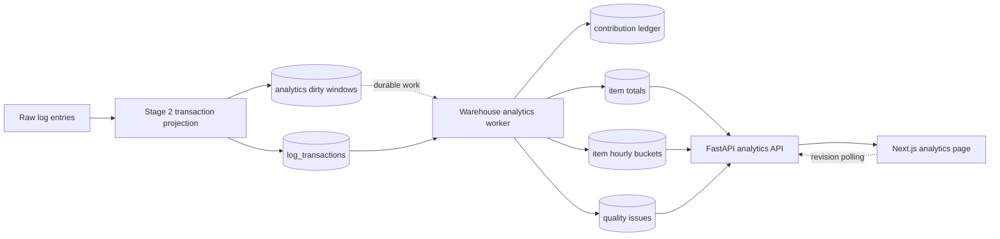

# Real-time warehouse consumption analytics plan

> ## SUPERSEDED
>
> **Superseded on 2026-08-17 by [`2026-08-17_22-32_merged-warehouse-analytics-platform-plan.md`](2026-08-17_22-32_merged-warehouse-analytics-platform-plan.md).**
> Do not implement from this document. Kept for history and for the analysis it contains.
>
> **What carried forward unchanged.** The contribution ledger with delta application, the transactional dirty-window ticket, `NUMERIC(38, 9)` quantities, revision polling before SSE, the read-only web tier with the loop in the singleton `app.worker`, the phased rollout with the worker disabled first, and the rejected-alternatives analysis. That core mechanism was correct and is the foundation of the successor.
>
> **Why it was replaced.** A code and live-data review found eleven defects, three of them capable of producing silently wrong totals. The most significant:
>
> - **Ticket bounds.** `regroup_incremental` deletes `WHERE sealed IS FALSE` with no time predicate (`derive_transactions.py:779-780`), so "the range Stage 2 used" is undefined for the highest-frequency rebuild path. Bounds must be computed from the freed set.
> - **Reconciliation blind spot.** Recomputing from `log_transactions` cannot detect that ~1,000 `log_entries` rows past the abandon window belong to no transaction at all, so the check passes while under-counting.
> - **Ledger identity.** Source uniqueness is `UNIQUE NULLS NOT DISTINCT (id, started_at)`, not unique on `id` (see `continuity.py`). Keying contributions on `source_transaction_id` alone can collapse two real rows into one receipt.
> - **Consumption filter.** The definition below keys on `transaction_type = '002001'`. That field carries WMS-supplied placeholders (`xxxxxx`, `XXXXX`, `0050XX`), and `AddStockCountLine` carries real `CountedQuantity` under a placeholder. Filter on `method` instead.
> - **Freshness semantics.** The 5-second objective measures analytics lag behind the projection. Measured settling time is 1.7 h average and 5.4 h worst, so a row can be reported fresh while still due to change. Two indicators are required, not one.
> - **Ticket table.** `log_regroup_pending` already exists in production with the same columns and is healthy (7,407 tickets, zero pending, zero abandoned, zero retries).
>
> The successor also adds daily, weekly and monthly grains, a generic metric registry, and an append-only contribution history for reproducible machine learning.

## Status and scope

This document is an implementation plan only.
No application code, database schema, service configuration, or production data was changed during the investigation.

The production analytics host is `192.168.0.142`.
PostgreSQL 16 database `rag` on that host is the source and target for this module.
The WMS SQL Server is not part of the proposed runtime architecture.
The WMS application source was inspected only to challenge field meanings and identify business-semantic risks.

The initial definition of consumption is:

> The quantity physically picked by a successful `ConfirmPickLine` transaction, identified by transaction type `002001`, using the numeric `QuantityPicked` attribute and grouped by tenant and item.

Stock moves, receipts, stock counts, failed pick attempts, and incomplete pick attempts must not be folded into consumption.
They remain separate event or quality metrics because they represent different physical or operational facts.

The initial freshness service-level objective is:

> A committed source transaction must be reflected in the aggregate within 5 seconds during normal operation, and the API must expose actual processing lag.

The number is effectively real-time, but it is not allowed to claim freshness while the ingestion, regroup, or analytics pipeline is behind.

## Executive decision

Build an idempotent incremental materialization inside the existing FastAPI, worker, and PostgreSQL stack.

Do not add Apache Flink, Kafka, Redis, Celery, or a separate analytics database at the measured volume.
The current peak is 68 derived transactions per minute and 13 pick transactions per minute.
Those rates do not justify another distributed stateful processing platform.

Do not add quantities directly whenever a `log_transactions` row appears.
`log_transactions` is a mutable derived projection that is deleted and rebuilt by Stage 2.
A naive additive consumer would count reconstructed rows again and produce plausible-looking wrong totals.

Use these components:

1. Stage 2 writes a bounded analytics dirty-window ticket in the same PostgreSQL transaction that commits a transaction projection change.
2. One dedicated analytics worker coalesces dirty windows per tenant and rereads the current authoritative projection for the affected range.
3. A contribution ledger records the latest normalized contribution for each stable transaction identity.
4. The worker applies the difference between the old and new contribution to per-item lifetime and hourly aggregates.
5. The contribution changes, aggregate deltas, quality issues, and dirty-window acknowledgement commit atomically.
6. The FastAPI read path serves pre-aggregated tenant-scoped rows.
7. The Next.js browser polls a cheap revision endpoint and refetches the snapshot only when the revision changes.

This is at-least-once work delivery with exactly-once effective aggregate mutation.

## Evidence boundary

### Verified

- The live PostgreSQL schema, counts, ranges, cardinalities, JSON keys, status distributions, and query plans were queried read-only.
- The local and deployed FastAPI code, models, migrations, workers, and tests were inspected.
- The deployed Next.js structure, API client, tenant context, and refresh conventions were inspected.
- The WMS C# source was inspected for operation-specific quantity mappings and activity logging behavior.

### Inferred

- A successful `002001 / ConfirmPickLine` transaction represents a successful physical pick because the live method, transaction name, status, item, and quantity fields align, and the WMS source identifies `002001` as pick activity.
- `QuantityPicked` is the best available consumption quantity because it is present and numeric on every observed `002001` row, while failed and incomplete transaction statuses demonstrably carry requested quantities that must not be counted.
- A sub-5-second worker is operationally real-time at the observed rate.

### Assumed and requiring product sign-off before implementation

- Consumption means successful physical picks, not demand, allocation, despatch, stock movement, or net inventory change.
- The unit in `QuantityPicked` is acceptable as the item's native transaction unit.
- Cross-item comparison of raw quantities is not meaningful unless an upstream canonical unit conversion is later supplied.
- Historical data currently present in the analytics database is the desired initial backfill scope.

## 1. Data inventory

### Production snapshot

The following values came from one `REPEATABLE READ READ ONLY` PostgreSQL transaction captured at `2026-08-11 00:11:34.122439+01`.

| Dataset | Exact rows | Event-time range | Tenant count | Relevant cardinality |
| --- | ---: | --- | ---: | --- |
| `log_entries` | 1,100,516 | 2026-06-29 11:10:17.275+01 to 2026-08-11 00:11:23.943+01 | 2 | 47 source files |
| `log_transactions` | 63,012 | 2026-06-29 11:10:17.275+01 to 2026-08-11 00:11:23.845+01 | 2 | 1,007 populated item numbers |
| Successful `002001 / ConfirmPickLine` | 7,584 | 2026-06-29 13:29:38.326+01 to 2026-08-11 00:11:22.605+01 | 2 | 692 picked items |

The successful pick quantity at that snapshot was `42,985.268644` native item units.
There were zero unconsumed and non-abandoned `log_regroup_pending` windows at the snapshot.
The log entry, assignment, and transaction relations occupied 1,882,578,944 bytes, reported as 1,795 MB.

### Physical storage shape

- `log_entries` is the append-only, lossless parsed-log source of truth.
- `log_entry_assignment` stores mutable membership between raw entries and derived transactions.
- `log_transactions` is a daily-partitioned, rebuildable REQUEST-to-RESPONSE projection.
- The parent partitioned relations report zero physical rows because rows live in dated and default child partitions.
- Future daily partitions are provisioned in advance.
- The default partitions contain substantial historical data, so a date predicate does not currently eliminate all historical reads.

Relevant model evidence is in:

- `app/persistence/models/log_entry.py`
- `app/persistence/models/log_entry_assignment.py`
- `app/persistence/models/log_transaction.py`
- `app/services/mnp_log_ingestion/pipeline/parse_insert.py`
- `app/services/mnp_log_ingestion/pipeline/derive_transactions.py`

### Where consumption fields live

The promoted `log_transactions.item_number` column contains the item identifier.
The quantity is not a promoted SQL column.
It lives at `log_transactions.attributes ->> 'QuantityPicked'` as JSON text.

For observed `002001` rows:

- `QuantityPicked` was present on every row.
- Every observed value matched the tested numeric format.
- The observed range was `0.0` through `1470.0`.
- No negative value was observed.
- `ExpectedQuantity` was also present and numeric on every row.
- `QuantityToBePicked` was blank on most rows and populated on 696 observed rows during the profiling pass.

The relevant promoted dimensions are:

- `customer_code`
- `started_at`
- `created_at`
- `item_number`
- `warehouse`
- `warehouse_id`
- `user_name`
- `device_id`
- `order_number`
- `reporting_number`
- `transaction_name`
- `transaction_type`
- `method`
- `status`
- `sealed`
- `reqid`

The relevant JSON dimensions include:

- `QuantityPicked`
- `ExpectedQuantity`
- `QuantityAlreadyPacked`
- `QuantityToBePicked`
- `LotNumber`
- `OrderLine`
- `OrderLineSuffix`
- `FromLocation`
- `ToLocation`
- `StockTransactionType`

### Other quantity-bearing transactions

These fields are useful for separate insight families but are not consumption:

| Transaction | Observed rows during profiling | Quantity evidence | Interpretation |
| --- | ---: | --- | --- |
| `001001 / StockMove` | 986 | `Quantity`, numeric on all observed rows | Internal transfer, not consumption |
| `004001 / ReceiptPO` | 1,612 | `Quantity`, numeric on all observed rows | Receipt activity, not consumption |
| `005001 / ReportCount` | 4,262 | `CountedQuantity`, `BalanceQuantity`, `OnHandBalanceToCompare` | Count and variance evidence, not consumption |

The WMS source shows that receipt activity can combine received and rejected quantities.
Receipt quantity must therefore not be labeled accepted stock inflow without an additional validated rule.

The WMS source also shows that stock-count field names do not follow intuitive semantics consistently.
Count metrics must be defined per transaction type and tested against known examples.

## 2. Data quality assessment

### Suitable for the initial consumption metric

#### `transaction_type` plus `method`

Use both `transaction_type = '002001'` and `method = 'ConfirmPickLine'`.
This prevents a future reused or malformed transaction code from silently entering the metric.

Observed `transaction_type` also contains placeholders and junk-like values:

- empty string
- `xxxxxx`
- `00xxxx`
- `XXXXXX`
- `0050XX`
- `XXXXX`

Those values can be useful for API activity analysis but cannot be treated as physical transaction codes.

#### `status`

Count only `status = 'success'`.

Observed pick rows included success, soft failure, hard error, and incomplete statuses.
Failed pick rows carried non-zero `QuantityPicked` request values, including error messages such as invalid pick line, missing allocation, missing location, and insufficient available quantity.
Summing all pick requests would therefore overstate physical consumption.

At one profiling point, successful pick rows contributed about `42,898.384358`, while error rows carried another `271.836` requested units and incomplete rows carried another `33.58` requested units.
The exact live total moved during the investigation, which is expected in production.

#### `item_number`

All observed `002001` rows had a populated item number.
The general transaction table did not: 24,902 of 62,936 rows lacked an item at an earlier snapshot.
Item completeness must be enforced for consumption but must not be generalized to all transaction families.

Normalize item numbers by trimming surrounding whitespace only.
Do not change case, strip leading zeros, or coerce to a number without an upstream item-master contract.

#### `QuantityPicked`

Parse as an exact decimal, never binary floating point.
Reject blank, non-numeric, non-finite, and negative values into a quality issue table.
Do not coerce malformed values to zero.

Zero is a valid observed value but does not increase consumption.
It remains a fact for short-pick and zero-pick analysis.

The initial database type should be `NUMERIC(38, 9)` unless profiling discovers a larger required scale before implementation.
This preserves the six-decimal values already observed and leaves headroom for later normalized units.

#### Event time and write time

Use `started_at` for business time buckets.
Use the tenant timezone for day and shift boundaries.
Use `created_at` or analytics processing timestamps only for freshness and operational lag.

Both active tenants had `Europe/London` configured during profiling.
The worker must reject or quarantine time-bucket materialization for a tenant without a valid timezone rather than silently selecting a deployment default.

### Misleading or unsafe fields

#### `log_transactions.created_at`

This is not an immutable event cursor.
Stage 2 stamps rebuilt rows again, including historical rows.
Using it as an additive cursor would double-count rebuilt transactions.

The existing notification cursor also acknowledges a tied-timestamp page-boundary case that may skip rows.
That trade-off is unacceptable for accounting.

#### `log_transactions.id`

The application works to preserve transaction identity across rebuilds, but identity alone does not make the transaction content immutable.
Item, quantity, status, timestamps, and membership can change after late data arrives.

The database uniqueness rule includes `started_at` because of partitioning.
The analytics ledger should enforce one logical active contribution per `(customer_code, source_transaction_id)` and quarantine any duplicate source identity rather than counting both.

During profiling, all 7,609 then-current pick rows had distinct transaction IDs.
This establishes the current condition, not a permanent guarantee.

#### `reqid`

`reqid` was populated on all then-current pick rows, but one request ID appeared twice.
It is a correlation field, not a safe unique accounting key.

#### Expected versus picked quantity

Among 7,572 successful pick rows in one profiling pass:

- 6,513 had picked quantity equal to expected quantity.
- 833 had picked quantity below expected quantity.
- 226 had picked quantity above expected quantity.
- 681 had zero picked quantity.
- Expected quantity summed to `51,177.895245`.
- Picked quantity summed to `42,937.404358`.

These differences support operational metrics, but they do not prove unfulfilled customer demand.
The expected quantity can be a workflow value rather than the final order-line demand.

### Completeness limitations

The log database observes activity that reached and was captured by the MNP application log pipeline.
It is not a database transaction log from the WMS.

The WMS source shows that activity logging can catch and suppress exceptions while allowing the business transaction to continue.
It also shows operation-specific branches that may not call the same logger uniformly.
Therefore, this module can provide exact aggregation over captured successful pick transactions, but it cannot prove complete warehouse-wide physical consumption without reconciliation to an authoritative inventory ledger.

The UI and API must label the source as captured successful picks.
They must not claim audited inventory depletion or financial consumption.

### Metrics that are not derivable today

The following must be shown plainly as unavailable or provisional:

- Monetary consumption value, cost of goods, margin, and inventory valuation are unavailable because no validated unit cost is present.
- Canonical-unit consumption across unlike items is unavailable because UOM conversion is not validated in the log projection.
- True customer demand is unavailable because unsuccessful demand, cancellations, substitutions, and complete order-line lifecycle are not established.
- Lost sales and service level are unavailable for the same reason.
- Exact stock on hand is unavailable from the log projection because the transaction feed is not an inventory balance ledger.
- Days of supply is unavailable until a trusted current balance and canonical consumption unit are joined.
- Shrinkage is unavailable because adjustment and count semantics do not establish cause or accepted variance consistently.
- Supplier lead time and supplier performance are unavailable because supplier identity and complete purchase-order milestone history have not been validated.
- Profitability by item, warehouse, user, route, or customer is unavailable without cost and revenue facts.
- Forecast accuracy is unavailable until forecasts and observed demand are stored with versioned model metadata.

### Defect handling policy

Every candidate transaction must end in one of three states:

1. A valid active contribution.
2. A valid zero contribution because the transaction is not successful or its picked quantity is zero.
3. A quarantined quality issue with a machine-readable reason.

No invalid source value may be silently dropped, rounded, defaulted, or counted as zero.

Quality issue reasons should include:

- `missing_item_number`
- `invalid_quantity`
- `negative_quantity`
- `missing_event_time`
- `invalid_tenant_timezone`
- `duplicate_source_identity`
- `unsupported_transaction_semantics`

The analytics health API must expose counts and the oldest unresolved issue by tenant.

## 3. Insight catalogue

### Available today from successful pick facts

#### Consumption

- Lifetime consumption quantity per item.
- Consumption quantity per item by hour, day, week, and month.
- Consumption event count per item.
- Average, median, minimum, maximum, and percentile pick quantity per item.
- Active item count in a selected period.
- Top and bottom items by picked quantity or event count.
- Item share of total picked quantity within one warehouse or tenant.
- First and last observed pick time per item.
- Recency since last successful pick.
- Rolling 1-hour, 24-hour, 7-day, and 28-day consumption.
- Rate of change versus the preceding comparable window.
- Intraday and day-of-week consumption patterns.

Source fields are `customer_code`, `item_number`, `started_at`, `QuantityPicked`, `transaction_type`, `method`, and `status`.

#### Pick fulfillment and exceptions

- Picked versus expected quantity.
- Short-pick event count and short-pick quantity gap.
- Over-pick event count and over-pick quantity gap.
- Zero-pick count and rate.
- Successful, soft-failed, hard-error, and incomplete attempt rates.
- Error count and quantity-at-risk grouped by normalized error category.
- Items with repeated pick failures.
- Recovery rate where a later successful pick follows a failed request, if a validated correlation rule is added.

Source fields are `QuantityPicked`, `ExpectedQuantity`, `QuantityToBePicked`, `status`, `error_text`, `reqid`, `item_number`, and event time.

#### Warehouse operations

- Pick throughput by warehouse.
- Pick throughput by operator.
- Pick throughput by device.
- Pick throughput by order and reporting number.
- Pick process mix by `transaction_name`.
- Transaction duration distribution and slow-transaction rate.
- Error rate by warehouse, operator, device, item, and process.
- Peak transaction and pick rates per minute.
- Workload concentration by hour and operator.

Source fields are `warehouse`, `warehouse_id`, `user_name`, `device_id`, `order_number`, `reporting_number`, `transaction_name`, `duration_ms`, and `status`.

#### Lot and traceability views

- Consumption by item and lot.
- Lot count consumed per item.
- Items consumed across unusually many lots.
- Last consumption time for a lot.

The observed successful pick rows had 1,465 distinct non-empty lot values.
Expiry was not populated on successful pick rows in the measured projection, so expiry-at-consumption is not available today.

#### Pipeline and trust indicators

- Source event watermark.
- Last transaction write time.
- Analytics processed watermark.
- End-to-end freshness lag.
- Pending regroup window count and age.
- Pending analytics dirty-window count and age.
- Quarantined source count and age.
- Reconciliation difference by tenant and item.
- Default-partition row growth.

These indicators must appear beside business metrics so stale or incomplete data cannot look current.

### Available today as separate non-consumption insights

- Receipt activity quantity by item and time, clearly labeled gross receipt activity until rejected quantity semantics are resolved.
- Internal stock movement quantity by item, origin, destination, warehouse, user, and time.
- Stock-count reported versus comparison quantity and observed variance.
- API transaction volume, latency, and error rate for every method and transaction type.
- User and device activity heatmaps.

None of these should be netted into the consumption total.

### Requires an upstream or source-model change

- Canonical base UOM and versioned conversion factor per event.
- Accepted receipt quantity separated from rejected quantity.
- Authoritative current on-hand, allocated, and free balance snapshots.
- Complete immutable WMS movement event identity and reversal semantics.
- Order-line demand, cancellation, substitution, and fulfillment lifecycle.
- Item master descriptions, categories, suppliers, storage class, and unit cost.
- Location and zone dimensions on pick events where currently absent.
- Expiry date on consumed lot events.
- Shift calendar and planned labor capacity.
- Explicit correction and reversal events.
- An audited completeness watermark from the WMS source.

These additions unlock inventory coverage, days of supply, stockout risk, waste and expiry exposure, fill rate, service level, supplier performance, labor utilization, and reliable ML demand targets.

## 4. Architecture

### Component diagram



### Stage 2 dirty-window publisher

Responsibility:

- Record that a bounded tenant event-time range may have changed.
- Write the ticket in the same transaction as the `log_transactions` rebuild.
- Never perform analytics calculation inside the event-loop-heavy grouping path.

Integration points:

- `app/services/mnp_log_ingestion/pipeline/derive_transactions.py`
- New `app/services/warehouse_analytics/dirty_windows.py`
- New model `app/persistence/models/warehouse_analytics_dirty_window.py`

The ticket contains:

- UUID primary key.
- `customer_code`.
- Inclusive lower and upper event-time bounds.
- Creation time.
- Availability time.
- Attempt count.
- Last error.
- Consumed or abandoned time.

The bounds must be the same padded range Stage 2 used to free and rebuild transaction ownership.
That makes deletion detection exact for the affected projection region.

### Analytics worker

Responsibility:

- Poll every second in the existing dedicated `app.worker` process.
- Claim and coalesce all currently available windows for one tenant.
- Serialize work per tenant with a transaction-scoped advisory lock.
- Query the latest source projection for the coalesced range.
- Normalize valid source rows into contributions.
- Diff them against stored contributions for the same range.
- Apply aggregate deltas.
- Record quality defects.
- Acknowledge tickets in the same commit.
- Retry with bounded exponential backoff.
- Abandon only after a configured threshold and raise a critical health signal.

Integration points:

- New `app/services/workers/warehouse_analytics_worker.py`.
- New `app/services/warehouse_analytics/normalizer.py`.
- New `app/services/warehouse_analytics/reconcile.py`.
- New `app/services/warehouse_analytics/fold.py`.
- `app/background.py` for worker registration.
- `app/settings.py` for cadence, batch, backoff, and staleness limits.

Do not reuse the existing notification timestamp cursor for accounting.
It has different correctness requirements and an acknowledged tied-timestamp skip case.

### Contribution ledger

Create `warehouse_consumption_contributions` with:

- `customer_code`.
- `source_transaction_id`.
- `source_started_at`.
- `source_version_hash`.
- `item_number`.
- `warehouse` and `warehouse_id`.
- `lot_number` when populated.
- `event_time`.
- `business_date` derived in the tenant timezone.
- `quantity NUMERIC(38, 9)`.
- `processed_at`.

Use primary key `(customer_code, source_transaction_id)`.
Store `source_started_at` as content, not identity.
If the source contains the same logical ID twice, quarantine it and stop advancing that tenant window until the ambiguity is resolved.

The version hash covers every value that changes accounting:

```text
sha256(
  transaction_type,
  method,
  status,
  item_number,
  quantity,
  event_time,
  warehouse,
  warehouse_id,
  lot_number
)
```

The ledger is the audit trail that explains every aggregate value.
It also enables later ML feature generation without reading mutable JSON from the full transaction history.

### Running totals

Create `warehouse_item_consumption_totals` with primary key `(customer_code, item_number)` and:

- `total_quantity NUMERIC(38, 9)`.
- `event_count BIGINT`.
- `first_event_at`.
- `last_event_at`.
- `revision BIGINT`.
- `updated_at`.

Create `warehouse_item_consumption_hourly` with primary key `(customer_code, bucket_start, item_number, warehouse_key)` and:

- `quantity NUMERIC(38, 9)`.
- `event_count BIGINT`.
- `revision BIGINT`.
- `updated_at`.

Use an explicit sentinel warehouse key for missing warehouse only in the bucket table.
Do not overload an empty string with two meanings.

The lifetime table makes the headline read proportional to the number of returned items.
The hourly table makes bounded time-series reads proportional to returned buckets rather than raw history.

### Quality issues and health state

Create `warehouse_analytics_quality_issues` keyed by tenant, source transaction, issue code, and source version.

Create `warehouse_analytics_state` keyed by tenant with:

- Current aggregate revision.
- Last successfully processed time.
- Source event watermark.
- Source write watermark.
- Oldest pending dirty-window time.
- Last reconciliation time.
- Reconciliation status.
- Current quality issue count.

This row supplies the cheap browser revision and freshness endpoint.

### Read API

Add `app/api/v1/analytics.py` and include it from `app/api/v1/router.py`.

Every endpoint must use `Depends(get_current_customer)` and `Depends(get_session)`.
The `X-Customer-Code` header remains the only tenant scope.

Initial endpoints:

- `GET /api/v1/analytics/warehouse/status`.
- `GET /api/v1/analytics/warehouse/consumption/items`.
- `GET /api/v1/analytics/warehouse/consumption/items/{item_number}`.
- `GET /api/v1/analytics/warehouse/consumption/timeseries`.
- `GET /api/v1/analytics/warehouse/picks/quality`.
- `POST /api/v1/analytics/warehouse/backfill` returning `202 Accepted` for an administrative tracked run.
- `POST /api/v1/analytics/warehouse/reconcile` returning `202 Accepted` for an administrative tracked run.

List endpoints require a default limit, hard maximum, and keyset pagination.
Do not run a default `COUNT(*)`.
Make exact totals opt-in only if the UI truly needs them.

Responses include:

- Aggregate revision.
- Source watermark.
- Analytics processed watermark.
- Lag seconds.
- Regroup pending state.
- Analytics pending state.
- Quality issue summary.
- `stale` boolean computed by the server.

Return an `ETag` derived from tenant, revision, filters, and response schema version.
Honor `If-None-Match` with `304 Not Modified`.

### Browser update path

Add these deployed frontend files:

- `src/app/analytics/warehouse/page.tsx`.
- `src/components/analytics/WarehouseAnalytics.tsx`.
- `src/components/analytics/ConsumptionSummary.tsx`.
- `src/components/analytics/ConsumptionTable.tsx`.
- `src/components/analytics/ConsumptionTrend.tsx`.
- `src/components/analytics/AnalyticsFreshness.tsx`.
- `src/hooks/useWarehouseAnalytics.ts`.
- `src/lib/warehouseAnalyticsApi.ts`.
- Associated Jest and Testing Library tests next to each component or hook.

Add an Analytics link to `src/components/ManageMenu.tsx` or a dedicated top-level navigation element after a UI review.
Do not place analytics under Notifications because it is a primary product area, not configuration.

The hook should:

- Poll the status endpoint every 2 seconds while the tab is visible.
- Pause or reduce polling when the tab is hidden.
- Refetch snapshots only when the revision changes.
- Abort superseded requests.
- Prevent an older response from replacing a newer revision.
- Back off after transient failures.
- Keep the last consistent snapshot visible with a stale warning.
- Clear data immediately when the active logspace changes.

The existing `LogspaceContext` must supply tenant selection.
The API layer must follow the existing same-origin rewrite and `X-Customer-Code` conventions.

### Why polling first

Revision polling is the recommended first delivery mechanism.

- It works across four Gunicorn worker processes without in-memory shared state.
- It survives reconnects because every read is authoritative.
- An unchanged status response is tiny and can return `304`.
- It requires no new broker or long-lived database listener.
- A 2-second poll meets the selected sub-5-second target when combined with a 1-second worker cadence.

Server-Sent Events with PostgreSQL `LISTEN/NOTIFY` can be a later optimization if measurement shows polling load matters.
SSE notifications would remain invalidation hints only, and the browser would still refetch authoritative state after reconnect.

WebSockets are rejected for the initial module because the browser sends no continuous data and their bidirectional complexity adds no value.

### Deployment model

- Keep the four Gunicorn web workers read-only for analytics requests.
- Run the analytics loop inside the existing singleton `python -m app.worker` process.
- Use the worker's existing advisory-lock and short-session conventions.
- Keep transactions short.
- Never hold a database transaction across a network call or CPU-heavy formatting.
- Offload any unavoidable heavy synchronous serialization with `asyncio.to_thread`.

### Schema and documentation files

The eventual implementation must change:

- `app/persistence/models/__init__.py`.
- New analytics ORM model files under `app/persistence/models/`.
- One or more Alembic revisions under `alembic/versions/`.
- `docs/database-er-diagram.md` in the same change.

Production indexes must use `CREATE INDEX CONCURRENTLY` in an Alembic autocommit block where the table already contains meaningful data.
New empty tables can receive indexes during table creation.

## 5. Running total write and read paths

### Candidate source query

The worker rereads a bounded event-time window and never scans the unbounded table:

```sql
SELECT
    id,
    started_at,
    customer_code,
    item_number,
    warehouse,
    warehouse_id,
    attributes ->> 'LotNumber' AS lot_number,
    attributes ->> 'QuantityPicked' AS quantity_text,
    status,
    method,
    transaction_type
FROM log_transactions
WHERE customer_code = :customer_code
  AND started_at >= :window_start
  AND started_at < :window_end
  AND transaction_type = '002001'
  AND method = 'ConfirmPickLine'
ORDER BY started_at, id;
```

The implementation must add and measure an index matching the actual query shape.
A likely candidate is `(customer_code, started_at, transaction_type, method, id)`, but the final order must be chosen from `EXPLAIN (ANALYZE, BUFFERS)` on realistic partitions.

### Reconciliation pseudocode

```text
begin transaction

acquire transaction-scoped advisory lock for customer
claim and coalesce available dirty windows for customer

current_rows = read current source candidates in coalesced window
normalized = normalize every current row
stored = lock contribution rows whose source_started_at lies in window

if a logical source id occurs more than once:
    persist quality issue
    rollback and retry after operator resolution

for every source identity in union(stored, normalized):
    old = stored.get(identity)
    new = normalized.get(identity)

    if new is invalid:
        record or refresh quality issue
        new_quantity = 0
    else:
        resolve any previous quality issue
        new_quantity = new.quantity

    old_quantity = old.quantity if old exists else 0

    if old and new and old.version_hash == new.version_hash:
        continue

    if old exists:
        decrement old item's lifetime total by old_quantity
        decrement old item's old hourly bucket by old_quantity
        decrement corresponding event counts when old_quantity represents an active event

    if new exists and new is a valid successful contribution:
        increment new item's lifetime total by new_quantity
        increment new item's new hourly bucket by new_quantity
        increment corresponding event counts
        upsert contribution with new content and version hash
    else:
        delete or deactivate old contribution

increment tenant aggregate revision once for the committed batch
update watermarks and processed time
mark claimed dirty windows consumed
commit
```

Subtracting the complete old contribution before adding the complete new contribution handles:

- Quantity correction.
- Item correction.
- Warehouse correction.
- Event-time movement into another hour or day.
- Status change from incomplete or error to success.
- Status change from success to error.
- Source transaction disappearance after regroup.
- Historical backfill.

### Atomic aggregate SQL shape

```sql
INSERT INTO warehouse_item_consumption_totals (
    customer_code,
    item_number,
    total_quantity,
    event_count,
    first_event_at,
    last_event_at,
    revision,
    updated_at
)
VALUES (
    :customer_code,
    :item_number,
    :quantity_delta,
    :event_count_delta,
    :event_time,
    :event_time,
    :revision,
    clock_timestamp()
)
ON CONFLICT (customer_code, item_number)
DO UPDATE SET
    total_quantity = warehouse_item_consumption_totals.total_quantity
                     + EXCLUDED.total_quantity,
    event_count = warehouse_item_consumption_totals.event_count
                  + EXCLUDED.event_count,
    first_event_at = LEAST(
        warehouse_item_consumption_totals.first_event_at,
        EXCLUDED.first_event_at
    ),
    last_event_at = GREATEST(
        warehouse_item_consumption_totals.last_event_at,
        EXCLUDED.last_event_at
    ),
    revision = EXCLUDED.revision,
    updated_at = EXCLUDED.updated_at;
```

`first_event_at` and `last_event_at` cannot be corrected safely by simple delta arithmetic when the removed event was the current boundary.
After any removal or event-time move that touches a boundary, recompute those two values from the indexed contribution ledger for that item inside the same transaction.

Delete aggregate rows whose event count reaches zero.
Assert that event count never becomes negative.
Permit a negative quantity delta during correction while requiring the final total to match the contribution ledger.

### Headline read path

```sql
SELECT
    item_number,
    total_quantity,
    event_count,
    first_event_at,
    last_event_at,
    revision,
    updated_at
FROM warehouse_item_consumption_totals
WHERE customer_code = :customer_code
  AND (:after_item IS NULL OR item_number > :after_item)
ORDER BY item_number
LIMIT :limit_plus_one;
```

For top-item ordering, use a keyset on `(total_quantity DESC, item_number ASC)` and a matching index.

### Time-series read path

```sql
SELECT
    bucket_start,
    item_number,
    warehouse_key,
    quantity,
    event_count
FROM warehouse_item_consumption_hourly
WHERE customer_code = :customer_code
  AND bucket_start >= :from_time
  AND bucket_start < :to_time
  AND (:item_number IS NULL OR item_number = :item_number)
  AND (:warehouse_key IS NULL OR warehouse_key = :warehouse_key)
ORDER BY bucket_start, item_number, warehouse_key
LIMIT :hard_limit_plus_one;
```

Long periods can be rolled up from hourly rows in a bounded query.
If retention eventually makes hourly history large, add daily rollups only after measurement.

### Failure guarantees

- A crash before commit changes neither aggregate nor ticket state.
- A crash after commit replays no work because the ticket is consumed.
- A connection loss with unknown commit outcome is safe because replay recomputes old versus current contributions.
- Duplicate dirty-window delivery is safe because unchanged version hashes produce delta zero.
- An older ticket processed after a newer ticket is safe because both reread the latest committed projection.
- Two workers cannot race one tenant because of the advisory lock.
- Different tenants can be processed concurrently in a future worker pool.
- Invalid source values stop or quarantine the affected contribution and remain visible.
- Retention cannot remove required source history until dirty windows are processed and reconciliation is current.

## 6. Scale and query behavior

### Measured current volume

- 1,100,516 raw log entries.
- 63,012 derived transactions.
- 7,584 successful pick contributions.
- 692 items with successful consumption.
- Peak 68 derived transactions per minute.
- Peak 13 pick transactions per minute.
- 1,795 MB across raw entries, assignments, and transaction tables.

The busiest observed complete day had 1,492 pick events and about 10,016.852272 successful picked units on 2026-08-10.

### Measured current query cost

The current direct top-item query over mutable `log_transactions`:

```sql
SELECT item_number,
       sum((attributes ->> 'QuantityPicked')::numeric) AS qty
FROM log_transactions
WHERE customer_code = 'tmp-live'
  AND transaction_type = '002001'
  AND status = 'success'
GROUP BY item_number
ORDER BY qty DESC
LIMIT 20;
```

measured:

- Planning time: 10.640 ms.
- Execution time: 43.156 ms.
- Shared buffers hit: 6,905.
- Rows entering the aggregate: 7,516 at that instant.

The current direct seven-day hourly query measured:

- Planning time: 11.957 ms.
- Execution time: 45.062 ms.
- Shared buffers hit: 5,691.
- Rows entering the aggregate: 6,108 at that instant.

Both plans append across many partitions and cast JSON text on every matching row.
Execution therefore grows with historical pick rows and partition count.
That is acceptable for investigation but not the desired permanent dashboard read path.

### Growth behavior of the proposed paths

| Path | Complexity after indexing | Growth behavior |
| --- | --- | --- |
| Dirty-window claim | Proportional to ready tickets | Coalescing keeps one tenant burst bounded |
| Source reconciliation | Proportional to source rows in affected event window | Independent of total retained history when partition pruning works |
| Contribution lookup | Proportional to contributions in affected window | Requires tenant and source-time index |
| Contribution upsert | Approximately logarithmic index lookup per changed identity | Only changed identities write |
| Lifetime headline | Proportional to returned items | Independent of transaction history |
| Top items | Index-assisted bounded scan | Independent of raw history |
| Hourly time series | Proportional to returned item-hour buckets | Independent of raw transaction count inside each bucket |
| Full reconciliation | Proportional to all retained successful picks | Background-only tracked run |

### Required indexes to test

Candidate indexes are:

- Source candidate scan on `log_transactions` beginning with `customer_code` and `started_at`.
- Dirty-window claim on unconsumed rows ordered by availability and creation time.
- Contribution range lookup on `(customer_code, source_started_at, source_transaction_id)`.
- Lifetime top-items lookup on `(customer_code, total_quantity DESC, item_number)`.
- Hourly lookup on `(customer_code, bucket_start, item_number, warehouse_key)`.
- Item-specific hourly lookup on `(customer_code, item_number, bucket_start)` if the primary index does not serve it.

Do not finalize index order from intuition.
Populate representative test volumes and require `EXPLAIN (ANALYZE, BUFFERS)` evidence for every hot query.

### Load and retention policy

- Fetch bounded source batches and enforce a hard maximum window size.
- Split an oversized historical dirty window into deterministic subwindows.
- Keep per-tenant transactions short.
- Run full reconciliation as `202 Accepted` background work with progress.
- Publish a consumer-retention dependency so source partitions are not dropped while analytics is behind.
- Alert before the analytics lag reaches the retention safety boundary.
- Retain the compact contribution ledger longer than raw transaction partitions if ML history requires it.

## 7. Test plan

### End-to-end first

Build the first test at the user-visible boundary.

1. Insert representative raw log evidence through the same ingestion endpoint or parser path an operator uses.
2. Allow Stage 2 to build the transaction.
3. Allow the analytics worker to process the dirty window.
4. Call the tenant-scoped analytics API.
5. Render the Next.js analytics page.
6. Assert the displayed item total, freshness state, and time bucket.

The test must fail before implementation and pass only when the full path works.

### Accounting correctness cases

- One successful pick increments one item once.
- Replaying the same dirty window changes the total zero times.
- Rebuilding an unchanged transaction changes the total zero times.
- Correcting quantity applies only `new - old`.
- Correcting the item subtracts from the old item and adds to the new item.
- Moving event time subtracts from the old hour and adds to the new hour.
- Changing success to error retracts the contribution.
- Changing incomplete to success adds the contribution.
- Removing a transaction during regroup retracts the contribution.
- A zero successful pick records an event according to the agreed event-count rule but adds zero quantity.
- A failed pick with non-zero request quantity adds zero consumption.
- A negative or malformed quantity is quarantined and never silently counted.
- A duplicate logical transaction ID blocks or quarantines the ambiguous window.
- Two tenants using the same item number never share totals.
- Decimal quantities sum exactly with no floating-point drift.

### Cursor, queue, and failure cases

- Crash before contribution write.
- Crash after contribution staging but before aggregate update.
- Crash after aggregate update but before ticket acknowledgement.
- Lost connection with unknown commit result.
- Duplicate ticket delivery.
- Overlapping dirty windows.
- Older ticket processed after a newer ticket.
- Multiple tickets for one tenant coalesce correctly.
- Two worker instances cannot process one tenant concurrently.
- One failing tenant does not block another tenant.
- Backoff and abandonment are visible in health state.
- A stale worker triggers an alert before retention can remove needed source data.

### Late data and rebuild cases

- Add an earlier raw entry to an unsealed transaction.
- Backfill a historical sealed interval.
- Preserve transaction identity while changing membership.
- Change transaction identity because continuity cannot preserve it and prove window reconciliation removes the old contribution.
- Move a rebuilt transaction across a daily partition boundary.
- Process many rows sharing the same `created_at` and prove no timestamp cursor is involved.

### Data-quality cases

- Missing item.
- Empty item after trimming.
- Leading-zero item preserved.
- Case-sensitive item preserved until a master-data rule says otherwise.
- Missing quantity.
- Whitespace quantity.
- Non-numeric quantity.
- Exponent notation policy explicitly tested.
- More than nine fractional digits.
- Quantity beyond numeric precision.
- Negative quantity.
- Missing event time.
- Invalid tenant timezone.
- Placeholder transaction code excluded.
- Receipt and stock-move quantities excluded from consumption.

### Reconciliation tests

For every test dataset, compare materialized totals against a clean full recomputation from current source transactions by:

- Tenant and item.
- Tenant, item, and hour.
- Tenant, item, and warehouse.
- Event count.
- First and last event time.

The production reconciliation job must report exact differences and affected identities.
It must never silently overwrite unexplained differences unless explicitly run in repair mode.

### API and security tests

- Missing `X-Customer-Code` is rejected.
- Unknown or inactive tenant is rejected.
- Every query includes tenant scope.
- Keyset pagination has no duplicates or gaps.
- Limits and hard maxima are enforced.
- Default paths do not execute `COUNT(*)`.
- `ETag` and `If-None-Match` return correct `304` behavior.
- Stale and unhealthy states are server-derived.
- Backfill and reconciliation endpoints return `202` and expose progress.

### Frontend tests

- Initial snapshot renders exact decimal quantities.
- Revision change triggers one snapshot refetch.
- Unchanged revision does not refetch large data.
- An older response cannot overwrite a newer revision.
- Tenant switch clears the prior tenant immediately.
- Hidden-tab polling slows or pauses and resumes safely.
- Transient failure preserves the last consistent snapshot and shows stale status.
- Quality issues and pipeline lag are visually prominent.
- Empty state distinguishes no consumption from stale or failed data.
- Tables, charts, keyboard focus, contrast, responsive layout, and decimal formatting pass accessibility and pixel-level review.

### Performance tests

Seed at least:

- Current production scale.
- 10 times current successful-pick history.
- 100 times current successful-pick history.
- A burst above the observed 13 picks per minute.
- One pathological tenant with a large historical backfill.

Measure:

- Source-window query planning and execution.
- Contribution diff time.
- Aggregate update time.
- Worker catch-up rate.
- Status endpoint p50 and p95.
- Item-list endpoint p50 and p95.
- Time-series endpoint p50 and p95.
- End-to-end source-commit to browser-visible freshness.
- `/health` responsiveness during catch-up.

Require index scans with effective partition pruning and no large sort on hot paths.

## Delivery sequence

### Phase 0: semantic contract and baseline fixture

- Record the successful-pick consumption definition as an API and analytics contract.
- Select several known production transactions with operator-confirmed outcomes.
- Capture sanitized fixtures for success, zero pick, short pick, error, incomplete, late backfill, and transaction rebuild.
- Confirm native item-unit treatment and decimal precision.

Exit criterion:

The fixture totals are signed off and the end-to-end test fails for the expected missing feature.

### Phase 1: schema, models, and ER diagram

- Add dirty-window, contribution, total, hourly, quality, and state models.
- Add Alembic migrations and constraints.
- Update `docs/database-er-diagram.md` in the same change.
- Add model, migration, constraint, and Mermaid validation tests.

Exit criterion:

Schema tests pass, every relationship is documented, and no source table is modified destructively.

### Phase 2: transactional dirty-window publication

- Publish exact padded ranges from every Stage 2 path that can create, delete, or rebuild transactions.
- Cover incremental tail regroup and historical window repair.
- Commit tickets atomically with projection changes.
- Add overlap, rollback, and late-data tests.

Exit criterion:

No committed projection change can occur without a durable analytics ticket, and a rolled-back projection creates no ticket.

### Phase 3: normalizer, contribution diff, and worker

- Implement strict candidate filtering and decimal parsing.
- Implement quality quarantine.
- Implement old-to-new contribution diff.
- Apply lifetime and hourly deltas atomically.
- Register the bounded singleton worker.
- Add crash, replay, overlap, concurrency, and correction tests.

Exit criterion:

Repeated processing is idempotent, every correction is reversible, and worker lag stays below the target at 100 times the measured pick rate.

### Phase 4: historical backfill and reconciliation

- Add tracked `202` runs.
- Backfill in bounded tenant and event-time windows.
- Compare materialized state with full recomputation.
- Add explicit report-only and repair modes.
- Gate source retention on healthy analytics state.

Exit criterion:

Production history reconciles exactly or every difference is explained and quarantined.

### Phase 5: read APIs

- Add status, item list, item detail, time series, and pick-quality endpoints.
- Add keyset pagination, limits, filters, revision metadata, and ETags.
- Measure every SQL path with realistic data.

Exit criterion:

All endpoints are tenant-safe, bounded, and meet agreed latency targets without default counts or raw-history aggregation.

### Phase 6: Next.js analytics experience

- Add the top-level analytics route and navigation.
- Add status, summary, item table, trend, and quality components.
- Implement revision polling, stale behavior, race prevention, and tenant switching.
- Perform accessibility, responsive, and pixel-level E2E review.

Exit criterion:

An operator sees a correct updated total within 5 seconds, can tell when it is stale, and cannot mistake a quality failure for zero consumption.

### Phase 7: production rollout and observation

- Deploy schema first.
- Deploy ticket publication and worker disabled.
- Run historical backfill and report-only reconciliation.
- Enable the worker for one tenant.
- Compare incremental and full totals continuously.
- Enable the API and UI after a stable observation window.
- Keep a feature flag to hide reads and pause new processing without deleting state.

Exit criterion:

Freshness, reconciliation, error rate, database load, and web-tier health remain inside thresholds under normal and catch-up load.

## Rejected alternatives

### Apache Flink

Rejected for the initial system because the measured rate is tiny relative to the operational cost of a separate cluster, checkpoint storage, connector lifecycle, schema registry, monitoring, and deployment model.
The proposed contribution ledger and dirty-window contract preserve a clean future boundary if volume later warrants Flink.

### Kafka or another broker

Rejected initially because PostgreSQL already provides the durable transaction boundary and singleton worker infrastructure.
Adding a broker would create dual-write or outbox-relay work without solving the mutable-source reconciliation problem.

### Direct aggregate query on every API request

Rejected because current direct queries already take about 43 to 45 ms at only about 7,500 pick rows, scan many partitions, and cast JSON per row.
Cost grows with retained history and concurrent dashboard users.

### Additive cursor over `log_transactions.created_at`

Rejected because rebuilt transactions receive new write timestamps, content can change, deletions are invisible, and tied timestamps can defeat timestamp-only pagination.

### Aggregate directly from raw `log_entries`

Rejected for the initial metric because success depends on REQUEST-to-RESPONSE grouping.
The raw request contains quantity, but counting it before the matching outcome would include failed physical picks.

### Database trigger on `log_transactions`

Rejected because Stage 2 performs bulk delete and rebuild behavior, business normalization would become hidden database logic, and complex correction handling in triggers would be difficult to test and operate.

### In-memory totals

Rejected because Gunicorn has four independent processes, the worker is a separate process, restarts lose memory, and state would not be shared or auditable.

### WebSocket-first browser delivery

Rejected because the use case needs server-to-client invalidation only, and revision polling already meets the selected freshness target with less operational state.

## Definition of done

- Consumption is explicitly limited to validated successful physical picks.
- Every source change produces durable bounded analytics work.
- Replays and rebuilds change totals exactly once in effect.
- Corrections and deletions retract old contributions.
- Full recomputation matches lifetime and hourly aggregates exactly.
- Invalid records are visible and never silently counted.
- Every API query is tenant-scoped and bounded.
- Hot queries have measured index-backed plans.
- Browser-visible freshness is under 5 seconds at the tested load.
- The UI displays stale and quality states beside the numbers.
- The ER diagram is updated with every schema change.
- Unit, integration, E2E, failure-injection, reconciliation, load, accessibility, and frontend race tests pass.

