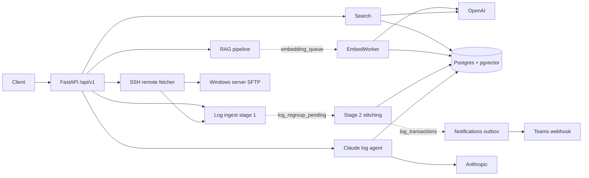

# Repo X-ray: RAG FAST API

Generated on 2026-07-09 by the /repo-xray skill.
Every claim below was verified against the code at the commit current on that date (HEAD = 5be82d9).

## Master overview

This is a FastAPI + PostgreSQL backend serving two loosely coupled product domains in one codebase.
The first domain is a 7-stage RAG document pipeline (upload, parse, chunk, embed, hybrid search, with pluggable vector stores).
The second domain is an M3/WMS log debugging platform: it ingests Infor M3 .NET server logs via file drop or remote SSH/SFTP pull, stitches raw lines into transactions, exposes them to a Claude tool-use debugging agent, and alerts via a notifications outbox.
It runs as a two-process topology: a web tier (uvicorn/gunicorn) and an optional dedicated worker process (`python -m app.worker`) that owns seven background asyncio loops.
Processes coordinate through Postgres advisory locks and queue-like tables rather than a message broker.
The codebase is roughly 170 Python files (120 in `app/`), multi-tenant via a `customer_code` soft key, async SQLAlchemy 2.0 throughout, with Alembic migrations.
The log domain is where all recent activity and nearly all tests live.
The RAG domain is older, untested, and currently has a broken search endpoint (see Gaps and risks).

## How the codebase is organized

```
main.py                  # uvicorn shim -> app.main:app
app/
  main.py                # FastAPI app + lifespan (conditionally starts workers)
  background.py          # setup_logging + start/stop of all background loops
  worker.py              # dedicated worker entrypoint (advisory-lock singleton)
  settings.py            # single pydantic-settings class, ~90 env vars
  config/database.py     # async engine, session factory, Base, get_session
  api/
    deps.py              # tenant resolution (X-Customer-Code), admin stub
    v1/                  # 7 routers under /api/v1
  services/
    data_ingestion/      # RAG pipeline: parsers, chunkers, orchestrator
    search/              # hybrid search over the vector store
    mnp_log_ingestion/   # M3 log parsing (stage 1), transaction stitching
                         #   (stage 2), remote/ SSH fetch, rendering
    log_agent/           # Claude tool-use agent over the log tables
    notifications/       # rules engine -> bus -> dispatcher outbox -> Teams
    workers/             # the 7 run_* background loops
    logspace_cleanup.py  # hard tenant purge
  persistence/
    models/              # 20 SQLAlchemy models
    repositories/        # 5 repository classes (partial coverage)
    storage/             # ObjectStorage ABC + local FS
    vectorstore/         # VectorStore ABC + pgvector/qdrant/pinecone
alembic/                 # 27 migrations, async env.py
docs/                    # 15 design docs, specs, postmortems
tests/                   # 16 files, real-Postgres integration tests
scripts/                 # 6 standalone E2E verification scripts
deploy/ + deploy.sh      # systemd worker unit + pull/migrate/restart script
```

## Components

| Component | Responsibility | Key files |
|---|---|---|
| API layer (~2,840 lines) | 7 routers: documents (upload/search), logs, SSH log sources, saved views, customers/log spaces, notifications. Tenant resolution via `X-Customer-Code` in `app/api/deps.py:45`. | `app/api/v1/logs.py` (699 lines, the hub), `saved_views.py` (619) |
| RAG pipeline | Upload -> parse (PDF/DOCX/MD/HTML) -> chunk -> enqueue embeddings. PDFs go through a multi-pass profile-aware chunker into `ChunkEntity`; everything else through a hierarchical chunker into `Chunk`. | `pipeline/orchestrator.py:33`, `CvChunker.py` (785 lines), `DataIngestion.py:22` |
| Search | Query embedding + keyword extraction -> vector-store hybrid query. Not tenant-scoped. | `search_service.py:112` |
| Log ingestion | Stage 1: parse M3 log lines, dedup by entry hash, insert `log_entries` (`parse_insert.py:54`). Stage 2: stitch entries into `log_transactions` with seal/abandon windows (`derive_transactions.py`, 835 lines - the heaviest brain in the repo). | `derive_transactions.py:232` (`_group`), `:746` (`finalize_pending`) |
| Remote SSH fetch | Per-customer pollers + on-demand runs pull log files over SFTP from a Windows server with checkpoints, rotation fingerprints, circuit breaker, host-key pinning, and per-host advisory locks. | `remote_fetcher.py:478` (`fetch_now`), `ssh_client.py`, `secrets.py` (Fernet) |
| Log agent | Claude (`claude-opus-4-8`) tool-use loop over 5 SELECT-only, tenant-scoped DB tools. | `log_agent/agent.py:58`, `tools.py:49` |
| Notifications | Rules engine polls `log_transactions` -> in-process bus -> durable Postgres outbox with lease-based retry -> channels. Only Teams is implemented; Slack/WhatsApp are stubs. Off by default. | `dispatcher.py:64`, `rules/engine.py:33` |
| Workers | The 7 loops: embedding worker and log watcher always-on; grouping, SSH fetcher, notifications, and logspace cleanup env-gated. | `app/background.py:69`, `app/services/workers/` |
| Persistence | 20 models, 5 repositories (customers, jobs, notifications, SSH sources, presence - none for the log tables), storage and vector-store adapters behind ABCs. | `models/__init__.py`, `vectorstore/factory.py:7` |

## How components communicate

Dependency direction is API -> services -> persistence -> config/settings, and the persistence layer is verifiably clean (zero upward imports).
There are exactly two upward violations, both targeting `app/api/deps.py`: `log_agent/agent.py:19` and `workers/log_watcher.py:17`.
In practice `deps.py` has become shared glue rather than a pure API-layer module.

The system's signature pattern is DB-mediated handoff.
There is no message broker; all async coordination happens through Postgres tables polled with `FOR UPDATE SKIP LOCKED`.
Advisory locks provide cross-process mutual exclusion: worker singleton (`worker.py:39`), per-SSH-host (`remote_fetcher.py:81`), per-tenant finalize (`derive_transactions.py:782`).

Representative trace - a document upload:

1. `POST /api/v1/documents/upload` (`upload.py:17`) applies a 50 MB guard, then `DataIngestion.ingest` (`DataIngestion.py:22`) saves the file to local storage, creates a `jobs` row, and fires a background task.
2. `run_pipeline` (`orchestrator.py:33`) parses, chunks (multipass or hierarchical branch at `:53`), and writes chunk rows plus `embedding_queue` items in one transaction (`:112`, `:170`).
3. The embedding worker independently claims pending queue items with `SKIP LOCKED` (`embedding_worker.py:25`), calls OpenAI, upserts vectors into the configured store (`:139`), and marks the job `completed` when the queue drains (`:151`).
4. The client polls `GET /documents/jobs/{job_id}` throughout.

The SSH log flow is the same shape at larger scale.
A poller or on-demand run performs an SFTP incremental pull, Stage 1 inserts entries plus a `log_regroup_pending` dirty-window row, `finalize_pending` coalesces windows and runs Stage 2 stitching, and notifications later discover new `log_transactions` by polling, never by direct call.



External systems: Postgres/pgvector (`config/database.py:23`, `vectorstore/pgvector.py`), optional Qdrant and Pinecone, OpenAI embeddings (`embedding_worker.py:45`, `search_service.py:102`), Anthropic (`agent.py:56`), asyncssh to the Windows server (`ssh_client.py:71`), Teams webhooks via httpx (`teams.py:33`), and the local filesystem for uploads and the log staging directory.

## Entry points

| Entry point | Kind | Where | What it starts |
|---|---|---|---|
| `uvicorn main:app` | HTTP | `main.py:3` -> `app/main.py:48` | FastAPI app; lifespan starts all loops unless `RUN_BACKGROUND_WORKERS=false` |
| `python -m app.worker` | Worker | `app/worker.py:65` | All 7 loops, advisory-lock singleton, SIGTERM-aware |
| 7 background loops | Poller | `app/background.py:69` | Embedding (2s), log watcher (5s), grouping (5s, off), SSH fetcher (per-customer, on), notifications (10s, off), cleanup (hourly, off) |
| `POST /logs/fetch-remote`, `POST /logs/regroup/finalize` | On-demand tasks | `log_sources.py:263`, `logs.py:285` | Tracked `asyncio.create_task` runs, pollable via run rows |
| `alembic upgrade head` | Migration | `alembic/env.py`, run by `deploy.sh:17` | 27 async migrations |
| `pytest` | Tests | `pytest.ini` | Real-Postgres integration tests |
| `scripts/*.py` | E2E scripts | `scripts/` | Six standalone verification harnesses driving the real app in-process |

## Architecture

Honestly assessed: this is a loosely layered, service-oriented monolith with a two-tier process topology, where the layering is habit rather than structure.
Two subsystems are genuinely hexagonal: vector store / object storage (ABCs + factory, `vectorstore/base.py:5`) and notifications (channel and evaluator ABCs).
The log subsystem bypasses repositories entirely: `logs.py`, `log_sources.py`, and `saved_views.py` issue raw SQLAlchemy directly from route handlers, and `logs.py` carries real business logic (cascade deletes at `:388`, pending-window aggregation, async task lifecycle).
There is no repository for the two most important tables (`log_entries`, `log_transactions`).
Two session idioms coexist by design: request-path DI (`Depends(get_session)`) and background-path `async with async_session()`.
One boundary is impeccably respected: `HTTPException` never appears outside `app/api/` - services raise typed domain errors that routes translate.

## Conventions and best practices

House rules a newcomer must follow:

- Every log-domain query filters on `customer_code`, resolved only via `deps.py`, which also pins the request's display timezone.
- Cross-tenant probes deliberately return 404 identical to missing.
- Config goes through `app/settings.py` only, env-gated with safe defaults; all secrets default empty, and SSH keys are Fernet-encrypted and fail closed (`remote/secrets.py:34`).
- Migrations are hand-written and feature-named.
- Docs land in `docs/` with the feature, including postmortems.
- Tests run against real Postgres with rollback isolation (`tests/conftest.py:59`) and surgical monkeypatching of network boundaries only.
- Per project instruction, any schema change must update `docs/database-er-diagram.md` in the same change.

### Gaps and risks (in order of severity)

1. Search is broken on the default backend.
   `search_service.py:167-172` always passes `text_match=` but `PgVectorStore.query` (`pgvector.py:55`) does not accept it, so every `POST /documents/search` on pgvector raises `TypeError`.
   The abstract base (`base.py:22`) declares the parameter, so pgvector's override is out of sync.
   Hybrid search only actually works on the Qdrant backend.
2. No authentication or authorization.
   The API trusts the `X-Customer-Code` header; `require_admin` is a permit-all placeholder (`deps.py:34`, the repo's only TODO).
   Multi-tenancy is real but unenforced against a hostile caller.
3. The entire RAG side has zero tests: upload, pipeline, chunkers, embedding worker, and search are all untested (which is how risk 1 survived), as are the log agent and notification delivery logic.
4. God modules: `derive_transactions.py` (835 lines mixing builder, grouping, persistence, and orchestration), `CvChunker.py` (785 lines, 15 classes), `logs.py` (699 lines).
5. Fragile in-memory coupling: `app/main.py:11` imports the private `_fetch_tasks` dict from a router module.
   The `except (asyncio.CancelledError, Exception): pass` pattern (`main.py:44`, `background.py:120`) can suppress cooperative cancellation.
6. Staleness: the README directory tree describes a structure that no longer exists (`app/models/`, `app/pipeline/`); nine `*_copy` log fixtures are tracked under `logs/processed/`; three chunker scaffold dirs are empty; PascalCase filenames (`DataIngestion.py`, `ChunkEntity.py`) break the snake_case convention; and `Chunk` vs `ChunkEntity` is a naming trap (both live, different pipelines).
7. `deploy.sh` restarts `fastapirag.service`, but that web unit is not in the repo; only the worker unit is committed.

## Suggested reading order

1. `app/settings.py` - every feature flag and tunable; the fastest map of what the system can do.
2. `app/main.py` + `app/background.py` - process topology and which loops run where.
3. `app/api/deps.py` - the tenancy model everything else assumes.
4. `app/services/data_ingestion/pipeline/orchestrator.py` - the RAG pipeline end to end in 170 lines.
5. `app/services/workers/embedding_worker.py` - the queue-consumer pattern used repo-wide.
6. `app/services/mnp_log_ingestion/pipeline/derive_transactions.py` (skim `_group` and `finalize_pending`) - the domain core.
7. `app/services/mnp_log_ingestion/remote/remote_fetcher.py` - the SSH hardening story behind most recent commits.
8. `app/services/log_agent/tools.py` - how the Claude agent is constrained.
9. `docs/transaction-log-ingestion-design.md` and `docs/stage2-stitching-stall-postmortem-and-fix.md` - the why behind the design.
