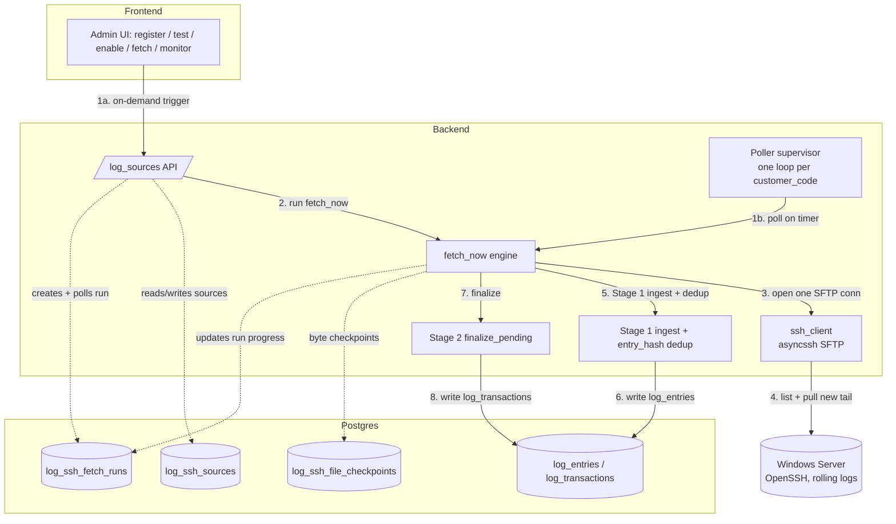
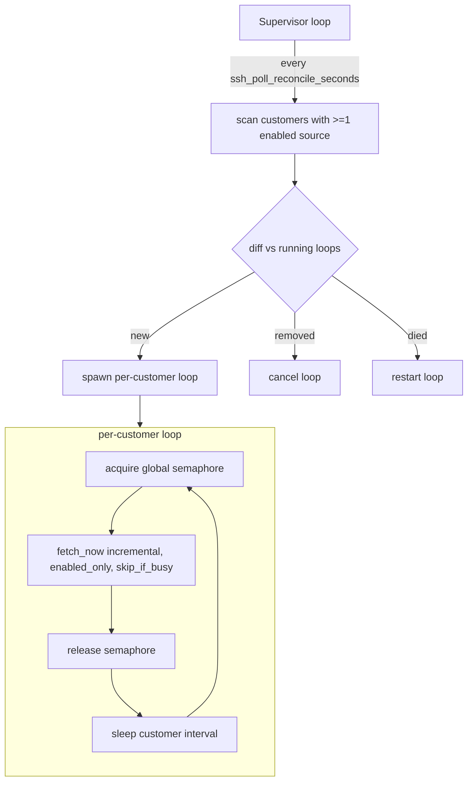
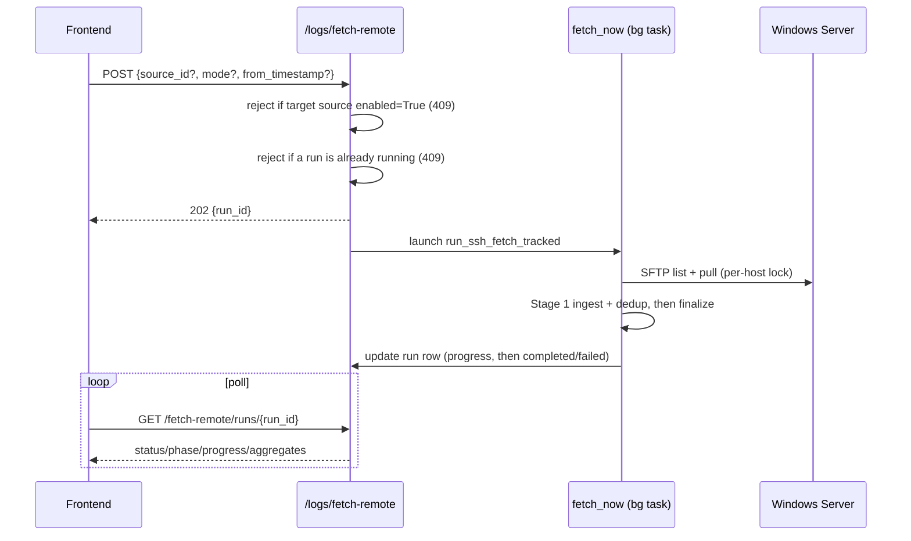

# SSH/SFTP Automatic Log Fetch - Design, Hardening & Operations

This document is the master reference for the SSH/SFTP log-fetch subsystem: what it is, how automatic and manual fetching behave, how it stays correct and safe against a live production server, the frontend administration surface, and the concrete implementation plan to harden it.
It supersedes the older `docs/automatic-log-fetch.md` overview and captures every design decision agreed in planning.

> **Status:** design + hardening plan, not yet implemented. Section 10 lists the concrete changes and build order; no code has been changed yet.

---

## 1. Master overview

### 1.1 What it does

Instead of a human uploading a log file, the backend reaches out over SSH/SFTP to each customer's Windows Server (running OpenSSH), reads only the *new tail* of the matching log files, and feeds those bytes through the **same Stage 1 ingestion** the upload / scan / watcher paths already use.
Stage 2 finalize then stitches the new entries into transactions so they are visible to reads and the debugging agent.

There are two ways a fetch is triggered, both landing in one shared engine (`fetch_now`):

- **Automatic** - a background poller pulls on a timer, per customer.
- **Manual** - an operator (via the frontend) triggers an on-demand pull, optionally bounded by a start timestamp.

### 1.2 The core correctness model (two independent layers)

This is the single most important idea in the whole subsystem.
Correctness never depends on the network transfer being exactly-once.

- **Layer 1 - the byte checkpoint (a bandwidth optimization).**
  Per remote file we remember how far we have read, so unchanged files are skipped and grown files transfer only their new tail.
- **Layer 2 - content dedup (the correctness guarantee).**
  Every parsed entry is stored with `entry_hash = sha256(raw_body)` under a unique `(customer_code, entry_hash)` constraint via `INSERT ... ON CONFLICT DO NOTHING`.
  Re-reading overlapping or whole files therefore *never* creates duplicate rows.

Because Layer 2 makes re-reading always safe, the design can afford to err toward re-reading (shrink, rotation, timestamp over-selection, full re-sync) without any risk of duplication.

### 1.3 Architecture at a glance



Follow the **solid numbered arrows** for the fetch sequence: a fetch is triggered either on-demand from the UI (`1a`) or by the per-customer poller on its timer (`1b`); both run `fetch_now` (`2`), which opens a single SFTP connection (`3`), lists and pulls only the new tail (`4`), feeds the bytes through Stage 1 ingest + content dedup (`5`) into `log_entries` (`6`), then finalizes Stage 2 (`7`) into `log_transactions` (`8`).
The **dotted arrows** are DB bookkeeping (config, checkpoints, run progress), not steps in the sequence.

### 1.4 Key files

- `app/persistence/models/log_ssh_source.py` - `log_ssh_sources` (one row per Windows Server per customer; gains `consecutive_failures` / `auto_disabled_at` / `last_attempt_at`).
- `app/persistence/models/log_ssh_file_checkpoint.py` - `log_ssh_file_checkpoints` (per source+file byte cursor; gains `head_fingerprint`).
- `app/persistence/models/log_ssh_fetch_run.py` - `log_ssh_fetch_runs` (tracked-run row; `LogSshFetchMode`, `LogSshFetchPhase`, `LogSshFetchRunStatus`).
- `app/services/workers/ssh_log_fetcher.py` - the background poller (rewritten to supervisor + per-customer loops).
- `app/services/mnp_log_ingestion/remote/remote_fetcher.py` - the engine (`fetch_now`, `_fetch_source`, `_pull_range`, `_save_ckpt`, `run_ssh_fetch_tracked`).
- `app/services/mnp_log_ingestion/remote/ssh_client.py` - asyncssh connect / SFTP, host-key pinning, timeouts/keepalive.
- `app/services/mnp_log_ingestion/remote/secrets.py` - Fernet encrypt/decrypt for inline key material (fail-closed).
- `app/api/v1/log_sources.py` - the frontend-facing API (CRUD, test, fetch-remote, runs).
- `app/main.py` - lifespan startup/shutdown of the poller + stale-run sweep.
- `app/settings.py` - all `ssh_*` settings.

---

## 2. Data model

### 2.1 `log_ssh_sources` - what to fetch (one row per server)

- Identity: `id` (uuid PK); unique `(customer_code, name)` - the tenant-local label (e.g. `prod-wms-1`) addresses a source.
- Connection: `host`, `port` (default 22), `username`.
- Auth (key only): `private_key_path` (a file on the backend host, preferred - no secret in the DB) OR inline Fernet-encrypted `private_key_enc` / `key_passphrase_enc`.
- What to pull: `remote_log_dir` + `file_glob` (POSIX style even on Windows OpenSSH, e.g. `C:/logs/m3` + `*.log`).
- Poller control: `enabled` (drives the automatic poller AND the manual/auto ownership contract), `poll_interval_seconds` (now wired up - see §4.1).
- Security: `host_key_fingerprint` (pinned on first successful connect).
- Bookkeeping: `last_ok_at`, `last_error`, `created_at`, `updated_at`.
- Outage / circuit breaker (NEW): `consecutive_failures` (int, default 0 - reset to 0 on any successful fetch), `auto_disabled_at` (timestamptz, null unless the breaker flipped `enabled=False`, so the UI can distinguish an auto-disable from an operator disable), and `last_attempt_at` (timestamptz - when a fetch was last *attempted*, success or failure; `last_ok_at` remains last *success*). See §4.5 and §9.6.
- The per-source `status` the frontend renders is **computed** (not stored) in `_to_out` from these fields - see §9.6.

### 2.2 `log_ssh_file_checkpoints` - the incremental cursor (per source+file)

- `id` (uuid PK); `source_id` (FK -> `log_ssh_sources.id`, ON DELETE CASCADE); `customer_code`.
- `remote_path` (full remote path); unique `(source_id, remote_path)`.
- `last_size`, `last_mtime`, `last_offset` (newline-aligned bytes ingested), `last_fetched_at`.
- **NEW: `head_fingerprint`** - `sha256` of the first N bytes of the file, used to detect log rotation (a path reused by different content).
  Nullable, backfilled lazily.

The identity is the **full remote path**, never the basename - so `M3.log`, `M3.log.1`, `M3.log.2` are tracked independently, and the same basename on two servers never collides.

### 2.3 `log_ssh_fetch_runs` - a tracked manual run

- `id` (uuid PK); `customer_code`; `source_id` (nullable, no FK - null means "all sources").
- `mode` (`incremental` | `timestamp` | `full`); `requested_from`.
- `status` (`running` | `completed` | `failed` | `cancelled`); `phase` (`listing` | `fetching` | `regrouping` | `done`); `progress` (JSONB). (`cancelled` is NEW - set by the cancel endpoint, §9.3.)
- Aggregates: `files_considered`, `files_fetched`, `bytes_fetched`, `entries_ingested`.
- `error`, `result` (JSONB), `created_at`, `finished_at`.

The automatic poller does not create run rows; only the manual/tracked path does, so the frontend can poll progress.

---

## 3. Configuration (`app/settings.py`)

Existing:

```python
ssh_log_fetcher_enabled: bool = True           # global kill-switch (default on); per-source `enabled` drives auto-poll
ssh_log_fetcher_poll_seconds: float = 60.0      # default per-customer cadence when no source interval is set
ssh_connect_timeout_seconds: float = 20.0        # bounds the initial TCP/SSH handshake only
ssh_max_file_size: int = 200 * 1024 * 1024       # per read-window cap (mirrors the upload cap)
ssh_secret_key: str = ""                          # Fernet key for inline private-key material
```

New (added by this plan):

```python
ssh_operation_timeout_seconds: float = 60.0     # per SFTP op (glob/stat/open/read/close) hard ceiling
ssh_keepalive_interval_seconds: float = 15.0     # asyncssh keepalive probe cadence
ssh_keepalive_count_max: int = 3                 # drop the connection after this many missed probes
ssh_fingerprint_bytes: int = 4096                # head bytes hashed to detect rotation (one small read/file/poll)
ssh_checkpoint_retention_days: int = 30          # prune checkpoints for vanished paths older than this
ssh_fetch_lock_wait_seconds: float = 30.0        # on-demand: max wait to acquire the per-host fetch lock
ssh_poll_max_concurrent: int = 8                 # global cap on concurrent per-customer fetches (protects the DB pool)
ssh_poll_reconcile_seconds: float = 30.0         # how often the supervisor re-scans the set of customers to poll
ssh_auto_disable_after_failures: int = 10        # consecutive failed poller fetches before a source is auto-disabled (0 = off)
```

Tuning note: a full 200 MB read window over a slow link can exceed the 60 s op-timeout; on slow links raise `ssh_operation_timeout_seconds` or lower `ssh_max_file_size`.

---

## 4. Fetch scenarios

This section is the operational heart: what actually happens in each situation.

### 4.1 Automatic fetching (the poller)

**Ownership:** the poller only ever touches sources with `enabled = True`.
A per-`customer_code` model gives full tenant isolation - a slow or unreachable server for one tenant never blocks another.



- **Supervisor** (`run_ssh_log_fetcher`, started in lifespan by default; `ssh_log_fetcher_enabled` is only a global kill-switch): every `ssh_poll_reconcile_seconds` it reconciles the desired set of customers (those with >=1 enabled source) against a `dict[customer_code, asyncio.Task]`, spawning, reaping, and restarting loops. Idle (no loops) when nothing is enabled, so auto-poll is driven entirely by the per-source `enabled` flag from the frontend. Wrapped so it never dies; cancels all children on shutdown.
- **Per-customer loop**: acquires the global `asyncio.Semaphore(ssh_poll_max_concurrent)` only around the fetch, runs `fetch_now(..., enabled_only=True, skip_if_busy=True)`, catches everything except `CancelledError`, then sleeps its interval.
- **Per-customer cadence** (wires up `poll_interval_seconds`): interval = the minimum non-null `poll_interval_seconds` across that customer's enabled sources, else `ssh_log_fetcher_poll_seconds`.
- **Isolation:** a crash is caught per tenant (and the supervisor respawns); a hung server is bounded by SFTP timeouts (§7) and occupies only one semaphore slot; within a tenant, sources are processed sequentially (a tenant's slow server only delays that tenant's other servers).
- **Mode:** always `incremental` (per-file byte tail via checkpoints - see §5).

### 4.2 Manual fetching (on-demand)

Triggered by the frontend via `POST /logs/fetch-remote`, which returns `202` + a `run_id` to poll.
Runs in a background task on its own session, records progress on the `log_ssh_fetch_runs` row, and never raises (failures land as `status=failed`).

Three modes:

- **incremental** - "pull whatever is new right now" (same per-file tail logic as the poller).
- **timestamp** - "ensure coverage from time T" (the windowed catch-up - see §4.4).
- **full** - re-pull every matching file whole (first sync / repair); dedup drops the overlap.

Mode defaults: `timestamp` when `from_timestamp` is provided, else `incremental`; an explicit `mode` in the body wins.



### 4.3 Manual vs automatic - the ownership contract

`enabled` cleanly separates who owns a source:

- `enabled = True` -> **the poller owns it**. A manual fetch of that specific source is rejected with `409` ("disable auto-polling before fetching manually").
- `enabled = False` -> **the operator owns it** (manual only). The poller ignores it; manual fetch works.
- A "fetch all" manual request (`source_id = null`) pulls **only the disabled sources**, silently skipping the enabled ones the poller owns.

This is a policy for clarity and predictable UX; concurrency is already made safe by the per-host lock (§6), so the contract is not a correctness requirement - it just prevents confusing "busy, try later" bounces and keeps a single owner per source.

### 4.4 Manual bounded resume after an outage (avoid backpressure)

When a source has been off (disabled, or its server unreachable) for a long time, you usually do not want to backfill 30 days of rotated files.
The `timestamp` mode gives an operator-controlled, volume-bounded catch-up.

Procedure:

1. Ensure the source is `enabled = False`. It reaches that state either because the operator disabled it (planned downtime) or because the circuit breaker (§4.5) already auto-disabled it after a sustained outage. Either way the poller ignores a disabled source, so it never auto-backfills on its own.
2. Trigger `POST /logs/fetch-remote { source_id, mode: "timestamp", from_timestamp: <e.g. now-24h> }`.
3. Only files whose `mtime >= from_timestamp` (plus the single newest older file, i.e. the active file) are pulled - so "last 24h" touches ~1-2 rotation files, not a month. The window is file-granular, so you get whole recent files (dedup drops overlap), never the old backlog.
4. **Forward-only seed:** the resume seeds checkpoints for *all* currently-present files up to their current end (size, mtime, offset=EOF, fingerprint) without ingesting the old ones. So when you later flip `enabled = True`, the incremental poller only appends new bytes - no backfill burst of the pre-window rotations.
5. Flip `enabled = True` to resume automatic polling.

Two supporting details:

- `force_remote`: an explicit manual timestamp request always hits the server, bypassing the "local Postgres already covers T" short-circuit (which would otherwise misfire on resume because old local data exists). The automatic path keeps the short-circuit.
- Cold-resume correctness: on the first pass, the active file and any reused rotation paths are detected as changed via the head fingerprint (§5.2) and re-read from 0; dedup drops overlap. You recover everything the server *still retains*; anything the server itself already rotated away during the outage is permanently gone (a remote-retention limit, mitigated server-side by a larger keep-count).

### 4.5 Automatic outage handling (circuit breaker)

`enabled` is otherwise a manual flag, so a source whose server goes unreachable would stay enabled and retry forever, then auto-resume with a full retention-set re-read (backpressure) the moment the server returns.
To prevent that, the automatic poller runs a **circuit breaker** that moves a persistently-failing source into manual-only mode:

- Each source carries `consecutive_failures`. A failed **poller** fetch increments it; any successful fetch resets it to 0 and clears `auto_disabled_at`. (Manual fetches do not drive the breaker; a manual fetch of an enabled source is 409'd anyway per §4.3.)
- When `consecutive_failures` reaches `ssh_auto_disable_after_failures` (default 10; at a 60 s cadence, ~10 minutes of continuous failure), the poller flips the source to `enabled = False`, sets `auto_disabled_at = now`, and writes a clear `last_error` (e.g. "Auto-disabled after 10 consecutive failures - re-enable and run a bounded resume").
- The source is now **manual-only** (§4.3): the poller stops touching it, so there is no more retrying and no surprise backfill later.
- The operator sees the auto-disabled state in the health view (§9.4), fixes the server, resumes with a bounded timestamp window (§4.4), then re-enables. Re-enabling (PATCH `enabled=true`) resets `consecutive_failures` and clears `auto_disabled_at`, arming the breaker afresh.
- Set `ssh_auto_disable_after_failures = 0` to disable the breaker (retry-forever behavior).

This closes the loop between "connection off for a while" and "source in manual-only mode", so the bounded resume in §4.4 applies to unplanned outages, not just planned ones.

---

## 5. The engine internals

### 5.1 Incremental checkpoint decision (per file, keyed on full remote_path)

Each poll stats every currently-present file, reads its head bytes (§5.2), and decides:

| Current file vs checkpoint | Decision | Why |
|---|---|---|
| same `size` AND same `mtime` AND fingerprint matches | **skip** (no transfer) | genuinely unchanged |
| `size` grew, fingerprint matches | read `[last_offset, size)` | append-only growth - just the new tail |
| fingerprint differs | re-read from `0` | path reused by different content (rotation/replace) |
| `size` shrank (`< last_size`) | re-read from `0` | truncation/rotation |
| metadata changed but `offset >= size` | update checkpoint, no pull | nothing new to read |

For `timestamp`/`full` the file is read whole from 0 (dedup drops overlap); `timestamp` additionally narrows to selected files and seeds the rest (§4.4).

### 5.2 Head fingerprint - closing the rotation miss window

Identity is path-based, so without a content signal a path reused by different content (log rotation) could, in a rare lagging-poller + mtime-collision case, skip never-seen bytes.
Fix: store `head_fingerprint = sha256(first ssh_fingerprint_bytes)`, and fingerprint **every considered file each poll** (even unchanged size+mtime).
If the stored fingerprint differs from the current one, the file was rotated/replaced -> re-read from 0.
**Stability rule:** the first-N-bytes hash is a reliable identity only once the file has `>= ssh_fingerprint_bytes` (an append-only log never rewrites its first N bytes past that point).
Below N the window still covers appendable bytes, so the fingerprint is compared **only when both the stored and current sizes are `>= N`** - otherwise the fetcher falls back to size/mtime/offset and never mistakes a small-file append for a rotation.
Consequence: rotation detection covers the realistic case (log files `>= N`); a reused path on a sub-N file with a size+mtime collision is the only residual (tiny) miss, and truncation is still caught by the size-shrank branch.
This makes cold resume and fast rotation lossless for real log files (dedup absorbs any overlap).
Cost: one small (default 4 KB) `open`+`read`+`close` per considered file per poll - negligible.

### 5.3 Newline alignment (`_pull_range`)

Reads `[start, size)` in windows of at most `ssh_max_file_size`.
A window that does not reach EOF is trimmed back to its last newline, so a partial trailing line is never ingested; the offset advances only to that boundary.
A full window with no newline (one absurdly long line) is ingested whole to guarantee forward progress.

### 5.4 Two-layer dedup (recap)

- Layer 1 (checkpoint) decides whether to transfer bytes at all.
- Layer 2 (`entry_hash`, `ON CONFLICT (customer_code, entry_hash) DO NOTHING`) guarantees no duplicate rows even when bytes are re-read.
  Dedup is per customer - two tenants emitting an identical line are two distinct rows; the same line for one tenant across two files (e.g. rotation overlap) is stored once.

---

## 6. Concurrency & locking model

- **Per-host fetch lock (one connection per server).** Each fetch takes a session-scoped `pg_try_advisory_lock` in the two-int keyspace, keyed on normalized `host:port`, on a dedicated `engine.connect()` connection held (idle) for the fetch. Closing that connection auto-releases the lock. This guarantees **at most one live SSH connection to any single server at any moment**, across the poller and manual fetches and even across tenants sharing a server. It also prevents the checkpoint race. Different hosts use distinct keys, so they fetch in parallel.
  - Poller: non-blocking try-lock; if busy, skip that source this tick (records `skipped`, not an error).
  - Manual: blocking with a bounded `ssh_fetch_lock_wait_seconds` wait; on timeout the run fails with "another fetch for this host is in progress".
- **Two-int keyspace** is disjoint from the single-arg keyspace used by `finalize_pending`'s `pg_advisory_xact_lock(hashtext(customer_code))`, so the fetch lock and the finalize lock provably cannot deadlock or collide.
- **Checkpoint upsert.** `_save_ckpt` becomes `pg_insert(...).on_conflict_do_update(index_elements=["source_id","remote_path"], ...)`, so any residual overlap can never raise `IntegrityError`.
- **Global fetch concurrency cap.** `ssh_poll_max_concurrent` bounds how many per-customer fetches run at once (protects the DB pool).

---

## 7. Connection hygiene & remote-server protection (hard requirement)

The remote servers carry sensitive traffic; the design must never multi-connect, leak, or hammer a server.

- **One connection per source fetch, reused across all its files.** `_fetch_source` holds a single SFTP session for the whole file loop; files are `open`/`read`/`close` on that one connection, never a connection per file. The session refactor (§8, gap 3) keeps this - only DB sessions become short-lived.
- **Deterministic teardown on every path.** `connect()` closes and `await conn.wait_closed()` in `finally`; `sftp()` `client.exit()`s in `finally`. Success, error, timeout, and cancellation all close the connection. No leak.
- **At most one connection per `host:port`** (the per-host lock, §6).
- **Dead / half-open detection** via asyncssh keepalive (~60 s); **hung operations abandoned** via per-op `wait_for`, then closed. A `wait_for`-cancelled channel is abandoned, not reused.
- **Bounded total concurrency** via the global semaphore; **no reconnect storms** (one attempt per fetch, full-interval backoff on failure).
- **Conservative connect options:** `known_hosts=None` (we pin ourselves), only the needed `client_keys`, no agent/x11/port forwarding; one connection = one SFTP channel.
- **Reading the active (currently-written) file is safe.** We only `read()` - never write/lock/truncate/rename - so the app's writes and its own network traffic are untouched; we add only brief disk/sshd load for the incremental tail. **Decision: read the active file directly** (best freshness). The one version-dependent nuance: on strict/old Win32-OpenSSH builds that open reads without `FILE_SHARE_DELETE`, our brief read handle could momentarily block the writer's *rotation* (not its writes). Mitigated by tail-then-close (tiny open window); a strict-share writer that denies our open surfaces as a per-source error we skip and retry. Verify per §11.

---

## 8. Security model

- **Auth by private key only.** Prefer `private_key_path` (file on the backend host) so no private material lands in the DB.
- **Inline key material** is Fernet-encrypted at rest with `settings.ssh_secret_key`. If that key is unset/invalid, encryption is refused (fail-closed, never plaintext).
- **Host-key pinning (TOFU).** asyncssh's own `known_hosts` is disabled; the first successful connect pins the server fingerprint, and every later connect must match or is rejected (`SshHostKeyMismatch`). Changing `host`/`port`/`username` clears the pin so it re-pins next connect.
- **The API never serializes key material back out** (see §9).

---

## 9. Frontend administration surface

All administration is driven by the frontend against these endpoints (router prefix `/logs`, under `/api/v1`).
Reads use the current-customer dependency; mutations use the active-customer dependency; every call is tenant-scoped.

### 9.1 Source CRUD

- `GET /logs/ssh-sources` -> `{ sources: [SourceOut, ...] }` - list the tenant's sources.
- `POST /logs/ssh-sources` (201) -> `SourceOut` - create. Body: `name`, `host`, `port` (default 22), `username`, `remote_log_dir`, `file_glob` (default `*.log`), `enabled` (default false), `poll_interval_seconds` (>=5, nullable), and auth: `private_key_path` OR `private_key` (PEM, stored encrypted) + optional `key_passphrase`. 409 if the name exists; 400 if no key is provided.
- `GET /logs/ssh-sources/{id}` -> `SourceOut`; 404 if not found.
- `PATCH /logs/ssh-sources/{id}` -> `SourceOut` - partial update. Changing `host`/`port`/`username` clears the pinned fingerprint (re-pins next connect). Setting a key path and inline PEM are mutually exclusive (one clears the other).
- `DELETE /logs/ssh-sources/{id}` (204) - cascades its checkpoints.

`SourceOut` (what the frontend renders) includes: `id`, `customer_code`, `name`, `host`, `port`, `username`, `remote_log_dir`, `file_glob`, `enabled`, `poll_interval_seconds`, `effective_poll_seconds` (resolved cadence: the source's interval or the global default), `auth_method` (`path`|`inline`|`none`), `host_key_fingerprint`, `status` (computed, §9.6), `last_ok_at` (last success), `last_attempt_at` (last try), `last_error`, `consecutive_failures`, `auto_disabled_at` (circuit-breaker marker, §4.5), `created_at`, `updated_at`.
It **never** returns `private_key_path` contents, `private_key_enc`, or `key_passphrase_enc`.

### 9.2 Test connectivity

- `POST /logs/ssh-sources/{id}/test` -> `{ ok, fingerprint, matched_files, sample: [paths...] }`.
  Connects, lists the remote dir, and pins the fingerprint on first success.
  `409` on host-key mismatch; `502` on connection/config/secret errors (with a human-readable reason).
  The frontend should call this after create and surface the fingerprint + sample so the operator can confirm the target before enabling.
  This is the **active, real-time liveness probe** (an immediate connect+list) - use it to answer "is this server reachable *right now*", independent of the poll cadence, in any status (§9.6).

### 9.3 Trigger a fetch and monitor it

- `POST /logs/fetch-remote` (202) -> `{ run_id, status, mode, poll }`.
  Body: `source_id` (omit for "all"), `from_timestamp`, `mode`.
  Enforces the ownership contract (§4.3): 409 if the target source is `enabled=True`; 409 if a run for it is already in progress (see "Double-submit" below).
- `GET /logs/fetch-remote/runs/{run_id}` -> the run row: `status`, `phase`, `progress` (current source/file, files done/total, bytes/entries so far), aggregates, `error`, `result`, timestamps.
  The frontend polls this until `status` is `completed`, `failed`, or `cancelled`.
- `GET /logs/fetch-remote/runs` (NEW) -> `{ runs: [...] }` - **fetch-run history** for the customer, newest first, tenant-scoped. Optional query: `source_id` (filter), `status` (filter), `limit` (default 50, capped 200), `offset`. Each item carries `run_id`, `source_id`, `mode`, `status`, `phase`, the aggregates, `error`, `created_at`, `finished_at`. Backs an audit/history panel; reuses the existing `log_ssh_fetch_runs` table (no schema change).
- `POST /logs/fetch-remote/runs/{run_id}/cancel` (NEW) (200) -> `{ run_id, status }` - **cancel an in-flight fetch**. 404 if the run isn't the tenant's; 409 (no-op) if it is already terminal (`completed`/`failed`/`cancelled`); otherwise it cancels the background task and marks the run `cancelled`. Because the fetch holds only a per-host advisory-lock connection + one SFTP connection, cancellation releases both cleanly (the `finally` blocks close them), and any bytes already ingested stay (dedup-safe) - the run just stops. Partial-progress is safe: the next fetch resumes from the last saved checkpoint.

**Double-submit (clicking Fetch twice before the first finishes):**

- The frontend should **disable the Fetch control while a run for that source is active** (it holds the `run_id` from the 202).
- If a second `POST /logs/fetch-remote` still arrives for a source that already has a `running` run (same `customer_code` + `source_id`, or a running "all" run when `source_id` is null), the request is rejected **409** and the response echoes the **in-flight `run_id`** so the UI attaches to and polls the existing run instead of starting a duplicate.
- If two requests race *past* that status check simultaneously, the per-host advisory lock (§6) is the authoritative backstop: one acquires it and runs; the other blocks up to `ssh_fetch_lock_wait_seconds` then fails with "another fetch for this host is in progress".
- Net guarantee: at most one effective fetch per source proceeds; a duplicate click never double-ingests (content dedup) and never corrupts checkpoints (upsert + lock).

### 9.4 Suggested frontend workflows

- **Onboard a server:** create (disabled) -> test -> if OK, enable (or leave disabled for manual-only).
- **Manual catch-up after downtime:** ensure disabled -> fetch with `mode=timestamp`, `from_timestamp` = desired window -> monitor run -> enable to resume auto-polling.
- **Force a one-off pull on a manual source:** fetch with `mode=incremental` (or `full` to repair) -> monitor run.
- **Health view:** drive per-source colour off the computed `status` (§9.6) - `live`/`stale`/`degraded`/`pending`/`auto_disabled`/`disabled` - and show `last_ok_at`, `last_attempt_at`, `last_error`, `consecutive_failures`, `host_key_fingerprint`. A non-null `auto_disabled_at` means the circuit breaker (§4.5) disabled the source after an outage (versus an operator disable) - the cue to fix the server, run a bounded resume (§4.4), then re-enable (which resets the breaker).
- **Enable/disable toggle** is the primary control: it decides poller ownership and gates manual fetch.

### 9.5 Finalize (Stage 2) - when the "include the newest data" step is needed

Stage 2 finalize stitches freshly ingested entries into `log_transactions`.
Whether the operator must trigger it depends on the ingestion path, and this trips people up:

- **SSH fetch (poller AND `POST /logs/fetch-remote`) finalizes automatically.**
  Both go through `fetch_now`, which finalizes once at the end via `_do_finalize` (surfacing as the `regrouping` phase). Finalize runs on a **fresh short-lived session** (not the caller's `db`, which has sat idle across the SFTP transfer and may have a dropped connection), and a finalize failure is **surfaced** — `agg["finalize_error"]`, a `failed` run row for a manual fetch ("fetched OK but stitching failed…"), and an error log on the poller path — rather than swallowed. The ingested rows are already committed and the pending windows stay open, so the next fetch retries; this prevents un-stitched `log_regroup_pending` from accumulating silently.
  So by the time a fetch run reports `completed`, the data is already stitched in - **no manual finalize is needed**, and the frontend should not prompt for one after an SSH fetch.
- **Manual upload / scan (`POST /logs/ingest`, `/logs/scan`) does NOT auto-finalize.**
  Stage 1 runs in the background and only marks pending windows; the operator then triggers `POST /logs/regroup/finalize` ("I'm done") to stitch - deliberately, so several dropped files can be stitched once at the end.
  **This is the "include those" click** and it applies only to this path.
- **Read-side inclusion.** Transaction reads always succeed and carry a `pending_regroup` flag; `GET /logs/regroup/status` is the tenant-wide signal, and any read can pass `finalize=true` to stitch-before-read.
- **Idempotent.** `finalize_pending` is a no-op when nothing is pending (`windows=0`), so clicking finalize after an SSH fetch is harmless - just avoid showing a "not stitched" banner that an SSH fetch has already resolved.

### 9.6 Connection status & health (frontend detection)

`SourceOut.status` is **server-computed** (single source of truth) so every client renders the same states.
It is derived in `_to_out` from `enabled`, `last_attempt_at`, `last_ok_at`, `last_error`, `consecutive_failures`, `auto_disabled_at`, and `effective_poll_seconds` (the source's `poll_interval_seconds` or the global default). Values:

| status | meaning | derivation | UI |
|---|---|---|---|
| `live` | healthy, polling | `enabled` & last attempt ok & `last_ok_at` within ~3x `effective_poll_seconds` | green |
| `stale` | enabled but no recent successful poll (poller lagging / just resumed) | `enabled`, no current error, `last_ok_at` older than the staleness window | amber; Test to probe |
| `degraded` | connection breaking - failing but still retrying | `enabled` & `last_error` set & `0 < consecutive_failures < threshold` | amber/red; show `consecutive_failures`/`ssh_auto_disable_after_failures` |
| `pending` | never polled yet (just created / first tick not run) | `enabled` & `last_attempt_at` null | grey; Test to verify |
| `auto_disabled` | **broken** - breaker tripped after a sustained outage; now manual-only | `enabled=False` & `auto_disabled_at` set | red; fix -> bounded resume (§4.4) -> Enable |
| `disabled` | operator-disabled (manual-only), intentional | `enabled=False` & `auto_disabled_at` null | grey; Fetch now / Enable |

Mapping to the four detections requested:

- **Live:** `status == live` (or `POST .../test` for a real-time confirm).
- **Not live:** `status in {disabled, pending, stale}` - not actively serving fresh data.
- **Broken:** `status in {degraded, auto_disabled}` - `degraded` = failing but retrying; `auto_disabled` = failed enough that the breaker stopped it.
- **When to fetch manually:** whenever `enabled == False` (`disabled` or `auto_disabled`); a manual fetch of an enabled source is 409'd (§4.3). The UI shows "Fetch now" for `disabled` and "Resume (bounded)" for `auto_disabled`.

Last-fetch timestamps (answering "when did it last run, especially if unhealthy"):

- `last_attempt_at` - when a fetch was **last attempted** (success OR failure); this is the "last time fetch happened", stamped on every poller/manual attempt.
- `last_ok_at` - when it **last succeeded**.
- For an unhealthy source (`degraded`/`auto_disabled`) show both, e.g. "last tried {last_attempt_at}, last succeeded {last_ok_at or 'never'}, {consecutive_failures} consecutive failures"; `auto_disabled_at` is when the breaker gave up and `last_error` carries the reason.

Active vs passive: `last_ok_at`/`last_attempt_at` are **passive** (reflect the last poll, which on a long cadence can lag reality); `POST .../test` (§9.2) is the **active** probe returning live/broken *right now*.
Dashboard: `GET /logs/ssh-sources` returns every source with its computed `status`, so the fleet health view needs no per-source calls.

---

## 10. Implementation plan (changes, grouped by the gaps they close)

Ordering is bottom-up so each step lands on a stable base.

1. **Settings** - add the nine new `ssh_*` settings (§3).
2. **Schema (gaps 5 + 9)** - one Alembic migration (`down_revision = "e5a2c9f10b34"`, current head) adding:
   - `head_fingerprint VARCHAR(64)` nullable on `log_ssh_file_checkpoints` (gap 5, no backfill).
   - `consecutive_failures INT NOT NULL DEFAULT 0`, `auto_disabled_at TIMESTAMPTZ NULL`, and `last_attempt_at TIMESTAMPTZ NULL` on `log_ssh_sources` (gap 9, circuit breaker + status).
   - Matching model columns + docstrings.
   - `docs/database-er-diagram.md`: add `head_fingerprint` to the `log_ssh_file_checkpoints` block and `consecutive_failures` / `auto_disabled_at` / `last_attempt_at` to the `log_ssh_sources` block (no FK/relationship change).
3. **SSH client (gap 1)** - add keepalive kwargs to `asyncssh.connect`; add a `with_timeout`/`_op` wrapper and route `glob`/`stat`/`open`/`read`/`close` through it.
4. **Engine session refactor (gap 3)** - `_fetch_source` drops the long-lived `db`: preload the source's checkpoints once, then use short `async_session()` blocks for the fingerprint pin, each `_save_ckpt`, the prune, and the `last_ok_at`/`last_error` stamp. Give `_ingest_chunk` its own session (it currently rides the outer `db` at `remote_fetcher.py:82`). The single SFTP connection still wraps the whole per-source loop (§7).
5. **Concurrency (gap 2)** - per-`host:port` advisory lock on a dedicated `engine.connect()` (try-lock for poller, bounded-blocking for manual); `_save_ckpt` -> upsert; fix the misleading docstring at `remote_fetcher.py:51`.
6. **Rotation (gap 5 logic)** - head-fingerprint read + decision change in `_fetch_source`; store the fingerprint on every `_save_ckpt`.
7. **Prune (gap 6)** - after a non-empty listing, best-effort delete this source's checkpoints for paths not present AND older than `ssh_checkpoint_retention_days`.
8. **Stuck runs (gap 4)** - `sweep_stale_runs()` (mark `running` -> `failed`) called at lifespan startup; cancel `_fetch_tasks` on shutdown; catch `CancelledError` in `run_ssh_fetch_tracked` to mark `failed`.
9. **Per-customer poller (gap 7)** - rewrite `ssh_log_fetcher.py` as supervisor + per-customer loops + global semaphore (§4.1); wire per-customer cadence.
10. **Windowed resume + ownership (gap 8 + contract)** - `force_remote` on `fetch_now`; timestamp-mode forward-only seed; request-time 409s and "fetch all -> disabled only" in `log_sources.fetch_remote`.
11. **Circuit breaker + status (gap 9 + frontend detection)** - in `fetch_now`'s per-source handling, stamp `last_attempt_at` on every attempt, increment `consecutive_failures` on a failed poller fetch, reset it (and `auto_disabled_at`) on success; when it hits `ssh_auto_disable_after_failures`, set `enabled=False` + `auto_disabled_at` + a clear `last_error`. In `log_sources.update_ssh_source`, reset `consecutive_failures` / `auto_disabled_at` when `enabled` is set back to true. In `_to_out`, expose `last_attempt_at`, `consecutive_failures`, `auto_disabled_at`, `effective_poll_seconds`, and a **computed `status`** per the §9.6 table.
12. **Fetch-run endpoints (history + cancel)** - add `GET /logs/fetch-remote/runs` (tenant-scoped list with `source_id`/`status`/`limit`/`offset`, newest first) and `POST /logs/fetch-remote/runs/{run_id}/cancel`. Track in-flight tasks in a `dict[run_id, asyncio.Task]` (replacing/augmenting the `_fetch_tasks` set) so cancel can find and cancel the task and mark the run `cancelled`. Add a `cancelled` value to `LogSshFetchRunStatus` (Postgres enum migration: `ALTER TYPE ... ADD VALUE 'cancelled'`, run outside a transaction). Ensure the shutdown/`CancelledError` path (gap 4) does not overwrite an operator `cancelled` status, and that the request-time 409 echoes the in-flight `run_id` (§9.3 double-submit).
13. **Docs** - update `docs/automatic-log-fetch.md` to describe the supervisor/per-customer model, the ownership contract, windowed resume, the circuit breaker, the status model, and the run history/cancel endpoints.

### Critical files

- `app/settings.py`
- `alembic/versions/<new>_add_ssh_hardening_columns.py` (`down_revision="e5a2c9f10b34"`; adds `head_fingerprint` + the source breaker columns; a separate migration or a follow-up handles the `cancelled` enum value via `ALTER TYPE`)
- `app/persistence/models/log_ssh_file_checkpoint.py`, `docs/database-er-diagram.md`
- `app/services/mnp_log_ingestion/remote/ssh_client.py`
- `app/services/mnp_log_ingestion/remote/remote_fetcher.py` (bulk)
- `app/services/workers/ssh_log_fetcher.py` (rewrite)
- `app/api/v1/log_sources.py`, `app/main.py`, `docs/automatic-log-fetch.md`

---

## 11. End-to-end verification

Primary harness: an in-process asyncssh SFTP server (deterministic, no external deps), plus a local OpenSSH `sshd` smoke test.

1. **Happy path / incremental:** write lines, fetch, append, fetch again -> only the new tail is read; DB count == source line count.
2. **Timeout (gap 1):** mock SFTP `read()` sleeps past `ssh_operation_timeout_seconds` -> `SshConnectionError`, poller moves on; assert keepalive kwargs are passed.
3. **Concurrency (gap 2):** two simultaneous fetches for the same host -> one runs, the other skips (poller) or waits/times-out (manual); no `IntegrityError`; a concurrent finalize for the same customer does not deadlock.
4. **Pool (gap 3):** `pool_size=1, max_overflow=0`; a multi-window fetch completes (proves no connection held across `read`).
5. **Stuck runs (gap 4):** insert a `running` row, restart -> flips to `failed`; cancel an in-flight task -> best-effort `failed`.
6. **Rotation (gap 5):** replace a file with same-size, same-mtime, different content -> fingerprint mismatch forces re-read; dedup means no duplicate rows but new content is ingested; legacy null-fingerprint rows backfill then protect.
7. **Prune (gap 6):** stale + vanished checkpoint deleted; present/recent survive; empty listing prunes nothing.
8. **Per-customer isolation (gap 7):** a hung tenant never blocks a healthy one; supervisor spawns/reaps within `ssh_poll_reconcile_seconds`; `ssh_poll_max_concurrent=1` serializes without deadlock; a source-level `poll_interval_seconds` is honored.
9. **Windowed resume + ownership (gap 8):** month of rotations + `mode=timestamp, from_timestamp=now-24h` pulls only ~24h, short-circuit does not suppress, all present files seeded to EOF; enabling then only appends; manual fetch of an `enabled=True` source returns 409; "fetch all" pulls only disabled sources.
10. **Connection hygiene:** server-side, at most one connection per `host:port` at any moment even with poller + "fetch all"; count returns to zero after each fetch; a forced timeout/cancel leaves no half-open socket; two sources on one host serialize; a refused/slow port -> one attempt then full-interval backoff.
11. **Active-file coexistence (Windows):** with a process appending to `app.log`, repeated tails do not interrupt writes or truncate the file, and a rotation succeeds while a read is in flight (target OpenSSH opens reads with delete-share); note and mitigate if a build blocks rotation.
12. **Circuit breaker (gap 9):** point a source at an unreachable host; after `ssh_auto_disable_after_failures` poller ticks, assert it flips to `enabled=False` with `auto_disabled_at` set and a clear `last_error`, and the poller stops retrying it. Then re-enable (PATCH `enabled=true`) and assert `consecutive_failures`/`auto_disabled_at` reset; a subsequent success also resets the counter. Confirm `ssh_auto_disable_after_failures=0` disables the breaker.
13. **Connection status (frontend detection):** assert `_to_out.status` computes correctly across cases - `live` (fresh success), `stale` (enabled, old `last_ok_at`, no error), `degraded` (enabled, failing, below threshold), `pending` (enabled, `last_attempt_at` null), `auto_disabled` (breaker tripped), `disabled` (operator). Assert `last_attempt_at` advances on every attempt (success or fail) while `last_ok_at` only on success, and that `GET /logs/ssh-sources` returns `status` for the whole fleet.
14. **Fetch-run endpoints (history + cancel + double-submit):** `GET /logs/fetch-remote/runs` returns the tenant's runs newest-first with filters and is tenant-scoped (another customer's runs never appear). `POST .../runs/{id}/cancel` on a running run marks it `cancelled`, releases the lock + SFTP connection, and leaves already-ingested data intact; on a terminal run it's a 409 no-op. Double-submit: a second `POST /fetch-remote` for a source with a running run returns 409 echoing the in-flight `run_id`; two racing requests never both run (advisory lock), never double-ingest, never corrupt the checkpoint.
15. **Suite + migration:** run the existing tests; `alembic upgrade head` / `downgrade` round-trips the new columns and the `cancelled` enum value.

---

## 12. Risks & assumptions

- **Single app instance assumed** for the startup stale-run sweep and the request-time 409; the advisory lock itself is cross-instance-safe. Revisit if scaled out.
- **Pool sizing under "fetch all":** one idle lock connection per concurrently-fetching host; keep `ssh_poll_max_concurrent` within `pool_size + max_overflow` (default 15).
- **Op timeout vs large windows:** tune `ssh_operation_timeout_seconds` / `ssh_max_file_size` together for slow links.
- **Remote retention:** files the server itself rotated away during an outage are unrecoverable; mitigate server-side with a larger keep-count.
- **Active-file rotation coexistence** is version-dependent on Win32-OpenSSH share modes (§7); mitigated by tail-then-close and verified in §11.
- **Timestamp window is file-granular** (whole recent files), so you may ingest slightly more than the exact window - never less, never the old backlog.
